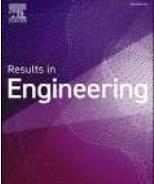
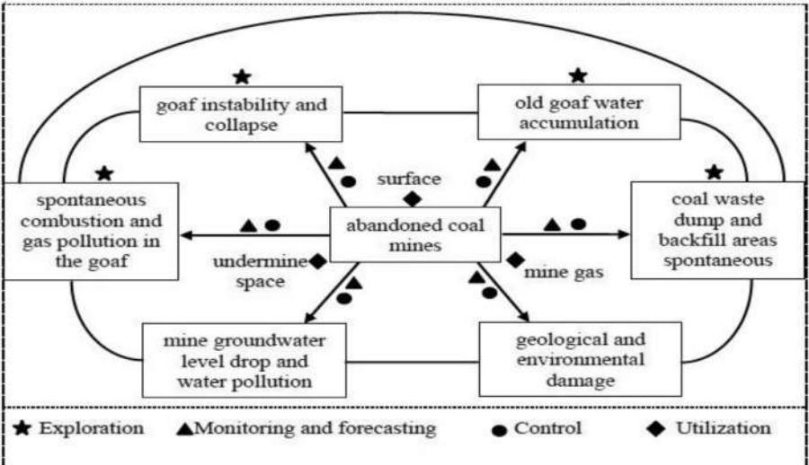
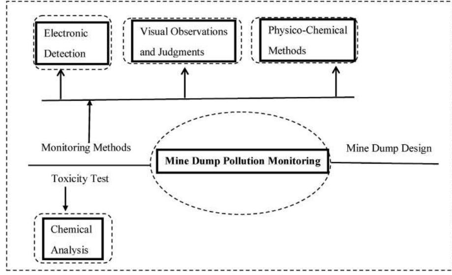
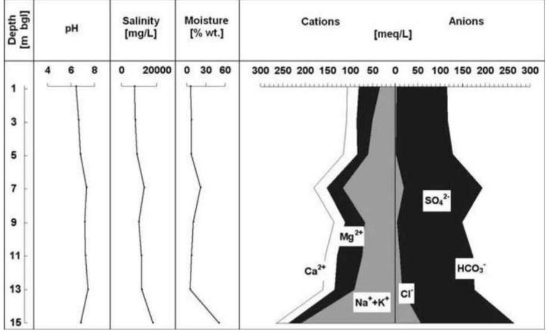
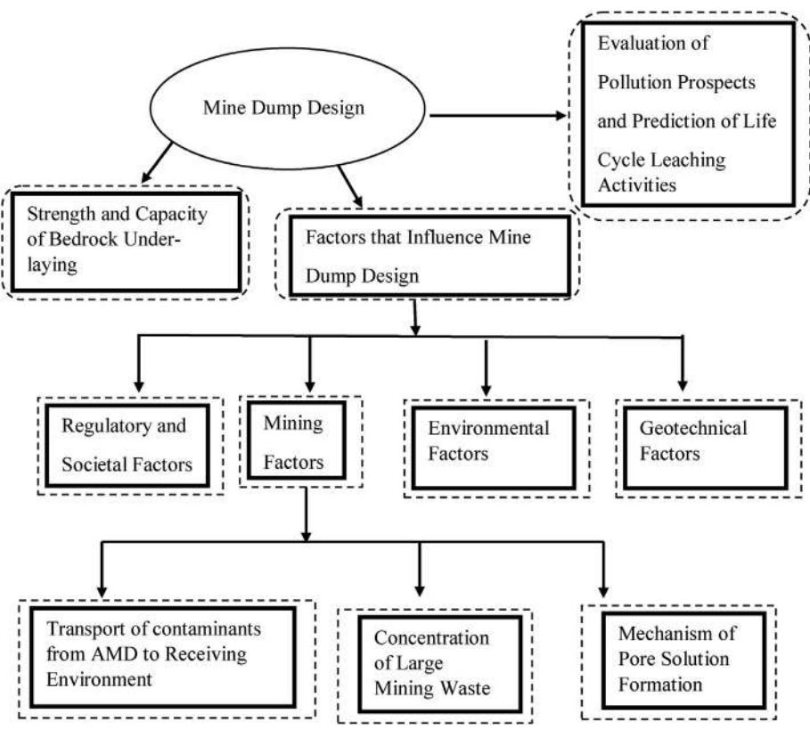
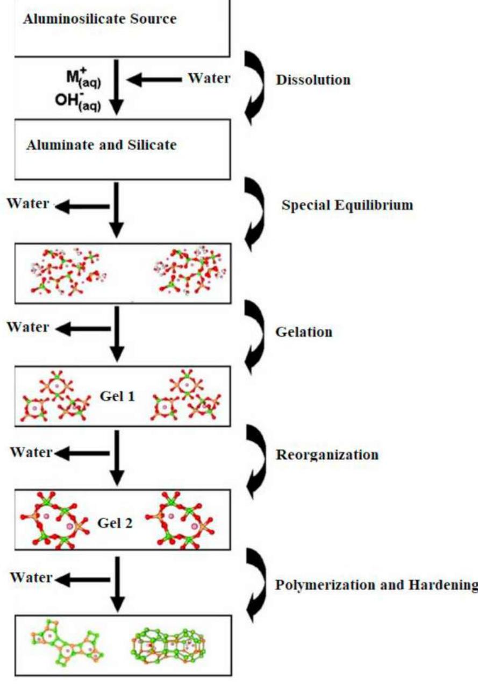
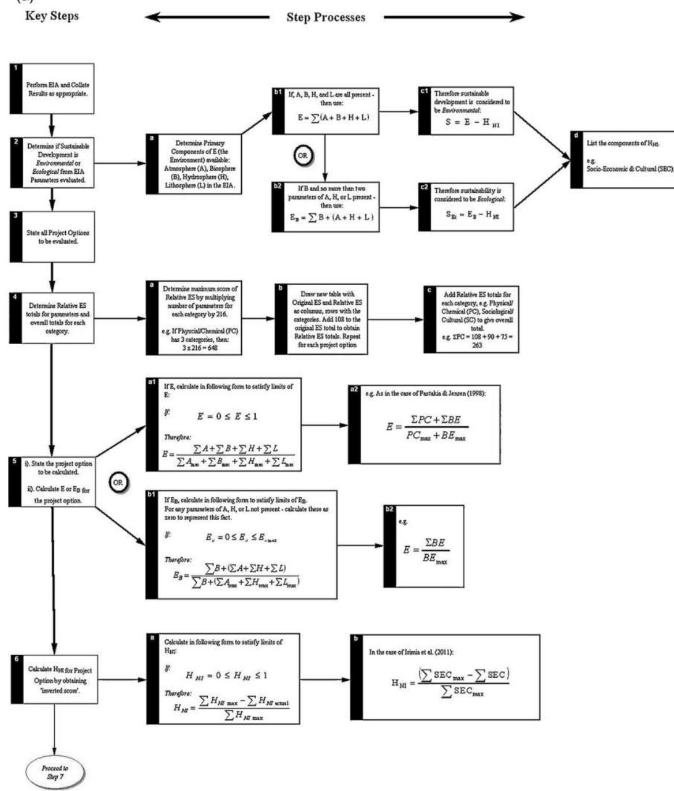
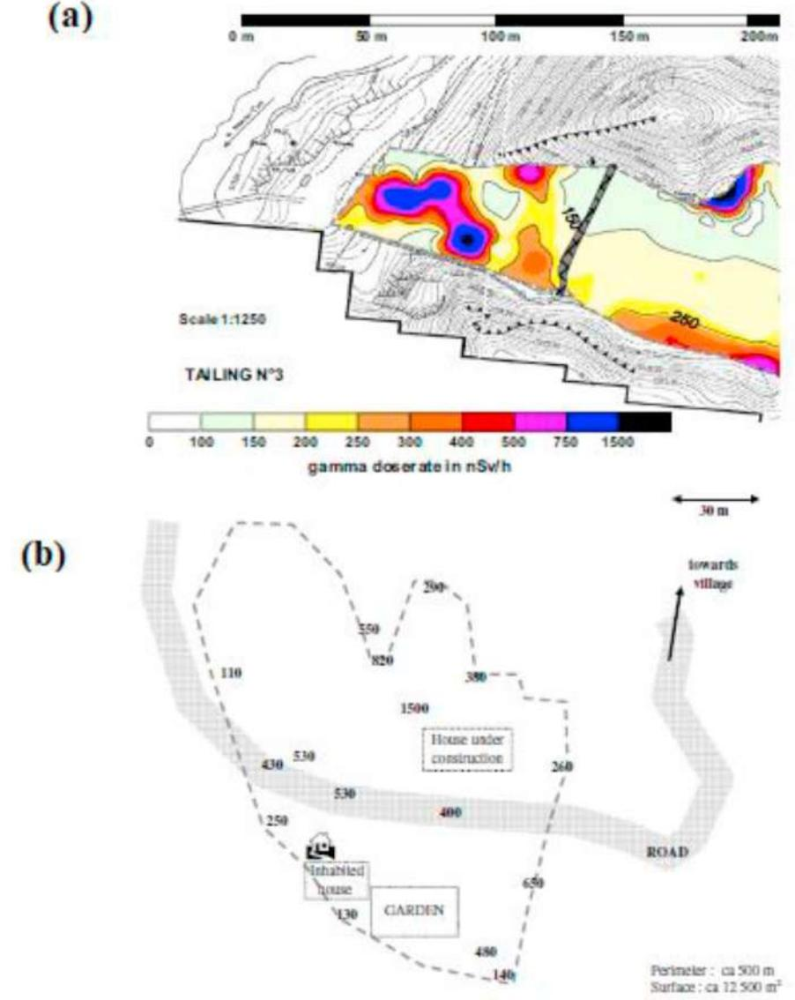

See discussions, stats, and author profiles for this publication at: [https://www.researchgate.net/publication/346040307](https://www.researchgate.net/publication/346040307_A_review_on_the_impact_of_mining_operation_Monitoring_assessment_and_management?enrichId=rgreq-b992e574ccbafad5104b504d105ce95e-XXX&enrichSource=Y292ZXJQYWdlOzM0NjA0MDMwNztBUzo5NjEzMjIzNzYyNjE2MzZAMTYwNjIwODUyMzg1Ng%3D%3D&el=1_x_2&_esc=publicationCoverPdf)

# [A review on the impact of mining operation: Monitoring, assessment and](https://www.researchgate.net/publication/346040307_A_review_on_the_impact_of_mining_operation_Monitoring_assessment_and_management?enrichId=rgreq-b992e574ccbafad5104b504d105ce95e-XXX&enrichSource=Y292ZXJQYWdlOzM0NjA0MDMwNztBUzo5NjEzMjIzNzYyNjE2MzZAMTYwNjIwODUyMzg1Ng%3D%3D&el=1_x_3&_esc=publicationCoverPdf) management

**Article** in Results in Engineering · November 2020 DOI: 10.1016/j.rineng.2020.100181

| CITATIONS 261 |                                                                                                 | READS 2,258                                                                           |  |
|------------------|-------------------------------------------------------------------------------------------------|------------------------------------------------------------------------------------------|--|
|                  | 8 authors, including:                                                                           |                                                                                          |  |
|                  | Oluranti Agboola Covenant University                                                         | Damilola Elizabeth Babatunde Covenant University                                      |  |
|                  | 179 PUBLICATIONS   2,125 CITATIONS SEE PROFILE                                               | 56 PUBLICATIONS   1,078 CITATIONS SEE PROFILE                                         |  |
|                  | Ojo Sunday Isaac Fayomi Bells University of Technology 586 PUBLICATIONS   5,711 CITATIONS | Rotimi Sadiku Tshwane University of Technology 645 PUBLICATIONS   14,008 CITATIONS |  |
|                  | SEE PROFILE                                                                                     | SEE PROFILE                                                                              |  |

Contents lists available at [ScienceDirect](www.sciencedirect.com/science/journal/25901230)

Results in Engineering

journal homepage: <www.editorialmanager.com/rineng/Default.aspx>

# A review on the impact of mining operation: Monitoring, assessment and management

Oluranti Agboola [a,](#page-1-0)[c](#page-1-1) , Damilola E. Babatunde [a](#page-1-0) , Ojo Sunday Isaac Fayomi [b](#page-1-2),[*](#page-1-3) , Emmanuel Rotimi Sadiku [c](#page-1-1) , Patricia Popoola [c](#page-1-1) , Lucey Moropeng [c](#page-1-1) , Abdulrazaq Yahaya [d](#page-1-4) , Onose Angela Mamudu [a](#page-1-0)

a Department of Chemical Engineering, Covenant University, Ota, Nigeria

b Department of Mechanical Engineering, Covenant University, Ota, Nigeria

c Department of Chemical, Metallurgical and Materials Engineering, Tshwane University of Technology, Pretoria, South Africa

d Department of Pure and Industrial Chemistry, Kogi State University

ARTICLE INFO

Keywords: Mine dump Remediation principle Dump pollution monitoring Management strategies Environmental laws Radioactivity Radioactivity monitoring

# ABSTRACT

Mining is very vital to the production of goods, services and infrastructure; it advances the quality of lives in the society. However, the possible hazard of waste and radioactivity generated by mining, dumping and tailing, has called on the society to find ways of seeking remedy that will adequately treat mining waste from mine dump, tailing and abandoned mine. Mine waste reuse and recycling in mining industries could offer cost-effective benefits through offsetting raw material requirements and decreasing the volumes of waste to be managed. This review discussed mine dump pollution monitoring and mine dump management strategies for some selected countries. Impact and mechanism of mine damage to the environment was discussed together with the remediation principles. It further examines the mining Act and regulations of the same selected countries. Emphasised was placed on the enforcement of environmental laws, regulations, and standards. Practical ways in which country's state authority and civil society can keep a close watch and enhance the enforcement of laws and regulations were highlighted. The prediction for the control of mineral exploration and environmental assessment was also discussed for executing a specific control to take preventive measures. Management techniques used in combating the impact of mine dump, stockpiles and tailing on the environment were discussed. In addition, radioactivity in mine and its monitoring and control was discussed.

# 1. Introduction

Mining of minerals produces significant quantities of waste and the waste materials have great impact on the surrounding. Usually, waste from mine operation does not have economic value. Hence, their exploitation is unprofitable. However, they have high possibility to stance as a long-lasting hazard and induce environmental impairment repeatedly. The nature of mining and the approach in which the mineral is treated depend on their chemical and physical composition; however, wastes generated from mine differ [[1](#page-19-0)]. Mine dump/tailing is one of the most life-threatening issue in mining milieu. Waste rocks and mining tailings storage around mine locations remain a long-lasting environmental problem. As a result, disastrous environmental pollution has ensued due to failed system used for storing mine wastes [[1\]](#page-19-0). The total removal of metals is as important as mine dump/tailing treatment. The outcome of waste from mine dump/tailing on human health, aquatic live, milieu and economy is quite severe [[2](#page-19-1),[3](#page-19-2)]. Repeatedly, mining industries are condemned for dumping waste with lack of taking the required precautions. Hazardous materials that generated from mining operations are mainly wastes that have reactive sulphide minerals suchlike pyrite ðFeS2Þor pyrrhotite ðFeSÞ. They could be seen in places such as open cuts, waste dumps, pit walls, impoundments, leach pads, tailings disposal amenities, tailings spillage locations, remaining footprints at the end of re-mining of tailing and the fall of a waste mix within the borders of previous mine properties [[4](#page-19-3)[,5\]](#page-20-0). Furthermore, mine waste disposal is a universal challenge that perpetually engenders a contamination risk to groundwater of exposed aquifers and surface water in dumping locations [[6](#page-20-1)]. There are several disaster to mine dump from abandoned mine and operational mine. Example of the functional classification of several disaster associated with abandoned coal mines is given by Li et al. [[7](#page-20-2)]

* Corresponding author. E-mail address: [ojo.fayomi@covenantuniversity.edu.ng](mailto:ojo.fayomi@covenantuniversity.edu.ng) (O.S. Isaac Fayomi).

<https://doi.org/10.1016/j.rineng.2020.100181>

Received 1 July 2020; Received in revised form 28 October 2020; Accepted 30 October 2020

2590-1230/© 2020 The Authors. Published by Elsevier B.V. This is an open access article under the CC BY-NC-ND license [(http://creativecommons.org/licenses/by](http://creativecommons.org/licenses/by-nc-nd/4.0/)[nc-nd/4.0/)](http://creativecommons.org/licenses/by-nc-nd/4.0/).

#### (see [Fig. 1)](#page-2-0).

Abandoned mines are lands, waters and surrounding watersheds where extraction and mining are no longer producing or operational because of harmful environmental and health effects. An active or operational mining zone includes landed property positioned under or above the surface of the land, utilized for the extraction of metal ore from their natural deposits via available extraction method; such as secondary recovery of metal ore from storage piles, rock dumps and mill tailings resulting from mining, cleaning and metal ores concentration. Mine dump is a large mound of residues or hill of mining waste (especially from abandoned mine) at the surface of a mine. A major area of worry with respect to mine dump is the mine dump that comprises of squashed, sandy by-product waste material, called tailings, formed in the course of the mining operation. Mine dumps are comprised of a multifaceted blend of metals and dust particles. Thus, exposure to dust could have serious health effect for communities living close to mining companies, most especially in windy conditions with dry low vegetation shelter [\[8\]](#page-20-3). This is the main reason the uneasiness has grown when considering the communities living close to mine dumps. Furthermore, respiratory diseases like asthma are becoming more frequent [[8](#page-20-3)]. It is therefore an established fact that mine dumps generate severe acidic and chemically noxious environments that effect the health of people living close to mine dumps. With time, wastes from mine dumps find their way in water bodies and they have great impact on agricultural land, they contaminate groundwater and surface water; and hence, affect aquatic life [[9](#page-20-4)–[12](#page-20-4)]. Hence, paying little attention to mine dump would cause serious consequences. It is the responsibility of mine owners to make sure that mine dump are properly monitored. The placement of settling ponds in mine dumps could lead to the discharge of contaminated water. Usually, mine dumps are made of concentrations of sulfides, removed in the course of exploration, development and production. To some extent, dump discharge water flowing across these materials react with the exposed sulfides, leading to decrease in the pH, which in turn results in more metals to be dissolved. The consequences of this chemical reaction is that the dump discharge water will be below the standard of water quality; hence, such practise is not supported [\[13](#page-20-5)]. Excluding the hazard and the impact mine dump has on land, the hazard of toxic air pollution and the contamination of water in streams and river; quite a number of mine dumps are explosive and flammable. Furthermore, mine dumps interrupt the surface stability and result in adverse landscape transformation [[14\]](#page-20-6).

It is important to know that dumps from mine dumps do not generate acid water. This could be connected to the presence of the type of pyrite, i.e. fine pyrite and pyrite that is typically dense with crystalline nature [[15\]](#page-20-7). Burnt dumps have all likelihood to generate acid water than unburnt dumps due to the existence of water-soluble sulphates that are very much amenable to leaching and oxidation [\[16](#page-20-8)]. Furthermore, atmospheric contamination and environmental degradation in several minefields take place due to the occurrence of gaseous products in the course of burning dumps [[17\]](#page-20-9). In the course of the combustion processes, greenhouse and some other gases suchlike H2O, CO2, CO, CH4, H2S, H, SO2, SO3, HCl, NH4 are formed [\[18](#page-20-10)[,19](#page-20-11)]. Worldwide, the composition of these gaseous materials are discharged from the combustion processes of active dumps into the atmosphere. Apart from the discharge of gaseous materials from the combustion processes of active dumps into the atmosphere, there are other impacts and mechanisms of mine damage to the environment.

In the annual publication of the World Mining Data, 65 mineral commodities are produced from 168 countries. This data are statistically summarized and evaluated by World Mining Data [[20\]](#page-20-12). The world production of iron and ferrous alloy metals in metric Tons, for five years are given in [Table 1](#page-3-0). The world production of non-ferrous metals in metric Tons, for five years are given in [Table 2](#page-3-1). The world production of precious metals in metric Tons, for five years are shown in [Table 3](#page-3-2). The world production of industrial minerals in metric Tons, for five years are given in [Table 4](#page-4-0). Lastly, the world production of mineral fuels in metric Tons, for five years are given in [Table 5](#page-4-1).

The mineral materials contained in the World Mining Data are categorized in five groups [[20\]](#page-20-12). All these minerals have different properties and usage. Properties of the five categories of minerals are given in [Tables 6](#page-5-0)–[10.](#page-5-0)

- - Iron and Ferro-Alloy Metals are iron, tungsten, vanadium, niobium, tantalum, chromium, titanium, etc.
- - Non-Ferrous Metals are copper, lead, lithium, indium, mercury, antimony, beryllium, bismuth, arsenic, bauxite, cadmium, brass, gallium, germanium, etc.
- - Precious Metals are gold, silver and platinum-group metals (platinum, palladium, and rhodium).
- - Industrial Minerals are baryte, diamond, kaolin, magnesite, fluorspar, graphite, fluorspar, graphite, fluorspar, graphite, feldspar, gypsum and anhydrite, perlite, phosphates, potash, salt, vermiculite, sulfur, zircon etc.
- - Mineral Fuels are crude petroleum, steam coal, oil sands, coking coal, natural gas, lignite, oil shales, and uranium.

Concerning the importance of the five categories of minerals; states

Fig. 1. Functional classification of several disaster associated with abandoned coal mines [[7\]](#page-20-2).

#### O. Agboola et al. Results in Engineering 8 (2020) 100181

# Table 1

The world production of iron and ferrous alloy metals from the year 2014–2018 [[20\]](#page-20-12).

| Commodity  | 2014       | 2015       | 2016       | 2017       | 2018       |
|------------|------------|------------|------------|------------|------------|
| Iron       | 1572296901 | 1572711479 | 1576687576 | 1620298164 | 1514832293 |
| Chromium   | 12997974   | 13246341   | 12846719   | 14250688   | 15290414   |
| Cobalt     | 136585     | 145801     | 130271     | 136572     | 156483     |
| Manganese  | 18758110   | 16115424   | 14748565   | 18909549   | 20180281   |
| Molybdenum | 305793     | 287226     | 263256     | 285378     | 27147      |
| Nickel     | 2124050    | 2062136    | 1938492    | 2139820    | 2256243    |
| Niobium    | 95956      | 87517      | 88564      | 91980      | 92480      |
| Tantalum   | 1642       | 1750       | 1666       | 2093       | 1799       |
| Titanium   | 7107045    | 6570200    | 6657820    | 7014320    | 7351855    |
| Tungsten   | 83312      | 88016      | 86701      | 86361      | 81386      |
| Vanadium   | 83085      | 79905      | 82224      | 86564      | 81701      |

# Table 2

The world production of non-ferrous metals from the year 2014–2018 [\[20\]](#page-20-12).

| Commodity   | 2014      | 2015      | 2016      | 2017      | 2018      |
|-------------|-----------|-----------|-----------|-----------|-----------|
| Aluminium   | 54028337  | 57901663  | 58612250  | 61229556  | 63237623  |
| Antimony    | 162466    | 149878    | 155215    | 150420    | 140704    |
| Arsenic     | 36550     | 37260     | 58917     | 57947     | 52737     |
| Bauxite     | 261837066 | 294377135 | 289257856 | 312007406 | 334962385 |
| Beryllium   | 8311      | 6938      | 5601      | 5312      | 6118      |
| Bismuth     | 12001     | 11689     | 10619     | 10607     | 10901     |
| Cadmium     | 24065     | 23326     | 26341     | 26781     | 24465     |
| Copper      | 18560687  | 19353809  | 20514186  | 20087220  | 20474372  |
| Gallium     | 303       | 285       | 194       | 310       | 323       |
| Germanium   | 124       | 139       | 122       | 98        | 101       |
| Indium      | 874       | 852       | 758       | 787       | 835       |
| Lead        | 5358372   | 5017075   | 4731704   | 4642192   | 4640740   |
| Lithium     | 62950     | 62587     | 82207     | 152433    | 189714    |
| Mercury     | 2861      | 3395      | 4094      | 2396      | 2814      |
| Rare earths | 11385     | 124467    | 128976    | 129097    | 163869    |
| Rhenium     | 37        | 45        | 49        | 45        | 47        |
| Selenium    | 3411      | 3275      | 3479      | 3055      | 2988      |
| Tellurium   | 353       | 446       | 463       | 610       | 647       |
| Tin         | 307790    | 325034    | 297232    | 317945    | 317862    |
| Zinc        | 13595978  | 13420071  | 12444099  | 12379787  | 12643000  |

#### Table 3

| The world production of precious metals from the year 2014–2018 [20]. |
|--------------------------------------------------------------------------|

| Commodity | 2014     | 2015     | 2016     | 2017     | 2018     |
|-----------|----------|----------|----------|----------|----------|
| Gold      | 3027838  | 3120326  | 3257955  | 3337532  | 3367607  |
| Palladium | 186555   | 206195   | 212129   | 204633   | 223497   |
| Platinum  | 144721   | 190529   | 189542   | 184641   | 189110   |
| Rhodium   | 17218    | 22964    | 23956    | 23074    | 22938    |
| Silver    | 27301259 | 28020395 | 27952977 | 26794050 | 27698787 |

and provinces where there are large concentration of mining activities, the mining industry plays a much more important role in the local economy. Generally, the economy cannot function well without minerals and the products made from them [[40](#page-20-13)]. As a means of illustration, electricity originates from mining coal. The copper cables employed in the power lines that distribute electricity comes from mining, processing and smelting of copper ore for the purpose of producing copper metal. Structural steel is needed for power distribution, which is extracted as iron ore, smelted into pig iron, which will subsequently be processed, rolled and designed into steel products. This products (Steels) are employed for high-rise buildings, automobiles, white goods, plants and infrastructure, having concrete in bridges. Concrete is extracted as limestone, it is burnt in a kiln to manufacture cement, which when blended with sand, aggregate and water, forms the basis of concrete. Electricity, steel and concrete have great importance to our standard of living, as a result, more waste will be generated from the minerals and metals mined for electricity, steel and concrete [\[41](#page-20-14)].

Currently, there are many researches on mine dump assessment and management. Tripathi et al. [\[42\]](#page-20-15) studied the long-term alterations in the properties of soil on re-vegetated mine spoil zones with regards to the status of inorganic nutrients, belowground biomass, nitrogen transformation, microbial biomass and bio-stabilization of dump slope in a dry tropical milieu of India. They authors resolved from their analysis, that plant roots played an important role in the stabilization of coalmine overburden dump slopes. Pashkevich [\[43\]](#page-20-16) presented classification of mine dumps based on their genesis and determined their multifactor environmental impact. The author gave a procedure to ecological and economic risk assessment of the mine dumps affecting the environment. Suleman and Baffoe [[44](#page-20-17)] Selected appropriate sites from mine waste dumps for the utilization of GIS techniques, because selection of best sites from mine waste dumps is, an important problem connected to surface mines operations. However, proper management of mine dump should still be in place. Adibee et al. [\[45](#page-20-18)] investigated adverse impacts of coalmine waste dumps on the environment and their management. The studied dump gave the authors a good case study for analyzing the effects of dumping on the environment by comprehending the properties of the dump materials in the diverse segments. Based on their findings, there is no significant chemical problem with the studied dump. However, studies have shown that chemical problems from, or associated to any mine dumps include the radioactivity, electromagnetic radiation, noise and chemicals that come from the mineral processing stage [\[46](#page-20-19)]. Owing to the negative efects of mine dump on the environment, there is a need to develop a new, long-term, cost-effective, and environmentally sound management approach to mitigate the impact of mine dump. An early monitoring and assessment approaches will also lead to a good management techniques. This review reports the impact of mine dump from mining operations. Monitoring, assessment and management techniques were also highlighted.

#### Table 4

The world production of industrial mineral from the year 2014–2018 [[20](#page-20-12)].

| Commodity   | 2014      | 2015      | 2016      | 2017      | 2018        |
|-------------|-----------|-----------|-----------|-----------|-------------|
| Asbestos    | 1657395   | 1309672   | 1287075   | 1157070   | 1226400     |
| Baryte      | 9853381   | 9734901   | 8742588   | 8954266   | 9207032     |
| Bentonite   | 16609506  | 18348235  | 19726560  | 21209189  | 21265014    |
| Boron       | 4479529   | 4754430   | 4077557   | 4228732   | 4492429     |
| Diatomite   | 2321356   | 1999246   | 1821244   | 2120028   | 2205649     |
| Feldspar    | 31454109  | 32603826  | 35934427  | 3629945   | 37091566    |
| Fluorspar   | 6273575   | 6301661   | 5580847   | 5714409   | 6857413     |
| Graphite    | 1105611   | 1129378   | 1106688   | 902135    | 1047048     |
| Gypsum      | 149814035 | 143637536 | 155290837 | 155219661 | 162985178.4 |
| Kaolin      | 38193680  | 38495984  | 39282800  | 41308006  | 41604189.28 |
| Magnesite   | 28576668  | 28336627  | 26895076  | 27459264  | 28801480    |
| Perlite     | 2688467   | 2550031   | 2773455   | 2360800   | 2725895     |
| Phosphate   | 74973287  | 82880467  | 83878266  | 79743065  | 72111340    |
| Potash      | 39496281  | 40862020  | 39795158  | 43081310  | 44373702    |
| Salt        | 296559349 | 293527550 | 280580373 | 284813101 | 285741917   |
| Sulfur      | 73642776  | 75976433  | 77274354  | 78062396  | 79701452    |
| Talc        | 9067797   | 7631677   | 7608523   | 8016781   | 7883978     |
| Vermiculite | 424851    | 429314    | 433982    | 416092    | 432401      |
| Zircon      | 1591586   | 1524289   | 1447385   | 1440693   | 1544945     |

#### Table 5

The world production of mineral fuels from the year 2014–2018 [[20\]](#page-20-12).

| Commodity   | 2014       | 2015       | 2016       | 2017       | 2018       |
|-------------|------------|------------|------------|------------|------------|
| Steam coal  | 5823508359 | 566978099  | 5254022126 | 5502503163 | 5791782824 |
| Coking coal | 1118855146 | 1090040710 | 1041768657 | 1018678790 | 1032331612 |
| Hard coal   | 6942363505 | 6759821609 | 6295790783 | 6521181953 | 6824114436 |
| Lignite     | 818877727  | 821961221  | 818488535  | 826418620  | 808179327  |
| Petroleum   | 4131311595 | 4285705119 | 4296012155 | 4299586996 | 4388772607 |
| Natural gas | 3530951    | 3589187    | 3595320    | 3771635    | 3959541    |
| Oil sands   | 127943100  | 148574300  | 149572400  | 158202900  | 165081000  |
| Oil shales  | 21899496   | 20506638   | 16682046   | 22558073   | 22794350   |
| Uranium     | 67829      | 72341      | 74807      | 69959      | 65308      |

### 2. Impact and mechanism of mining to the environment

The impacts of mining on the environment could take place at region, district, and worldwide via indirect and direct mining operations. Environmental impacts of mining could occur on the account of mine damage mechanisms suchlike erosion of mine dumps, sinkholes, and the pollution of surface water, groundwater and soil through the chemicals released from mining processes and the extinction of species worldwide. In addition, these processes have negative effect on the atmosphere because of the release of carbon, which in turn influences biodiversity and the quality of human health [[47](#page-20-20)].

Erosion of mine waste, particularly tailing and waste rock could greatly affect the quality of surface water. Considering that practices of mining and mineral processing usually generate extensive amounts of solid and liquid waste, mobilised metals could directly come from open mine tailings or mine dumps [[48\]](#page-20-21). Furthermore, non-vegetated surface-mined lands shelter substantial zones in different parts of the world. Therefore, it is evidently shown that substantial discharges could take place due to other external turbulences (such as transformation of in-channel topography or construction of roads and infrastructure) at mining sites [\[49\]](#page-20-22). The contamination of the environment through heavy metal from mining takes place through different distinguished passageways via operational timescales and associated effects on ecosystems. Sediment-bound metals are placed in topographic sinks situated in the mining regions or at lower-lying natural flood plains and wetlands during transportation. Remobilization can then take place through any kind of erosive processes. Furthermore, the extent of river loading by metals can be effected by in-channel storage and erosion, underlining the complication of the dispersion of noxious waste, storage and remobilization in mining regions [[48\]](#page-20-21).

Sinkholes can take place in the course of mining operation or several years after mining. There are different types of collapses, which are in the array of single immature sinkholes to multiple mature sinkholes. The two types of collapses could result to a significant hazard to the public [\[50](#page-20-23)]. The development of most sinkholes is because of the progressive collapse of roof strata or chimney formation to the surface. Sinkhole usually looks like a small deep hole on the surface; which with time, will expands to take a form of a conical shaped depression as unconsolidated surface deposits erode into the depression [\[51](#page-20-24)]. The formation of sinkhole in mining region could be hazardous to property and life because it occurrence comes without any kind of warning. It occurrence could lead to increased costs; it can also cause interruptions to innovative development; it can cause destruction to current development and infrastructure. Furthermore, the existence of surface water and groundwater has the capacity to increase hazard of sinkhole, which could result to injury, or loss of life [[52\]](#page-20-25). Sinkholes takes place in different environmental conditions, regardless of minor alterations in the extent of working, overburden geology, jointing and surface conditions. Nonetheless, the existence of a competent unit in the overburden will capture the failure and the development of sinkholes, in as much as the unit has the capacity to carry both itself and the surcharge load enforced on it by the overlying weak units [\[51](#page-20-24)]. In addition, suitable design of infrastructure like an excellent erection of walls to build a barricade all over the area susceptible to sinkholes can be used for the mitigation of sinkholes.

Mining processes have a terrible impact on water resources. The effect of mining on surface and groundwater ensue from sedimentation, spill erosion, acid mine drainage, subsidence, lowering of table water, disturbance on the hydrological cycle, and rainfall [\[53](#page-20-26)]. The damage has resulted in an unnaturally upsurge concentration of chemicals, like mercury, sulphuric acid and arsenic, over a huge area of surface or groundwater [[54](#page-20-27)]. The immense pollution potential of the region near mines is because of numerous chemicals utilized in the mining process, compounds with high potential damage and the metal mined from the

#### Table 6

Properties and importance of some Iron and Ferro-Alloy Metals.

| Metals    | Properties and Characteristics                                                                                                                                                                                                                                                                             | Importance                                                                                                                                                                                                                                                                                        | Source      |
|-----------|------------------------------------------------------------------------------------------------------------------------------------------------------------------------------------------------------------------------------------------------------------------------------------------------------------|---------------------------------------------------------------------------------------------------------------------------------------------------------------------------------------------------------------------------------------------------------------------------------------------------|-------------|
| Cast iron | Cast iron is brittle if thin.  It has Strong compression  strength It can be cast into mould.  It has excellent electrical  and thermal conductivity; however, I has poor resistance to corrosion.                                                                        | It is used for manhole covers, pans and gates                                                                                                                                                                                                                                                  | [21]        |
| Tungsten  | It is solid at room  temperature. Out of all metals, it has an  extreme melting point and lowest vapor pressure. It has the highest tensile  strength at temperatures above 1650C. It possess outstanding  corrosion resistance; it is however slightly attacked | Globally, tungsten alloys are important elements in the overall system of most industries. Tungsten can also be utilized as a protective element in shields which are employed around x-ray machines. Aerospace and automotive industries also use tungsten alloys. | [22, 23] |
| Vanadium  | by most mineral acids. Vanadium is a hard and  ductile metal that has silvery-grey appearance. It possesses excellent  corrosion resistance against alkalis and acids.                                                                                                             | Vanadium steel alloys are used in jet engines, crank shafts, gears and axles. It is also used in Nuclear reactors.                                                                                                                                                                    | [24]        |
| Nickel    | Nickel is malleable and  ductile with superior strength and corrosion resistance. It is a reasonable conductor  of heat and electricity. It possess magnetic  properties below 345C                                                                                          | Nickel is utilized for alloying elements, batteries and coatings. It is used in the production of mobile phones, kitchen wares and medical equipment.                                                                                                                           | [25]        |

#### Table 7

Properties and importance of some Non-Ferrous Metals.

| Metals    | Properties and Characteristics                                                                                                                                                               | Importance                                                                                          | Source |
|-----------|----------------------------------------------------------------------------------------------------------------------------------------------------------------------------------------------|-----------------------------------------------------------------------------------------------------|--------|
| Aluminium | Aluminium has a melting  point of 660C It has excellent strength to  weight ratio. It possess good conductor  of heat and electricity.                               | It is employed for kitchen utensils, window frames. It is used for general cast component. | [26]   |
| Copper    | The melting point of  Copper is 1080C It is malleable and ductile.  It is an excellent conductor  of heat and electricity. It is a good corrosion  resistance. | It is used in water pipes and electric wires. It is used in decorating goods               | [26]   |
| Tin       | Tin has a melting point  between 230C . It is a good corrosion  resistance. It is malleable and ductile                                                                 | It is normally used for coating steel to for tin plate                                        | [26]   |
| Brass     | The melting point of Brass  is between 900 and 1000C It is a good corrosion  resistance. It is an excellent conductor  of heat and electricity.                      | It is utilized for ornaments. It is utilized for casting articles like water taps.         | [26]   |

### Table 8

Properties and importance of some precious Metals.

| Metals                      | Properties and Characteristics                                                                                                                                                                                                                                                                                                                                          | Importance                                                                                                                                                                          | Source |
|-----------------------------|----------------------------------------------------------------------------------------------------------------------------------------------------------------------------------------------------------------------------------------------------------------------------------------------------------------------------------------------------------------------------|-------------------------------------------------------------------------------------------------------------------------------------------------------------------------------------|--------|
| Gold                        | Gold is an excellent  conductor of heat and electricity. It is a soft is a soft metal                                                                                                                                                                                                                                                                       | Gold can be hammered into thin sheets, alloys with various metals Gold has been used to make ornamental objects and jewellery Gold has many utilizations          | [27]   |
| Silver                      | Silver is a soft, ductile  and malleable metal. When compared to other  metals, it possess a very high electrical and thermal conductivity. It has good characteristic  of stability in oxygen and water; it however, gets tarnished when it is visible to sulfur compounds in air or water to form a black sulfide layer. | in the production of glass It used for jewellery and silverware. It used in electrical contacts and solders. It used in silver-zinc and silver-cadmium batteries. | [28]   |
| Platinum group metals | Platinum-group metals  are soft and ductile They are resistant to  oxidation and high temperature corrosion.                                                                                                                                                                                                                                             | Platinum-group metals  possess extensive catalytic uses. They are usually utilized  in industry with the incorporation of other metals.                     | [29]   |

### Table 9

Properties and importance of some Industrial Minerals.

| Minerals   | Properties and Characteristics                                                                                                                                                                                                                                  | Importance                                                                                                                                                                                                                                                                                                                                      | Source      |
|------------|--------------------------------------------------------------------------------------------------------------------------------------------------------------------------------------------------------------------------------------------------------------------|-------------------------------------------------------------------------------------------------------------------------------------------------------------------------------------------------------------------------------------------------------------------------------------------------------------------------------------------------|-------------|
| Kaolin     | It has outstanding firing properties and moderately high melting point                                                                                                                                                                                       | It is used in paint, ceramic, rubber and paper industries It is used as a filler in soap production                                                                                                                                                                                                                                    | [30]        |
| Phosphates | The two major characteristics of phosphates are their chain length and their pH. Their four properties are defined by their characteristics; which are buffer agent, sequestering power, dispersing power and water holding capability. | Phosphate Rock is utilized in agriculture to produce fertilizer and animal feeds. It is utiized in the industry for the manufacturing of detergent or food additives. It is used in energy industry as a source of uranium and rare earth metals. It is used in environmental science for metal immobilization | [31, 32] |
| Sulfur     | Sulfur is a bright yellow  solid and it has no odor                                                                                                                                                                                                          | Sulfur is used in medicine, agriculture chemical and plastic industries                                                                                                                                                                                                                                                                   | [33]        |
| Gypsum     | Gypsum is a soft mineral,  that is relatively soluble in water. The water solubility is affected by temperature It has low thermal  conductivity                                                                                           | Gypsum is employed in making drywalls or plasterboards. It is employed in the manufacturing of surgical and orthopedic casts, suchlike surgical splints and casting molds.                                                                                                                                                 | [34]        |

ore [[55,](#page-20-28)[56\]](#page-20-29). The impacts of mining on surface are usually from tailings and rock dumps, these impacts undesirably affect the quality of surface and groundwater. Generally, underground effects are described through the inflow of water into the underground operations and later, dewatering of the aquifer [\[57](#page-20-30)]. In addition, long-term largescale mining has the capacity to create a broad interrelated subsurface void space with a permanent modification of the circulation of air and water within its locality. Hence, this mechanism can significantly change the natural groundwater flow and quality regime [[58\]](#page-20-31). This problem can be solved by putting precedence on the fundamental roles of groundwater in the provision of drinking water and sustainability of certain ecosystems. This measure of control needs the exertion of strict control on mining companies [\[58](#page-20-31)]. Furthermore, appropriate recycling of used metals, implementation of ecological user-friendly techniques and good planning Table 10 Properties and importance of some Mineral Fuels.

| Minerals           | Properties and Characteristics                                                                                                                                                                                                                                                                         | Importance                                                                                                                                                                                                                                                                                                                                                                                  | Source |
|--------------------|--------------------------------------------------------------------------------------------------------------------------------------------------------------------------------------------------------------------------------------------------------------------------------------------------------|---------------------------------------------------------------------------------------------------------------------------------------------------------------------------------------------------------------------------------------------------------------------------------------------------------------------------------------------------------------------------------------------|--------|
| Crude petroleum | Physical properties (A.P.l gravity, wax content, sulfur content, cloud and pour point) of crude oils vary according to the composition of the oil, the relative abundance of the groups of hydrocarbons. These properties basically hinge on the temperatures and pressures. Of the reservoir | Some properties of crude oils have contributed immensely towards the analysis of the environments of occurrence of the crudes and the understanding of their mode of origin. Trace metal complexes occurring in crude oils are considered as important indicators for environmental interpretation                                                                              | [35]   |
| Steam coal         | Most of the properties of steam coal are rank and origin dependent; for example, the density of coal spans from about 1.1 to around 1.5 Mg per cubic metre.                                                                                                                                      | It is used as energy resources. Coal is important for domestic use. It is employed as fuel for the generation of electricity. It is used for export purposes.                                                                                                                                                                                                                      | [36]   |
| Coking coal        | Coking coal properties mainly depend upon coal rank, mineral contents, composition and the ability to soften when subjected to heat becomes plastic and re-solidifies into a coherent mass.                                                                                                      | It is used in creating coke. It is one of the main irreplaceable inputs in the production of steel.                                                                                                                                                                                                                                                                                      | [37]   |
| Natural gas        | Natural gas state of matter is gaseous.  It is not toxic, it does not bring out smoke when subjected to burning and it  possess a high calorific value                                                                                                                                     | In vehicles, it is utilized in the form of Compressed Natural Gas. It is employed for the manufacturing of few chemicals and fertilizers. It is employed as a source of energy for the generation of electricity, heating and cooking. It is used as chemical feedstock for manufacturing plastic It is employed in the production of glass, fabrics, paint, plastic, steel. | [38]   |
| Uranium            | Uranium is a dense, hard, malleable, ductile, silver-white, radioactive metal                                                                                                                                                                                                                       | Depleted uranium is used as a shield for the protection of tanks. Uranium is used for making bombs                                                                                                                                                                                                                                                                                       | [39]   |

should be in place [\[59](#page-20-46)].

It is known that mining has become a means of livelihood; however, it stance as a serious and highly explicit threats to biodiversity. Inappropriate management of mining operations could contaminate the environment and damage the biodiversity that reinforces economies, makes provision for fuel, food, building materials and freshwater. Furthermore, it damages the biodiversity that helps in mitigating the impacts of climate change and natural disasters. Globally, biodiversity, which we all hinge on for our survival, continues to decline; they varies from bacteria and fungi to exotic plants (such as Dipladenia Sundaville), lemurs and sharks, to whole ecosystems. In order to combat threats to biodiversity, sustainable mining have the need of mining companies to have good understanding and give value to the worth of biodiversity to their lasting operations and to local communities. Mining companies should put into consideration the entire environmental impacts. Furthermore, the consideration of direct, indirect, prompted and accumulation of impacts on the services of biodiversity and ecosystem all through the lifecycle of a mining project, which includes exploration, construction, and operation, closure, and post closure is very important [\[60](#page-20-47)].

In addition, it is imperative to note that all through the lifecycle of a mining project, the receptacle of ecosystem cycle is the soil. Biodiversity is a significant characteristic of healthy soil, having a community of countless mirco and macro organisms executing balancing tasks. The hazard in biodiversity is the human intervention intended to control insects, unwanted plant or diseases. This could have impact on biodiversity in an unforeseen ways; it could also pollute ground water and surface water [\[61](#page-20-48)]. The soil organisms does some vital functions, for example, decomposition and the degradation of plant litter and cycling of nutrient, transformation of atmospheric nitrogen into the formation of organic and remineralization of mineral nitrogen, resulting to the formation of gaseous nitrogen [\[62](#page-20-49)].

The variation of gaseous materials depend on the composition of the deposited material and the existence or nonexistence of soil cover [\[63](#page-20-50)]. In any case, exposure to this pollution is very destructive to the milieu and the health of the communities living close to mine dump. It is hence, the responsibility of mining companies to figure out ways to monitor the pollution and ending it, preferentially, from the source. Therefore, the over-all best practice principles used in monitoring and managing mine waste should be in place; they are made of four critical stages: (i) the prediction of life-cycle assessment of waste material that is made open to natural conditions for the analyzed variants of the dump under consideration. (ii) The development of precautionary measure, design and discarding functioning practices for the waste. (iii) Dump rehabilitation in working period and after the closure period. (iv) the monitoring of life cycle of the vadose and saturated zones contained in the dump area. This will make available an early observation in order to take remedial actions [[64\]](#page-20-51).

# 2.1. Remediation principles

# 2.1.1. Prediction of life-cycle assessment of waste material

For the prediction of life cycle for the leaching operation of mine, waste material analyzed for different mine dump under consideration, the assessment of environmental risk should be done. This assessment of risk would be different for the different stages in the life cycle of a mine dump. Life cycle assessments (LCA) are tools used in quantifying the ecological expenses of mining projects; though the utilization of LCA is normally a retroactive ecological measurement of functioning mines [[65\]](#page-20-52). Gusca et al. [[64\]](#page-20-51) developed a LCA model for evaluating the environment of two landfill mining substitutes - on-site sorting of mined waste with aid of mobile sorting tools. The life cycle inventory data obtained was dependent on the implementation of the real landfill-mining project in the studied area and supplementary data obtained from the literature. Results showed that sorting of waste at the landfill site supersedes the minimization of the impacts to the surroundings by 28% exceeding waste sorting at a centralised plant [[66](#page-21-0)]. Pell et al. [\[65\]](#page-20-52) reported a new approach of executing a LCA for creating life cycle impact assessment statistical data that could make an ecological block model of a deposit for the purpose of using the data as a constraint amid long-lasting mine planning simulations. The data obtained pointed out that substantial decrease of the impact in global warming could be attained with a little financial expenses. Their method allows the inclusion of ecological considerations in the strategic mine planning. Hence, the integration of ecological considerations into the initial stages of mine planning could help with the drive of ecologically responsibility of the extraction of raw material. In addition, data needs to be collected and analyzed for the purpose of possible identification of long-term trends, episodic change and variations in rates of change.

# 2.1.2. Development of precautionary measure, design and discarding operation practices for mine waste

Prior to the stage of dump design and construction, a credible assessment of likely contamination of ground- and surface water from waste, together with the prediction of the life-cycle leaching characteristics and it effect on the aquatic surroundings in a waste disposal likely region is necessary. This should be the standard of obtaining permit, rejection or acceptance of a material for engineering constructions for the dumpsite. The application of protective measures should also be put into consideration. Hence, careful evaluation should be done to avoid errors in the long-lasting risk assessment because such errors would have direct impact on the economic and the environment. Attention should also be given to mine waste of large volumes in small regions. In addition, the formation of pore solution mechanism in the anthropogenic and natural vadose area in the area allotted for discarding waste has be given consideration. Furthermore, the transportation of waste product from the origin to the destination of aquatic surroundings with the subsequent effect on the groundwater of the saturated zone and surface water in the surrounding area of dumping spot within its life cycle must be considered [[64\]](#page-20-51). It is therefore necessary to implement new approaches for precautionary measure, design and discarding procedures for mine waste. Preventive plans are evaluated for the following: 1) the mining process and technology that would be utilized, 2) construction of access roads for transportation, 3) identifiable resources like power and water sources, 4) the creation of ore processing facilities and discarding waste areas. Ortiz [[67\]](#page-21-1) reported a new approach for modelling and optimization of the design of a dump via the reduction of the entire haulage budgets. The site and design of the dump were given by the geological features of the mineral, delivered tonnage, geographical state of activities, the costs of infrastructure capital and transportation. The provision of a set of mathematical factors and economic rapport that offer prospects for modelling, facilitate the measurement and optimization of definitive dump designs were obtainable by the possibilities of spatial and physical design. Results obtained revealed that higher haulage cost was obtained in relation to larger footprint base until the curve attains a modulation point (lowest cost), where there is an alteration in the curvature. Results also revealed that haulage cost slightly upsurges on the condition that there is a reduction in the footprint area. The proposed designs were iteratively constructed via eight percent reduction in the preceding region until the ultimate dump design is reached. Other information of mine dump design is presented in section [3.](#page-8-0)

# 2.1.3. Dump rehabilitation in working period and after the closure period

Mine working period involves the prospecting, exploration and extraction of mine; prospecting and exploration usually take place concurrently as they are precursors to mining and they could take two to eight years to complete. During the stage of extraction, the mineral is taken out from the earth in great amounts as the mine commences production. Some exploration and development could also carry on at this stage. The completion of the extraction stage could be in the range of 5–30 years; however, several mines have been open for over 100 years, and could cost about a few million dollars to hundreds of millions of dollars, annually. This is dependent on the mine size and the area it is located [[68\]](#page-21-2). At the end of the accomplishment of the prospecting and exploration stages, a viability study is usually done in order to properly ascertain if the development of the mineral deposit into a mine is economically viable. The opening of an ore deposit for production at the development stage normally takes 4–12 years. A report would be generated from the feasibility study. The report comprises of parameters such as rate of production, costs of operation, estimation of the sale price of the mineral and income tax. All these parameters would be used to discover the final rate of return. In addition, reports on the subject of potential effects on the environment and neighbouring communities would also be generated. Then, the mining industry can make a decision regarding the continuation of the project or if the project will be abandoned at this stage [\[68](#page-21-2)]. Abandoning the project at this stage would result into mine closure. Mine closure is define as the time of ending the operational stage of a mine; then the last stage of decommissioning and mine rehabilitation will then be carried out. Sometimes, closure of mine could be a temporary action; or it could result to a process of care and maintenance. In situation like this, the closure of mine comprises of a diverse range of determining factors, processes and resulting performances [\[69](#page-21-3)].

Mining organization sufficiently commences on the planning for mine closure and reclamation in advance, prior to the opening of a mine. A reclamation plan must be put in place for the closure of a mine. The processes to be utilized for these reclamation plans are described by a mining operator in an effort to reinstate or revitalise an already mined land to natural or economically functioning state [[68](#page-21-2)]. Hence, mining waste dump rehabilitation is of high significant, as it is necessary for the tasks involved to be realized via technical, agrotechnical and biological actions that will enable economic and environmental restoration of the areas that are degraded [\[64](#page-20-51)]. These procedures are made of reshaping of land, sealing of dump, soil properties improvement, water balance regulation and a monitoring linkage installation in the affected site [\[70](#page-21-4)]. Because of the inadequate land availability for tracing dumps together with practical and economical restrictions of reusing waste for stowing during working period, land surface rehabilitation requirement must not be treated by way of a precise restoration of the primary landscape and area use. It should however, be treated as an optimum solution, that will also maximally ensure the volume of waste that needs to be discarded in the site [[64\]](#page-20-51).

If the closure of mine and completion are not properly done in a planned and effective means, the mine area could continue to be unsafe and it will for many years become a foundation for pollution [\[69](#page-21-3)]. In addition, pre-determined outcomes can be predicted and successfully attained to create sufficient opportunities to overcome any main issue that could generate complications after closure. Therefore, the general objective of mine completion is for the prevention or minimization of adverse effects on environmental, physical, social and economic, which will take place for a lengthy timespan. Furthermore, the objective is to construct a steady landform that is appropriate for some agreed succeeding land utilization [\[68](#page-21-2)]. Kivinen [\[71](#page-21-5)] studied the characteristics of landscape and post-mining land utilization in 51 metal mining locations in Finland. The investigated mines were closed between years 1924–2016; more than half of the mine locations had been operating over 10 years. The range of post-mining functions was usually restricted to small and secluded locations. The data the author obtained revealed that every closed mine is distinct, hence; viable post-mining land use would require thorough assessment of potentials and restrictions, such as pollution and other menaces of the sites. Therefore, the upsurge in sizes of new mining projects demands giving all attention to future post-mining landscapes for the purpose of avoiding degraded and underused zones from environmental, social and economic viewpoints.

# 2.1.4. Monitoring of life-cycle of the vadose and saturated zones contained in the dump area

Monitoring is a crucial factor of engineered barricade scheme design and operation. Monitoring systems at waste control locations could be intended for different kind of media like surface water, soil, air and groundwater [\[72](#page-21-6)]. The monitoring of vadose zone lifecycle is responsible for early detection of risk; and afterward, embark on a remedial action prior to the degradation of recoverable water resources by the contaminants. The monitoring of up-gradient and down-gradient of the dump at saturated zone life-cycle is done for the determination of site impacts, validation of short and long period projection and the efficiency of prevention and remediation schemes in the dumping location. The range of factors that should be integrated into the monitoring scheme are centred on: (1) the determination potential used for characterizing waste, utilized for the getting polluted water out of the generation and release of macroand trace component from the discarded mine waste. (2) The constituents generation channels, interactivities and movement in the anthropogenic and natural vadose and saturated zones in the definite hydrogeological and hydrologic conditions [[64\]](#page-20-51).

Vadose zone is a geologic media that spans from the land surface to the groundwater table of the first unconfined aquifer. It comprises of several coupled physical, geochemical, and microbial procedures; the interaction of these procedures is very complex to comprehend, particularly from the perception of remediation. The characterization of vadose zone and monitoring approaches are normally utilized for the purpose of developing a comprehensive and precise assessment of the inventory, dispersal, and transportation of pollutants in the unsaturated zone; development of enhanced predictive methods for liquid flow and conveyance of pollutant. Furthermore, the characterization of vadose zone and monitoring approaches are employed for remediation systems design such as, barrier systems and stabilization of buried wastes in situ. Other approaches are to cover systems for waste isolation, in situ treatment barriers of dispersed contaminant plumes etc., chemical treatment technologies design for the destruction or immobilization of highly concentrated contaminant sources such as, metals, explosive residues, radionuclides, and solvents, which are accrued in the subsurface [\[73](#page-21-7)]. Arora et al. [\[73](#page-21-7)] presented a summary of methodologies that can be used for monitoring and modeling of vadose zone dynamics occurrence amidst complex and heterogeneities features, together with the integration of transient conditions. In order to develop predictive models for the processes in the vadose zone, a conceptual framework is needed. Typically, conceptual models describe the key physical processes that occur in the vadose zone; conceptual models also describe the manner in which these processes work hand in hand or control the system. Generally, the conceptual physical framework comprises of different processes and characteristics suchlike a hydrologeologic setting which describes the hydro-stratigraphic and structural details; and relevant hydrological and biogeochemical processes. Modeling results could be utilized to offer early advice on the contamination of soil and groundwater prior to when problems arises. Furthermore, the model could offer scientific and regulatory standing to environmental management decision-making process in order to improve the protective measure taken for human health and the environment [[73\]](#page-21-7). Likewise, the recent advancements in numerical modeling of hydro-geochemical responses, transportation of contaminant in saturated-unsaturated media, and groundwater flow offer some advanced software packages that provide a prospect for a credible long-term prediction for the prevention and remediation schemes in the dumping site [[64\]](#page-20-51). The above listed practical principle is better than a prescriptive approach when it comes to dealing with the problem of mine dump.

# 2.2. Trend in the modern process for mine dump remediation

Remediation of acid producing mine waste could be expensive; however, the advancement of modern waste management approaches to remediate mine dump and waste by mining operations should be one of the important trends in mining waste management. Several researchers have used modern processes for mine dump remediation A relatively novel idea used in treating metal-contaminated soils that ensued from mine dump is the use of biological approach. Example of such approach is the utilization of living organisms to decrease or totally eradicate environmental contaminant [\[74\]](#page-21-8). Biological method of remediation comprises of one or more of the under-listed processes:

- i) Degradation process done by contaminant biochemical degradation using soil microorganisms such as fungi, bacteria and actinomycetes.
- ii) Transformation process done by contaminant biochemical conversion for making the waste less toxic or/and less mobile.
- iii) Accumulation process done by accumulating organic and inorganic contaminants in tissues of living organisms; such as plants, in most cases.
- iv) Mobilization; a contaminant-bearing solution could be separated from the contaminated soil.

The biological method of remediation is contingent on two remediation technologies: bioremediation and phytoremediation. The bioremediation process is dependent on the capability of microorganisms to degrade organic molecules; it also relies on the ability of microorganisms touching the contaminants, and the surroundings in the contaminated soil being conducive to the bacteria that would survive in the course of the process [\[75](#page-21-9)]. Freitas et al. [[76\]](#page-21-10) analyzed the biosorption of metals ions through the utilization of algal species in acid mine drainage from coal mining, using Brazil as case study. They discovered that algal biomass could accumulate more heavy metals, particularly iron which is made of 6.3% of the biomass. The following absorption capabilities: Fe > Al > Ca > Mg > Zn > Mn > Cu were reported for all studied sites. Phytoremediation approach employs plants to eradicate or reduce environmental contaminants such as metal ions, organics and radionuclides; mitigating the environmental hazard coming from mine operations. It is contingent on quite a few natural processes, which use plants [[74](#page-21-8)]. In the same vein, Diaby and Dold [[77\]](#page-21-11) presented data of the time-evolution of a remediation methodology on a marine shore tailings deposit through the employment of an artificial wetland. The employment of was very effective and swift when the system is water was saturated, and when pH and redox were in favour of precipitation and immobilization processes. These data showed that the utilized remediation method for the tailings deposit would be effective, if the system remained a sustained water-saturated.

# 3. Mine dump pollution monitoring/Mine dump design

Pollution monitoring is the making of several sporadic observations in order to quantify change with a particular type of pollution over time. Mine dump pollution monitoring is the series of discovery of the presence of mine dump and magnitude of pollution caused by mine dump. Several monitoring methods can be used depending on the type and environment of the pollution. Some monitoring methods involve visual observation and judgement, analysis of hydro-chemical composition of mine water and electronic detection. Some of these methods are manually operated, while others are automatic computer based methods [[78\]](#page-21-12). Site-specific toxicological test is also necessary in order to assist in pollution monitoring. This will target the types and level of elements in the mine dump for the purpose of demonstrating the efficiency of the remediation used in reducing contributions of AMD to the mine dump. [Table 11](#page-8-1) present different types of toxic pollutants found in different environments for different types of mine dumps. [Fig. 2](#page-9-0) shows the schematic representation of mine dump pollution monitoring.

Table 11

Different types of toxic pollutants found in different environments for different types of mine dumps.

| Country                     | Type of Mine Dump              | Environment Polluted             | Pollutants                                                                                    | Ref  |
|-----------------------------|-----------------------------------|-------------------------------------|-----------------------------------------------------------------------------------------------|------|
| Oman                        | Gold Mine Dump                 | Soil                                | Cu, Mn, Sr, Al, Fe, Na, Mg, Ca, S, K                                                       | [79] |
| Oman                        | Gold Mine Dump                 | Blue surface water               | Cu, Mn, Al, Fe, Na, Mg, Ca, S                                                              | [79] |
| Zambia                      | Copper Mine Dump               | Air                                 | SO2 and Particulate Matter both fine and ultrafine (PM10, PM5.0, PM2.5 and PM0.1) | [80] |
| Zambia                      | Copper Mine Dump               | Soil                                | As, Cu, Co, Pb, Fe, and Zn                                                                 | [80] |
| South                       | Gold Mine                         | Groundwater                         | Uranium and other                                                                             | [81, |
| Africa                      | Dump                              | and stream                          | toxic metals (As, Cd, Ni, Pb, Zn, Hg)                                                      | 82]  |
| Korea                       |                                   | Soil                                | Cd, Co, Cu, Ni, Pb, and Zn                                                                 | [83] |
| Western United States | Gold Mine Dump                 | Soil                                | Arsenic and other toxic metals (Cd, Ni, Pb, Zn, Hg)                                     | [84] |
| Zimbabwe                    | Pyrite waste rock Mine Dump | Groundwater and river water      | Iron and sulphate                                                                             | [85] |
| Zimbabwe                    | Gold Mine Dump                 | Groundwater and stream           | As, Zn, Cu, Ni, acidity                                                                       | [86] |
| USA                         | Phosphate Mine Dump            | Groundwater and surface water | Selenium (Se)                                                                                 | [87] |

Fig. 2. Schematic representation of mine dump pollution monitoring.

Quite a number of researchers have used several monitoring methods to monitoring mine dump pollution. Pehoiu et al. [\[88](#page-21-22)] examined the rate of the dose and the level of contamination of four mining tailing dumps. Samples were evaluated in situ for dose rate. The values of optimum concentrations in samples were sustained by the dose rate and pollution factor, which were computed as ratio between the content of metal in sample and the earth, crust metal. Further investigations were done by utilizing diverse physico-chemical approaches for additional complex data. The study confirmed the existence of chemical groups in soil composition together with the heavy and radioactive metals, which was expressed by pollution factor. The existence of the oxidation of metal sulphides in La Concordia mine was investigated and established by Nieva et al. [[89\]](#page-21-23). This mine produced a concentrated acidic solution that comprises of arsenic, dissolved metals and sulphate that drains into the creek and produces high concentrations of dissolved metals, upsurge salinity and lower pH values caused by the mine refuse. The discharge of arsenic in the course of sediment-water interaction was analyzed in 10 months. The data they obtained showed that primary arsenic-bearing minerals are arsenian pyrite and polymetallic sulfides. Nonetheless, the fast discharge of arsenic from suspensions of the investigated sediments in water, gave the impression of been connected to the dissolution of extremely soluble (hydrous) sulfates, since it was found in samples of the efflorescences that shield the whole site. Nieva et al. [[90](#page-21-24)] further investigated and analyzed the magnitude of metal and acid discharged in tailing dumps of La Concordia Mine via surveys of field and laboratory experiments. Static tests were done for the purpose of predicting the capability of the sulphidic refuse to produce acid, while XRD, SEM/EDS analysis and sequential extraction methods were used to identify Cu-, Zn-, Fe- and Pb-bearing stages in the wastes. The metals analyzed were adsorbed onto Fe (hydr) oxides or form less soluble hydroxyl sulfates. Metals resulted from these phases were slowly discharged into water body, hence demonstrating a prospective long-lasting source of metal ions contamination. The application of monitoring methods is an optimistic discovery of the existence of mine dump and degree of pollution instigated by mine dump. The utilization of these monitoring methods will continue as long as there is proof of increasing number of published articles on the subject matter, indicating increasing research in this area.

In addition to the utilization of monitoring methods, a dependent assessment of contaminants prospect to ground- and surface water from waste, together with the prediction of the life-cycle leaching activities is necessary. Furthermore, the influence on the aquatic milieu in the region of the potential disposal of waste needs be the core reason for the dumpsite permit, at the phase prior to the design and construction of a dump. Additionally, the design and construction of a mine dump depend on factors such as regulatory and social factors, mining factors, environmental factors, geotechnical factors and fill materials quality factors. Bedrock underlying a proposed mine dump should have adequate strength and capacity of supporting the predicted load without extreme deformation or foundation instability. Overtime, shear strength and bearing capability of the bedrock could drop, if the bedrock is prone to weathering and degradation, and this should be taken into consideration [[91\]](#page-21-25). The consideration of concentration of huge amount of mine waste in a moderately small region and the mechanism of the formation of simulated pore solution is necessary. This is due to the fact that diverse stratums and spatial parts of the dump exhibit different pore solution exchange rate and its associated chemical composition is depends on the time span and method of exposure to the atmospheric conditions [\[92](#page-21-26)]. The mechanism of pore solution in hydrogeochemical profiles of the dumps is shown in [Fig. 3.](#page-10-0) The time span of a dump and its pattern, together with the heterogeneity of the disposed material, significantly have impact on the alteration of pore solution and leachate, and a subsequent effect on the aquatic environment. In addition, part of a dump is an open source of technogenic environment pollution could be favoured by the hydrogeologic conditions. The foremost agents of pollutant transfer are water draining through the dumps and flows filtered into aquifers in diverse directions. This depends on the peculiarities of the structure of the geologic environment [\[93](#page-21-27)].

In addition, conveyance of waste product from acid mine drainage source to the receiving aquatic milieu and the subsequent effect on the groundwater of the saturated zone and surface water in the dumping site area amid its life cycle should also be put into consideration [\[95](#page-21-28)]. Furthermore, pollution monitory methods are very important as thermically, active dumps have the capacity to instigate falls in dumps, neighbouring forest fires, and health threats occurs as a result of gaseous contaminants, harmful elements and organic compounds [\[63\]](#page-20-50). Hence, burnt dumps that are usually not checked could result in destruction of property and ecosystem degradation. Again, mine dumps destroys excellent values of the site and its environmental functions [[96\]](#page-21-29). [Fig. 4](#page-10-1) shows the schematic representation of the conditions needed for mine dump design. A good dump design and a quality pollution monitoring, knowing the extent of pollution and the composition of gaseous materials provides the basis for a good management strategy and minimization of AMD by controlling waste rock dumps. Hence, information from monitoring and mine dump design enables scientifically based management decisions to ensure that mine dump is properly controlled in order to avoid environmental and health hazards.

Fig. 3. Hydrogeochemical profile of pore solution in the undistributed waste layers in Smolnica dump [Adapted from Ref. [94\]](#page-21-32).

Fig. 4. Schematic representation of the conditions needed for mine dump design.

# 3.1. Mine dump management strategies for some selected countries

The management of dust coming from mine dump is very important both in developed and developing countries, for the purpose of avoiding environmental contaminant and the spread of disease. Principally, the open mine dump in an uncontrolled sites, open burning of mine dump fractions and the leachate formed from the final disposal site should be properly managed. Dust coming from mine dump get worsen in slum regions that have high density population, traffic, air and water contamination, if the dump is not properly managed [\[97\]](#page-21-30). Emissions of dust and noise have the capacity to produce a substantial ecological impact of the mining industry in the course of all processes connected to surface mining, mineral processing, and waste dumping. The modern method used in managing noise and dust emission in mines involves a good comprehension of the type of source. It also involve the use of effective and present-day measures of mitigation and engaging in best practice in managing noise and dust for their emission reduction to a level below restricted values [\[98](#page-21-31)]. Impact identification of dust and noise, evaluation, and control are part of impact assessment and management process strategy, and they have several interrelating and

#### contending activities [[98\]](#page-21-31).

In South Africa, a study revealed that exposure to mine dust or residing near mine dump is a high-risk factor for asthma. This stems from the fact that inhaling dust particles have high capacity to damage the respiratory system. The occurrence of asthma in the midst of children in regions close to mine dumps are between 10% and 13%. It was discovered that the rate of asthma is 17.3% among older people. This statistic was remarkably higher when compared to studies done in the US and Australia, in the same vein, where the rate was found to be between 4% and 10% and 7.5%–12.5% respectively, among children and older people. The strategy suggested for the study is that a sustainability innovative approach for an effective dust control measures should be investigated and applied in mining industries [[99\]](#page-21-33). Though in the past, mining industry has, applied several strategies to minimize contaminants from mine dumps. This includes using water to spray mine dumps and rehabilitating regions through the plantation of grasses, which catches the dust. However, these strategies have frequently not been effective for the reason that the grass withers in the dry period of the year and sprayed water is quickly absorbed or evaporates [\[99](#page-21-33)].

A review that was equally reported in Zambia, revealed that the major hazards that results from the exposure to functioning and abandoned tailings and mining-waste dumps, are sulfur dioxide and metal-laden PM coming from smelter emissions and wind-blown dust. There are different processes that could takes place in such a mixed sulfur ore that comes from smelter emissions. Oxidative processes that takes place in mixed sulphides ores forms an acidic environment that increases metal mobilisation with regards to the following reaction [\[74](#page-21-8)]:

$$\begin{aligned} \text{MeS} + \text{Fe}_2(\text{SO}_4)_3 + 1.5\text{O}_2 + \text{H}_2\text{O} &\leftrightarrow \text{MeSO}_4 + 2\text{FeSO}_4 \\ + \text{H}_2\text{SO}_4(\text{Me} = \text{Cu}, \text{Zn}, \text{Pb}, \text{etc}) \end{aligned} \tag{1}$$

For the process of acidification that made contribution to all the mixed sulphides (Cu, Zn, Pb, Fe, etc.); as a means of illustration, considering the case of chalcopyrite CuFeS2, the reaction is given as [\[74](#page-21-8)]:

$$4CuFeS_2 + 17O_2 + 6H_2O \leftrightarrow 4FeOOH + 8SO_4^{2-} + 4Cu^{2+} + 8H^+ \tag{2}$$

On the other hand, oxidation of not-iron bearing sulphides, such as sphalerite ZnS or galena PbS, reacts in a manner that base metal sulphates are formed; however, no occurrence of acidification [[74\]](#page-21-8).

$$\rm{MeS} + \rm{2}O_2 \rightarrow \rm{Me}^{2+} + \rm{SO}_4^{2-} \leftrightarrow \rm{MeSO}_4 (Me = Cu, Zn, Pb, etc) \tag{3}$$

In any case, should iron sulphides be present in the environment, the way it frequently happens, hydrogen ions are formed, with respect to the reaction [[74\]](#page-21-8):

$$4MeS + 8Fe^{3+} + 4H_2O \to Me^{2+} + 8Fe^{2+} + SO_4^{2-} + 8H^+ \tag{4}$$

It therefore, been recorded that children living in settlements nearby or in the path of the predominant winds coming from the abandoned mine dumps documented the maximum concentrations of metals in their bodies. The review also described that the stages of cadmium and lead in children as disturbing and recommended instantaneous medical interference for the children affected by the metals. In addition, exposure to wind-blown dust from the abandoned Pb–Zn mine dump location in Zambia has revealed the lead poisoning effect in children, with blood lead levels beyond the reference value of 5 μg/dL [[80\]](#page-21-14). Furthermore, wind-blown dust from the abandoned Zambia Pb–Zn Mine dump location has been revealed to pollute soils in the region. Such soil pollution has ensued in lead-poisoning of wild rats. Besides, in the Copper belt area of Zambia, wet and dry deposition of smelter emissions have instigated metal ions pollution of soils and crops [[80\]](#page-21-14). Hence, the main course of exposure of the affected settlements are polluted dust; again, tailings dump locations are the reason for the emission of coarse PM. Consequence of exposure to environmental lead is a risk factor of neuro developmental damage like reduced intelligence quotient, encephalopathy, blindness, deafness convulsions, coma and death in children [[100](#page-21-34)]. The strategies implemented in Zambia to curb the health hazards associated with the exposure to mine dump are (1) improved control and management of operating current and future mines [[101](#page-21-35)]. This can be done by controlling and managing environmental hazards in current and future mines together with the stabilization of solid wastes and aqueous effluents. In addition, it is important for mining companies to centrally manage sites from one mine area to the order, for the purpose of achieving improved control of the enterprise. (2) Better implementation of existing environmental legislation should be looked into [[101](#page-21-35)]. The regular legislation regarding the efficacy of mining is currently not the most productive and most severe government orders. It is obvious that these regulations differ from one nation to the other, as some countries are more advanced in terms of their legislation than others. Nonetheless, there is need for improvement in mining industry [\[102\]](#page-21-36). (3) Improved the quality of environmental impact management plans. An improved environmental impact management plans will identify substantial impacts from mining process and offer alleviation measures to decrease the identified impacts. (4) Technical and geoscientific capacity building for an enhanced mandate for environmental management and the responsibility [[101](#page-21-35)]. For a successful technical and geoscientific capacity building, there should be a minimum level of enabling conditions which the capacity will build on. Capacity assessment could assist in choosing a suitable strategy or using a broad programme of capacity building. A broad programme of capacity building for the environment could be founded on five main components which are; (a) education and training, (b) organisations and their management, (c) networking and linkages among organisations, (d) public policy and institutional arrangements, and (e) the overall context or political culture in which the four listed aspects function [[103\]](#page-21-37).

It has been documented that in the US, after coal companies blast apart the mountaintops, mine companies dump rubble into neighbouring valleys, where the headwaters of streams and rivers lie, such as the Kanawha, Clinch, and Big Sandy. The open rock leaks toxic metals and other noxious substances that leads to massive health intimidations to the province's plants, animals and persons in the area [\[104\]](#page-21-38). In Appalachia, mountaintop removal/valley fills have converted 1.1 million hectares of forest to surface mines and supressed more than 2000 km of stream channel below mining overburden. The effects of lost forests and supressed streams are distributed all over the river networks of the location, as the ensuing sediment and chemical contaminants are conveyed downstream [[105](#page-21-39)]. An investigation from researchers at the U.S. Geological Survey gave strong confirmation that mountaintop elimination of coal mining in Appalachia is disturbing downstream fish populations [[106](#page-21-40)]. Hence, fishes serve as living indicators to the quality of water, Appalachian fish have suffered environmental degradation, decreasing populations, and collective cases of growing deformities in waters downstream of mountaintop removal locations. Hazardously elevated levels of conductivity and selenium have been revealed in connection with growing deformities amongst West Virginia fish located downstream of mountaintop removal locations [\[104\]](#page-21-38). The alterations in the quality of water have the capacity to kill aquatic family directly, upset their life cycles to the extent of reduction in their populations, or even vanish [\[104\]](#page-21-38). Price et al. [[107](#page-21-41)] proposed a management strategy for these problems. These authors proposed that improved regulations governing mountaintop removal/valley fills are required. Furthermore, the use of substitute reclamation methods could provide management strategies that will be advantageous to aquatic ecosystems and semi-aquatic organisms on reclaimed mined land. Again, their study shows that mountaintop removal mining and valley filling decreases the occupancy of the studies area and conditional abundance. Even if the potential mechanisms responsible for the decrease are numerous, their study suggested that an alteration in the present regulatory framework is required to offset the impacts of mountaintop removal mining and valley filling on stream ecosystems and biota. Reclamation methods that improve conditions for vegetative succession within catchments area might enhance habitat on reclaimed surface mines. In addition, the Forestry Reclamation Method [[108](#page-21-42)] encourages reforestation by enhancing soil conditions and the cultivation of native tree species. Similarly, in the course of soil reconstruction, the Forestry Reclamation Method helps in the reinstatement of landscape hydrologic designs and decrease the ion concentrations in water [\[109\]](#page-21-43). Management strategy proposed via the Forestry Reclamation Method could reinstate the microhabitat and microclimatic conditions in terrestrial and stream environments needed by stream biota.

In 2000, Black Hawk Mining Inc. accomplished a broad program on predicting and managing acid rock drainage (ARD) at Keystone Gold Mine, Manitoba. An initial waste rock management program founded on mixing of possibly acid producing and acid neutralizing waste rock was progressive. Subsequently refinement of the management program proceeded the analysis of some samples taken from individual blast holes in the course of the preliminary bench development stage of the Keystone pit. However, the actual achievement of sufficient mixing in the dumps at a mining-scale that will lead to the progress of a reviewed waste rock management program on the ground of separation is not certain [\[110\]](#page-21-44). In 2016, another mining company in Manitoba, Canada (True North Gold Mine of Klondex Canada Limited), began tailings re-claiming project subsequent to the random sample of a momentous tailings storage facility of the former Rice Lake Mine [\[111\]](#page-21-45). This move of tailings re-claiming project consent to the light of the fact that, if the management of mining companies have prospectively mined the mineralized waste rocks and stockpiled these waste rocks for the future, extreme exploitation and recovery of the deposits at slightest re-handling and reprocessing budgets would have been achieved. Furthermore, present ecological and social effects of these abandoned mineralized waste rock and the preparation of abandoned operations for mining in their present form will be reduced. The Management of mineralized waste rock for future resource, together with the current environmental awareness will lessen the mining footprint and negative social impacts [[112](#page-21-46)]. The core knowledge of this mine dump management strategy is to guarantee that the current mineral resources are economically and physically depleted as opposed to only economic depletion. A waste rock management strategy guarantee that the discarding of toxic materials is inert and controlled in order to reduce the surface footprint of wastes, and explore option for substitute applications [[113\]](#page-21-47). Hence, the recovery of treasured minerals and of waste rock materials reuse in abandoned mine and mine dump will reduce the request for minerals in the market, world-wide.

# 3.2. Minimization of AMD by controlling waste rock dumps

In the course of the process of burning mine dump, in the area that has hot gaseous emissions contacting the ambient air, some of the mineral phases comprising of fluorine, selenium, arsenic, iron, lead, and tin, together with other chemical elements get condensed. This occurrence create mats of concentrated efflorescent minerals on the surface of the wastes. In addition, highly detrimental organic condensates and organic components that are soluble in water are also found on the surface of the wastes [\[114\]](#page-21-48). Large number of different mineral phases such as pure metals, phlogopite, letovicite, mascagnite, metalloids and their alloys are produced during the course of burning processes [[115](#page-21-49)–[117\]](#page-21-49). The dispersion of trace elements in the unburnt portion of the dump is primarily governed by the organic matter content, sulfides, silicates and carbonates. On the other hand, their dispersal is primarily governed by the content of silicates, phosphates and sulfates, in the burnt portion of the dump. Furthermore, metals and metalloids takes place in the form of oxides and oxidized alloys [\[118\]](#page-21-50).

Minimization of effects of waste rock dump in water and wetlands has been integrated into the design of waste rock dump, haul roads and facilities. This was accomplished by designing the waste rock dump as a cross valley fills. The Development of the waste rock dump in this way uses the natural topography to maximize storage capacity and lessen the region of disturbance [\[119\]](#page-21-51). Nonetheless, one of the disadvantages of creating wetlands as close as possible to the impacted region is their closeness to the current mine operations, and ore deposit might lead in their being situated in the part of future mine expansions. However, mitigation should be designed in order to make the likelihood for conflicts amid mine operations and wetlands to reduced, not increased [[119](#page-21-51)]. Waste rock dump can also be controlled form source by isolating the waste material from either water or oxygen, or both by covering them with either water or soil. However, it is difficult to control waste dump from source when the waste dump covers large areas [[120\]](#page-21-52). Even at that, waste minimization stimulates ways in promoting sustainable community; hence, other sustainable ways of minimizing mine waste is needed in order to accommodate waste dump that covers large areas. The following sub-sections discuss sustainable methods of AMD waste dumps minimization.

# 3.2.1. Reuse and recycling of mine waste

Mine wastes reuse is a direct procedure that makes use of the original form of an aggregate mine waste that is devoid of any reprocessing, for an intended use. While, mine wastes recycling is the exercise that involves the extraction of new treasured resource materials, or the use of unwanted mine dump as feedstock and transforms the whole mine waste into a new valued product or utilization with some reprocessing. During course of recycling, the waste is subjected to physical, chemical, biological or thermal approaches intended for the purpose of extracting valuable compounds, elements, minerals or energy, given room for the residual waste material to be appropriate for a novel use or discarding on the mine site [[119\]](#page-21-51). The aim of the reuse and recycling of mine wastes is to create financial assets, reduce the intake of natural resources, place boundary waste production, and stimulate innovative local industries and makes jobs available [[121](#page-21-53)].

Gorakhki and Bareither [\[122](#page-21-54)] evaluated the possibility of reusing mixed mine tailings and waste rock in water-balance covers. Water-balance covers were designed for the purpose of minimizing percolation and/or oxygen ingress in underlying waste through retaining of moisture. In addition, they offer resistance contrary to the failure of slope and erosion of cover materials. They conducted water-balance simulations for the study by utilizing a variably-saturated 1-D numerical model to evaluate the hydrologic behaviour of the real water-balance covers and hypothetical mixed mine waste. The authors evaluated three scenarios through hydrologic modeling that concentrated on substituting the actual storage stratum with a stratum of mine waste. These three scenarios are: (1) storage strata were simulated as 1.22-m-thick strata of pure mine tailings, such as gold, coal, copper, and oil sand tailings); (2) storage strata were simulated as 1.22-m-thick strata of blended mine tailings and waste rock; and (3) mixed mine tailings and waste rock storage stratum thicknesses were redesigned in order to get a similar percolation rates as the actual cover.

It is of the fact that reusing mining and mineral-processing wastes could curtail the impacts of mine wastes dumping on the environment; however, some reuse and recycling measures could have negative effects on the surroundings. Several methods like ecological risk assessment, sustainability operations assessment and life cycle assessment could be utilized to determine the overall environmental expenses. Nonetheless, the cost-benefit analysis in an economic manner is the main driver with respect to the viability of a specific reuse technology [[123\]](#page-21-55). Hence, the implementation of any eco-friendly methods of processing will be demanding without regulation or government subsidies, should the final target mine waste reuse method costs become prohibitive, economically. However, the final target mine waste reuse method costs can minimized by improving the waste processing efficiency. The waste processing efficiency is dependent on the optimization of the available allocation resource, which will assist in reducing the impacts on the surroundings, at the same time taking full advantage of the amount of wastes processed and the related benefits [\[123\]](#page-21-55).

# 3.2.2. Recovery of Mineral and Energy Resources from mine wastes

Generally, mine wastes are considered to be of no importance during

production, though mine wastes can still have some treasured mineral and energy resources imbedded in them [[120\]](#page-21-52). Hence, the composition and the quantity of mine waste exclusively depend on human decisions. Usually, these decisions are established by putting the economic into considerations. The adjustment of the cut-off grade that segregates ore from waste rock, and the extent of recovery that segregates a mineral concentrate from tailings and leached ore depend on the working costs and the prices of metal. For every stage in the course of mining operation, a portion of the treasured metal being extracted is lost as a result of process inefficiencies. In addition, some treasured materials are lost due to the fact that they are not of economic interest [\[124\]](#page-21-56). Hence, the need to reprocess mine wastes in order to recover the lost treasured metal and other valuable materials. Valuable materials in the wrong concentrates can be taken as impure materials [[125](#page-22-0)]. Thus, changing circumstances (such as concentrates) could transform a particular waste into a treasured product. This transformation could be achieved through the possible use of superior technology for the extraction of metals, energy and minerals for economic benefits or if there is an identification of a market for the formerly discarded waste. It is very imperative to note that, the interest in waste reprocessing and the extraction of metals and minerals from a waste stream get promoted via amended commodity prices [\[121\]](#page-21-53). It has been stated that magnetite encompasses 20% of the tailings volume, which will be considerably reduced through reprocessing. Hence, reprocessing of mining wastes and prioritising those with severe environmental impacts, is a way to recover metal at the same time protecting human health and the environment. However, there is need to assess the economic stability of the mining waste reprocessing via a cost and benefits method to include the economic value of metals recovered, the cost of the reprocessing, the cost of the residual materials, the final and long-term safe disposal and the environmental benefit of this final disposal [\[126\]](#page-22-1).

It has been stated that globally, there are presently about 75 major tailings mining reprocessing projects [\[127\]](#page-22-2). Economically, Ergo Project is one of the utmost prosperous projects that utilizes tailings as a resource. It makes use of large-scale tailings hydraulicking and reprocessing of gold tailings in Johannesburg, South Africa. At the end of the removal of the tailings and recovering gold and uranium, the land is subsequently used for the improvements of houses. The residual tailings are taken into a consolidated tailings facility, in Johannesburg. In addition, in Johannesburg city of South Africa, the dumps of crushed rock and sand that was once thrown away during the course of mining process yield close to 0.45 g of gold for every reprocessed metric tonne. However, dumps comprising the lowest-grade ore are proving to be gold mines, with the valued metal at more than \$600 an ounce [\[128\]](#page-22-3). According to Nummi [[129](#page-22-4)], Rapaport Magazine described the struggles De Beers Consolidated Mines (DBCM) went through in order to mine overlooked diamonds from 360 million tons of old tailings nearby the Kimberley mines in South Africa. The company made use of advanced separation process together with equipment that sorts, and crushes to recover small diamonds from the remains of the original diamond-bearing ore. The company recovered 815,036 carats of diamonds from 6,133,799 tons of tailings in 2013 and their operations are expected to continue beyond 2030. In Kazakhstan, near the city of Balkhash, copper mine has been cost-effective and has a low environmental impact, as it involves only reprocessing existing waste dumps. In 2016, the facility was further expanded, in order to continue extracting more copper [\[130\]](#page-22-5). At Ernest Henry Mining, Queensland, Australia, tailings are usually reprocessed in order to obtain magnetite due to the added capacity of the process plant [[131](#page-22-6)]. In USA, there was an opportunity to reprocess slag that was initially disposed on the ground without any containment at Magma's San Manuel facility. The process of reprocessing was initiated as a result of excess capacity instigated by the reduction in the production of ore, the accessibility of stockpiled slag, and the reduction in the amount of copper contained in the ore. The quantity of flotation circuits assigned to slag was found by the additional capacity of the flotation process. The reprocessing of slag produces slag tailings, these tailings are joined with the ore tailings. The significant benefit that resulted from San Manuel's slag reprocessing operation was the recovery of additional copper which is of high economic value [[132](#page-22-7)]. Hence, the slag reprocessing operation offered a means of obtaining copper and the copper was obtained through what is usually considered a waste material. Furthermore, Magma Copper Company's Pinto Valley Division (Pinto Valley) also reprocessed copper from the Copper Cities Deep Pit; an abandoned, open copper pit with roughly 700-feet deep. The tailing reprocessing was assumed to be a continuous process in as much as copper prices warrant it [[132](#page-22-7)].

This sub-section has shown that mine dump and tailing have proven to be viable sources of other treasured and extremely desirable resource and rare earth elements through reprocessing, using modern extraction techniques. Hence, minerals like copper, gold, and diamonds are being reclaimed. A western Australian Company (Carbine Resources) is now interested in extracting an estimated million ounce of gold, left in the tailing at the old Mt Morgan mine location, near Rock-Hampton, in central Queensland [\[133\]](#page-22-8). Different technologies are available for extracting and reprocessing of mine tailings and mine dumps. Geopolymerisation is a new technology that is currently being studied on a global gauge. A geopolymer is a material produced by inorganic poly-condensation; hence, it is called geopolymerisation. The process is made of dissolution of aluminosilicate and condensation of free silicate and aluminate species that will results in a three-dimensional structure of silico-aluminate structures [[134](#page-22-9)]. [Fig. 5](#page-14-0) shows the demonstration of geopolymerisation reaction.

Relatively, in the course of this process, a 'paste' can be made via a simple chemical reaction. Contingent on the components available in the paste, the paste could be designed to 'bond' with diverse waste streams, like mine tailings and mine dumps [\[127](#page-22-2)]. This process can convert tailings or waste dump into a novel raw materials that will be supply for infrastructure construction such as roads, highways and commercial buildings [\[136\]](#page-22-10). Hence, the advancement of technologies that guarantee better environmental performance, via pollution management and control together with the optimization of operations is very important in mine waste processing [\[130](#page-22-5)].

# 3.2.3. Different management techniques for waste rock dumps, stockpiles and tailings

As a result of the cumulative quantities of waste generated from mine dump, stockpiles and tailing together with the environmental and social concerns regarding their disposal on land; standard waste management techniques are necessary to combat the impact on the environment and society. Standard waste management techniques to the tailings and waste rock dumps involves pollution prevention, cleaner production and waste minimization. Monitoring of waste dump and stockpiles via other means apart from visual observation is used in most mines for managing waste dump and stockpiles. The utilization of field monitoring system such as inclinometer measurements for deep displacement monitoring and the proposal of an integrated intelligent method has been emphasised in the literature [\[137\]](#page-22-11). Prism monitoring is an integral part of monitoring program at most mines and could be utilized for the quantification of vertical vector, horizontal vector, slope distance displacement and displacement rate. The mobilization of survey crew, processing and interpretation of survey data is needed in this technique. However, the process consumes a lots of time and would lead to improper delay in mining process [[138\]](#page-22-12). Other techniques used for combating the impact of mine dump and stockpile on the environment also exist.

The utilization of heat and other waste products are techniques that have also been used for managing and remediating mine wastes [[139](#page-22-13)]. Thermal desorption has been utilized via a rotary kiln of mercury polluted soil and mine wastes for the purpose of volatilization of mercury from the polluted medium. The type of thermal desorption used was solar thermal desorption. This technique is a novel treatment that makes use of solar energy to upsurge the volatility of pollutants, which are extracted from a solid matrix via a controlled air flow system. Results obtained from the study revealed that thermal treatment at temperatures greater

Fig. 5. Geopolymerisation reaction [[135](#page-22-20)].

than 400C effectively reduced the content of mercury (2070 - 116 ppm) to more than 15 mg/kg. Higher temperature and exposition time are responsible for the lowest values of mercury obtained in the treated samples [[140\]](#page-22-14). Some substituted materials like residual products from other industries have been utilized to alleviate the negative impacts of acid rock drainage on the environment [[141](#page-22-15)].

There are a lot of benefits that mining companies get from having stockpile. Stockpile performs a function of a buffer against supply of fluctuations and it allows grade intensification via blending. Challenges associated with stockpiles is the measurement of volume of an irregularly-faced stockpile, quantity and quality parameters. Laser surveying is an advanced techniques that offers faster stockpile measurement times, enhanced accuracy, and real time results. Laser bulk inventory surveying does not give room for inspectors to walk on the product being measured, thereby reducing the hazard to personnel and speeding up the measurement process [[142](#page-22-16)]. Another technique used for stockpile management is photogrammetry. This instrument is used for volume measurement because high resolution images offers more detail of the mapped stockpiles. Horizontally, high-resolution photogrammetric results produce accurate stockpile models that will enhance better volume measurement accuracy than the ones interpolated from one point of measurement to the other [[143](#page-22-17)]. Nonetheless, there is a cost attached to stockpiles using advanced equipment and additional levels of stockpiles would just nullify the advantages [[144](#page-22-18)]. Due to the cost implications associated with the rise in stockpiles, greater focus on stock control is required. Hence, stockpile turnover period, optimum stockpile size, level of stock fluctuation and prompt stock management are also of great importance.

Many of the large-scale mines generate significant waste, above economic minerals. Tailings are a by-product obtained from the separation of valued minerals from material that is not economical [[145](#page-22-19)]. Improper handling of tailings could have a long-lasting effect on the efficiency of mines economic and on the ecology; hence, a completely new approach is required for tailing management. Tailing management in a responsible and cost-effective manners are vital in order to lessen risks by developing and integrating novel and sustainable practices. Technology used for shifting the gears towards adoption of smart and hybrid solutions that will maximize ore and water recovery together with the optimization of operational costs is now in place. In addition, mine operators would require an economically feasible solution to dewater high tonnage of tailings [[146](#page-22-21)]. A good tailings management is needed and this requires a tailing storage facility. Tailing storage facility has to be designed, operated, closed and rehabilitated in order to make sure that the performance meets or exceeds agreed criteria via consultation with main stakeholders. The scale of the tailings management plan and the scale of the project should also match [\[147\]](#page-22-22). An advanced technique used in managing tailings is the utilization of strategic digital technologies. This technique allows mining operators to enable non-stop remote surveillance of a global network of tailing storage facilities dams by utilizing Internet of Things (IoT)-enabled devices, mobile devices, linked sensors, satellite data and video feed from drones or fixed points. This techniques will allow mining industries to evaluate the proximate real-time data for patterns in tailing storage facilities conditions associated with utilization of collective information with other data from disparate sources (such as production, weather conditions, hydrogeology, hydrology and geotechnical/structural measurements) to develop predictive models, monitor anticipatable tailing storage facilities dangers and minimize any possible exposure [\[148\]](#page-22-23). The understanding of these data will help in improving maintenance etiquettes of mining companies in order to assist in managing safety risks and facilitate a suitable training and a transparent program with the mining personnel and the community.

# 3.2.4. Mining act and regulations

In the past, several mining companies just dumped tailings in the nearest convenient place, such as nearby rivers and streams. This was done before the implementation of environmental laws and standards. Some of the most awful environmental consequences of mining have been linked with the open dumping of tailings, a practice that nearly all the universe now rejected [[149](#page-22-24)]. Legal consequences play a critical role in instituting new standards and consenting to novel approaches to be implemented. In the absent of an appropriate understanding of the legislative and regulatory context, solutions that will be feasible to provide improved results could technically fail [[150\]](#page-22-25). Hence, the operation of mining activities has been impinged to a body of national legislation recognized as the Mining Act. Every country has her own national legislation and by convention, the state makes and enforces laws within the country. The principal role of governments via its policy framework [[124](#page-21-56)] will provide a successful feasible solutions. Legislative frameworks need to be designed in order to provide assistance to companies on how to be responsibly and safely manage their tailings. Legislative frameworks should also demonstrate the practice to regulate and to assist companies implement reasonable diligence. Furthermore, these frameworks should offer a standard for evolving adapted management systems, revealing gaps in the midst of the available procedures, relating with "communities of interest", gaining necessary permits, conducting internal audits, and aiding compliance and careful examination, at all phases of the life cycle [\[149\]](#page-22-24).

For example, in Nigeria, the State Environmental Protection Agency (SEPA) and the National Environmental Standards and Regulations Enforcement Agency (NESREA) have the responsibility of enforcing environmental laws, regulations and standards for the purpose of dissuading industries and organisations from contaminating and degrading the environment [\[151](#page-22-26)–[153\]](#page-22-26). Waste disposal and oil spillage are part of the responsibilities these agencies sought for, in order to enforce law on industries generating them. Nigeria government put in place some mining laws, in order to protect the environment; for example, the Mineral and Mining Decree of 1999, which takes care of the environmental conservation matters, but there is a need to issue severe sanctions against industries that fail to act in accordance with the environmental protection regulations. Another decree; which is Decree 86 of 1992, provides a supplementary document with an objective of protecting the Nigerian environment. This 1992 decree is principally focused on regulating the mining industrialization processes taking into account the wellness of the environment. The 1992 decree presented compulsory environmental impact assessments for novel projects, and authorizes environmental audits for all projects in existence. In 1995, NESREA and Federal Ministry of Environment proposed that environmental impact assessment as sectoral guidelines for solid minerals, beneficiation and the metallurgical processes must be enforced [\[154](#page-22-27)]. However, conformity of mining industries with these mineral laws on most mining locations in Nigeria are very minimal and enforcement of these laws and supervision thereof are not very strong. If the growing interest in the exploitation of solid minerals in Nigeria is not properly controlled and monitored, it will result to a huge destruction on the environment.

In South Africa, a prospecting or mining right holder must conform to the environmental management requirements of the Mineral and Petroleum Resources Development Act (MPRDA). This compliance is attained through the environmental management programme (EMP), which was approved in terms of section 39 of the MPRDA. Anybody that prepares an EMP must, in terms of section 39(3)(d), outline the way in which they plan to (1) amend, provide remedy, control or put an end to any action, activity or process that will result to the contamination of the environment or causes environmental degradation. (2) Provide remedy to the cause of contamination or degradation and migration of contaminants; and (3) meet the terms of any prescribed waste and management standard practices [\[153\]](#page-22-28). With all these legislations, it appears the government agencies have no control over those mine dumps [[155](#page-22-29)]. This mean that, the common law position in relation to the ownership of mine dumps still prevailed, in spite of the mining legislation codes [[151](#page-22-26)]. However, The Department of Mineral Resources (DMR) has tried to make amendment to this situation, and to make sure that Government, from a regulatory perception, have control over the notable mine dumps. Initially, this amendment was achieved, by promulgation of the Mineral and Petroleum Resources Amendment Act 49 of 2008 (amendment to the earlier MRPDA). Some sections of the Act became effective on the June 7, 2013 through the Mineral and Petroleum Resources Development Amendment Bill of 2013 [[156](#page-22-30)[,157\]](#page-22-31).

In the United States, an extensive regulatory scheme has been developed to oversee current mining operations and to guide the cleanup of historical ones. The framework for mining regulation is mainly dependent on federal laws. On many occasions, these regulatory responsibilities were assigned to state agencies. Consequently, the state agencies have established their own sets of environmental laws, regulations, and standards [[158](#page-22-32)]. In USA, the National Environmental Policy Act (NEPA) is the main environmental law associated with mining on federal lands. NEPA defines processes for assessing and conveying the environmental consequences of Federal decisions and actions to miners [[158](#page-22-32)]. It is a United States environmental law that stimulates the improvement of the environment and confirmed the President's Council on Environmental Quality (CEQ). NEPA needs federal agencies to look into the environmental implications of its projects prior to any action taken. An agency has to make ready an Environmental impact statements (EIS) for all major Federal actions that have significant effect on the quality of the human environment [[159](#page-22-33)].

The Federal Land Policy and Management Act shields federal lands from getting degraded. Other substantive environmental statutes and regulations play the role in ensuring that the environment is protected. The Clean Water Act and Safe Drinking Water Act oversee the quality of surface water and underground injections into aquifers, the Surface Mining Control and Reclamation Act regulates the environmental effects of coal mining (SMCRA). SMCRA fulfils the required endorsements for the operations of surface mining, together with inspection and enforcement of mine locations until the completion of reclamation responsibilities and all performance bonds are released [[160](#page-22-34)]. Furthermore, solid waste disposal and likely poisonous substances are regulated by some Federal laws. The Endangered Species Act have need of shielding plans for plants or animals that might also be impacted [[161](#page-22-35)]. These laws have need of federal agencies to consult with the U.S. Fish and Wildlife Service and/or the National Oceanic and Atmospheric Administration (NOAA) Fisheries Service [\[162\]](#page-22-36). The consultation is to guarantee that actions and activities they approve, fund, or carry out, will not in any way endanger the continuous existence of any species or lead to the destruction or adverse alteration of the selection of critical habitation of such species for mine dump.

In Australia, the regulatory framework for the extraction of mineral is distributed through three stages of government as follows. (1) Australian Federal Government are involve in mining regulation. (2) State governments, are among other tasks, constitutionally vested with the main responsibilities for land administration and the regulation of the operations of mine suchlike environmental and occupational health and safety. (3) Local governments are in charge of controlling the needs of the community. Usually, communication with Local Governments is in connection to the maintenance of roads and town services for mine staff and their families [\[163\]](#page-22-37). Each State and Territory in Australia has her own environmental legislation, which generally needs to be approved from environmental authority (EA) for mining activities. Each State/Territory environmental legislation regulates all stages of mineral projects; from exploration to development, construction, operation, and closure and rehabilitation. Hence, environmental authorisations are prerequisite at all stages of mining operations. Standard endorsements are usually allowed for early stage operations initiating reduced disturbance to the land; in addition, difficult approvals are needed for more aggressive operations [[156](#page-22-30)]. In addition, projects having to do with major or complex environmental matters would need an environmental impact statement, which take into consideration comprehensive studies, assessment, community consultation and a broad environmental management plan [[156](#page-22-30)]. Hence, the EA process has to do with the identification of environmental impacts and the approaches on how to manage those impacts [[163](#page-22-37)].

In Kazakh, Kazakhstan's subsoil regulations remains the main hindrance for the advancement of the country's mining industry and attraction of foreign investors. The main legislative act governing mining activities in Kazakhstan is the Subsoil Law [[164](#page-22-38)]. The Kazakh government recently allocated close to \$1 billion to support exploration. The government is aiming to develop and adopt mining laws similar to those found in Australia and Canada. Subsoil users in Kazakhstan are subjected to broad environmental protection regulation. The Ministry of Environmental Protection of the Republic of Kazakhstan (MEP) is the main State authority managing the affairs of environmental protection. One of their task is to issues environmental permits and licenses, then institutes the limits for environmental emissions. Individuals and legal bodies that make use of the environment are subjected to State environmental control. MEP implements such control through the organization of State environmental inspections. Different facets of business activities are subjected to environmental requisites [[165](#page-22-39)]. However, slight alterations have already been implemented, the current regulations are still burdensome and require upgrading. Hence, lawmakers have proposed a striving strategy to bring Kazakhstan's subsoil regulations to be of standard with other international mining jurisdictions.

All these environmental laws, regulations, and standards need to be enforced and mining companies should be more focused on sustainable development rather than increasing profits.

Because no matter how successful mining operations are, problems will arise if the environmental law makers fail to effectively monitor and enforce the environmental laws, regulations, and standards. Hence, countries with highly intense mining operations should enforce these environmental laws, regulations and standards and there should be legal consequences or penalties for mining companies that violates the environmental laws. In addition, good practices have come into light in a number of countries. The practices are (1) clear rules and worthy administrative design ease monitoring via variables reduction and segregating promotion from enforcement. (2) Financial and regulatory independence have been significant to the formation of oversight and enforcement mechanisms in some countries. (3) Several operational methods involve partnerships whereby government agencies, industry and civil society collaborate to address monitoring requirements and challenges. (4) When monitoring efforts detect some loop holes in compliance, government enforcement and civil society advocacy mechanisms could work in order to make amendment to these loop holes and enhance imminent compliance [\[166\]](#page-22-40).

In addition to enhancing imminent compliance, a sustainable development goal should be put in place. Sustainable Development Framework for the mining sector with suitable benefit to the community affected by mining related operations should implement; though, most countries already have it integrated in their mineral policy act. Such framework is projected to be the controlling instrument that will fill loop holes in addressing apprehensions for the welfare and socio-economic development of affected community. It will further put in place sufficient and effective community engagement throughout the mining stages. This framework will ensure that environmental laws work in agreement with mining laws and balance the social and environmental issues that relates to the exploitation of mineral resources for economic growth and poverty reduction. The sustainable development framework should be totally aligned with the Sustainable Development Goals which are succeeding development [\[167\]](#page-22-41).

# 3.3. Prediction for the control of mineral exploration and environmental assessment

In addition to the mining act and regulations, it is very important to assess the possible environmental risk and predict the pollution trend of metal ions that comes for mine dump and tailing, for the purpose of implementing a specific control in order to take preventive measures. A number of control models have been reported as management options in predicting pollution that comes for mine dump and tailing. Philips [[168](#page-22-42)] established a predictive method (See [Fig. 6)](#page-17-0) needed to employ mathematical model of sustainability to the Rapid Impact Assessment Matrix (RIAM) evaluation. The establishment of sustainability or unsustainability of the model for the tailings dumps was attained via the following steps; some parameters such as component of the environment (E ¼ 0 E 1) and component of human needs and interests (HNI ¼ 0 HNI 1) were calculated in order to ascertain the sustainability (S ¼ E HNI) of the mine tailings dumps. Then the process was evaluated for the nature and level of sustainability. The extreme potential score for E and HNI components was determined. Then the relative ES was calculated and S for tailing dump was evaluated. The data obtained showed that the tailings dumps were presently considered unsustainable, due to the fact the E-value obtained (0.464) was below the HNI-value (0.482). Another vital reason for unsustainable results that was obtained was the relatively poor conditions of the environment and the impact on the environment. The study concludes that the tailings dumps have prospect of becoming a valued environmental and recreational resource; should there be an implementation of a proper and effective environmental management strategy. Jiang et al. [[169\]](#page-22-43) used Pearson correlation analysis and correspondence analysis to detect the sources of metal ions and the connexion amid points of sampling and variables. The study gave some valuable perceptions for making suitable management strategies that will prevent or reduce the pollution of heavy-metal around a coal gangue dump in the Yangcaogou coal mine. However, as a result of lack of sequence historical data of the concentrations of metal ions in the soil, in the study region, the establishment of a regression prediction model to predict the impending circumstances will not be possible. The correlation and correspondence analyses can also be used for other similar areas elsewhere. Shariati et al. [\[170\]](#page-22-44) proposed and develop a novel model; multi-criteria decision making (MCDM) model, for waste dump area selection. For the purpose of making evident the potential usage of the proposed model, an actual case study (Ayerma Phosphate Mine) was illustrated. The proposed model is dependent on fuzzy group of Additive Ratio Assessment

Fig. 6. The flow diagram procedure used in applying mathematical model for the sustainability of the Rapid Impact Assessment Matrix. (a) Gives the first set of steps used for the determination of the potential type of sustainability and the steps for computing E and HNI; and (b) Gives the set of steps used for the determination of ascertaining if sustainability occurs, and if it is, evaluate the level and nature of sustainability (Adapted from Philips, 2012; with permission from Elsevier [\[168\]](#page-22-42)).

(ARAS), for the evaluation and selection the best waste dump site. This was done for the important weights and preference ratings for the criteria and the substitutions were considered as linguistic terms. Fuzzy logic techniques was used to handle the inherent uncertainty of the proposed model. The efficiency and ability to offer appropriate solutions under the inherent uncertainty involved in the process modelling of a real-life problem, serves as the strength of the proposed model. However, the proposed method was utilized for the selection of the best waste dump site. The model can also be utilized to other MCDM problems with a finite number of substitutes, criteria, and decision makers [[168\]](#page-22-42).

role in mining process as optimum waste site selection is a step to the effectiveness of the entire mining process. It is a difficult issue since enormous number of criteria could influence the decision making process. In addition, it is important to select site- and dump-specific parameter values that is dependent on obtainable measured data from a chosen site. Hence, site selection is a serious task and must be given careful consideration at beginning of the model design, as it will affect all stages of the model. Should there be, unavailable data, appropriate parameters could be estimated from information obtained from studies of other waste rock dumps.

The challenge in selecting optimum waste site remains an important

17

#### 4. Radioactivity in mines

Our surroundings usually comprises of small quantities of Natural Occurring Radioactive Materials (NORMs) that have been in occurrence since the creation of the earth. Generally, NORMs are present in the environment at potentially harmful levels to human health [[171](#page-22-45)]. The matter of serious concern (such as earth quakes) arises when the levels upsurges as a consequence of human practices such as mining or natural hazards [[172](#page-22-46)]. The concentrations of NORMS on the earth's surface which upsurges via mining process causes health hazard to the community [[173](#page-22-47)]. The NORMs spawned from mining process goes through a continuous process of decay until the formation of a stable nuclide. During the course of the decay process, there is an emission of ionizing radiation that generates biological harm to human organs [\[171\]](#page-22-45). The most significant NORMs in radiation protection are radionuclides from the Uranium-238 (238U) and Thorium-232 (232Th) decay series. In addition, a non-series radionuclide, Potassium-40 (40K), significantly contributes to human exposure in the environment [\[174](#page-22-48)]. It is very important to have a very good understanding of 238U, 232Th and 40K activity concentrations in the evaluation of absorbed doses that could result in the estimation of their radiological hazard to the community. Thorium exist in monazite (which is a source of rare earth metals), zircon, and the minor heavy metals (such as xenotime and leucoxene).

New radioactivity are not created through mining; however, mining takes to the external surface the natural radioactivity associated with its decay products in uranium-bearing rocks. Regardless of the high concentration of metals because of mining process, the radioactivity remains low: a few thousand bq/kg [[175](#page-22-49)]. One significant characteristic of radioactivity is that it is impossible to envisage which atoms in a particular mass will decay. It is also impossible to sway an atom to either decay or not. This characteristic makes sure that the daughter products are distributed, homogeneously in their host matrix [[176](#page-22-50)]. Uranium has a complex chemistry and geochemistry, because of abundant oxidation states and the stability of several complexes. At least three geological processes are needed for the existence of uranium in ores mined for gold content, they are: uranium concentration into nearly pure blocks of uranium minerals, formation of granular detrital via weathering of these blocks and the gravity concentration of these weathering products into the reefs in the mine basin [[174](#page-22-48)].

## 4.1. Monitoring of radioactivity

Monitoring of radioactivity in the environment usually comprises of surveillance of artificial radiation and artificial radionuclides; however, this does not apply to the monitoring of the uranium mining where the analysis of natural radionuclides of the uranium decay series occurs. Exposure to natural radiation can only be controlled on the ground that natural radionuclides that could cause uncommonly high exposure to the public (such as natural radionuclides in drinking water and indoor radon) is suspected [[177](#page-22-51)]. In the course of exploration process for radioactive minerals that occurs naturally, or exploration process for radioactive minerals that are encountered incidentally; the key control at all times, will be to curtail the generation of dust and possible exposure to it. This control is particularly required in the course of soil sampling and splitting, and reverse circulation drilling, which has the capacity of producing significant levels of dust. Controls are needed to prevent the dust from being breathed in or swallowed [\[178\]](#page-22-52). The main techniques employed for the determination of individual exposure to radiation are personal thermoluminescent dosimeter badges worn in order to assess gamma exposure, and personal air samplers utilized for monitoring dust and the estimation of alpha exposure. Furthermore, survey meters could be employed for regional monitoring surveys and surface alpha contamination surveys check for cleanliness of work regions and crib rooms [[178](#page-22-52)].

Vandenhove et al. [\[179](#page-23-0)] assessed the radiation exposure in the uranium mining and milling area of Mailuu Suu, Kyrgyzstan. The assessment was done through a gamma and radon monitoring campaign. A gamma and radon monitoring network was set up in a particular period of time. Outdoor recording of the gamma dose rate and radon levels was done at 1.5 m above soil surface using thermoluminence detectors. The measurement of radon concentration was done using the Karlsruhe track-etch detector in the course of a 12 months at 50 diverse locations in Mailuu Suu. The background gamma exposure obtained via gamma scanning was in the span of 60–110 nSv h1 . The exposure was near background or a factor 2 higher for most tailings and the tailing surface. This shows that the present shielding covers have not been altered for most of the tailing surface. Higher dose rates were observed at Tailing 3, the borders of Tailing 4 and at Tailings 5, 11, 13, 18 and 21. At the waste dump of unidentified origin nearby Tailing 13, dose rates up to 19300 nSv h1 were recorded. The gamma scan for Tailing 3 was given an example ([Fig. 7](#page-19-4)a). At Kara Agach, the village partly situated on a mine waste dump, dose rates varied between 110 and 1500 nSv h1 (see [Fig. 7](#page-19-4)b). The measurements of radon on the tailings spanned from 87 to 1240 Bq m3 with an average of 365 380 Bq m3 and a median of 220 Bq m3 . Two high values of 710 and 1240 Bq m3 influenced the average value on the waste dump site of unidentified origin nearby Tailing 13. 23 radon indoors measurements spanned from 60 to 1500 Bq m3 [[179](#page-23-0)]. Another study assessed the zones of former radium and uranium mines for ecological radioactivity, metals stability and impact on public health. It was discovered that concentrations of radionuclides were highly improved in mine drainage, milling tailings and in some surface water streams. Field surveys are yearly done and results obtained were presented to the Government, the European Union; the results were also made available to the public. This monitoring program allows the assessment of the radiological risk which also makes yearly contributions for significant enhancement of radiological safety of population and milieu [\[180\]](#page-23-1).

#### 5. Global perspectives on the management of mine waste

The prospective environmental threat of mine waste that spawned from mining processes, together with a growing societal awareness of the need to effectively treat mine waste, have resulted to an advanced importance of global research. However, until date, there is no complete analysis of the developments in this area research. Aznar-Sanchezet al. [[181](#page-23-2)] recently filled this gap by analyzing the dynamics of the research into mining waste and its sustainable management from 1988 to 2017 on a global scale. Their results revealed that there is an upsurge in research of waste from mining operations and most studies focused on waste management accounting to about 40% of the total. From the global scale, only five most productive countries (United States, Canada, Spain, Australia, and China) contributed more to research. Research on the sustainable management of mining waste were not much; nonetheless, it is considered an area of research that possess substantial prospect given with regards to the increase in societal awareness of the environmental repercussions of mining activities with sustainable practices [\[181\]](#page-23-2). For example, there is an upsurge scientific interest in the use of geopolymer as a result of their flexibility in several applications. The geopolymer precursor is a mineral source with reactive Si and Al that is mechanically or thermally fabricated (see [Fig. 5)](#page-14-0) to enhance its cementitious activity [[182](#page-23-3)]. Literature has shown that Nickel-laterite mine waste is a potential geopolymer precursor. Nonetheless, this potentiality awaits exploration in most countries.

## 6. Conclusion

Mine dumps are responsible for the risk of contaminated soil, air and surface waters used for drinking, irrigation and domestic usage. The undesirable effects of mine dumps is evident in the release of toxic substances that resulted in huge health challenges such as asthma. The management of acid mine drainage in mine dump is a very vital strategy to avoid environmental pollution and the spread of disease. Technologies

Fig. 7. (a) Gamma scanning of Tailing 3; (b) gamma dose rate at some measurement points at Kara Agach [Adapted from Ref. 177].

that involves the re-use, recycling and reprocessing have the capacity to generate income to offset the costs of remediation and build a financial asset. The source of reducing and recycling of waste and novel methods for waste management presently used in mining was discussed for some countries. Putting environmental laws, regulations and standards into practice and enforcing them is also another way of controlling waste rock dumps in order to minimize of AMD. Some prediction approaches for the control of mineral exploration and environmental assessment will also help in curbing the problems of mine dump and tailing.

Different techniques and methods have been developed for monitoring radioactive encountered during the course of mining. Studies have shown that novel techniques have significant contributions in enhancing radiological safety of population and environment. Furthermore, monitoring system and the use of management techniques will assist in combating the impact of mine dump, stockpiles and tailing on the environment as it will offer the required information needed for assessing the performance and the degradation state of barrier systems. In addition, it will monitor areas where model developments used in predicting contaminants will presumably be released and offer information on the determination of the needs for facility maintenance and rehabilitation.

# Declaration of competing interest

The authors declare that they have no known competing financial interests or personal relationships that could have appeared to influence the work reported in this paper.

# Acknowledgement

The authors acknowledges Covenant University for the financial support provided for the publication of this review.

# References

- [1] [C. Falag](http://refhub.elsevier.com/S2590-1230(20)30089-X/sref1)[an, B.M. Grail, D.B. Johnson, New approaches for extracting and](http://refhub.elsevier.com/S2590-1230(20)30089-X/sref1)
- [recovering metals from mine tailings, Miner. Eng. 106 (2017) 71](http://refhub.elsevier.com/S2590-1230(20)30089-X/sref1)–[78](http://refhub.elsevier.com/S2590-1230(20)30089-X/sref1).
- [2] [O. Agboola, The role of membrane technology in acid mine water treatment: a](http://refhub.elsevier.com/S2590-1230(20)30089-X/sref2) [review, Kor. J. Chem. Eng. 36 (9) (2019) 1389](http://refhub.elsevier.com/S2590-1230(20)30089-X/sref2)–[1400](http://refhub.elsevier.com/S2590-1230(20)30089-X/sref2).
- [3] [O.A. Oyewo, O. Agboola, M.S. Onyango, P. Popoola, M.F. Bobape, Current](http://refhub.elsevier.com/S2590-1230(20)30089-X/sref3) [methods for the remediation of acid mine drainage including continuous removal](http://refhub.elsevier.com/S2590-1230(20)30089-X/sref3) [of metals from wastewater and mine dump, in: Bio-Geotechnologies for Mine Site](http://refhub.elsevier.com/S2590-1230(20)30089-X/sref3) [Rehabilitation, Elsevier, Amsterdam, Netherlands, 2018, p. 103.](http://refhub.elsevier.com/S2590-1230(20)30089-X/sref3)
- [4] N. Kuyucak, Acid mine drainage prevention and control options, IMWA Proceedings (1999). [www.imwa.info/docs/imwa_1999/IMWA1999_Kuyucak_](http://www.imwa.info/docs/imwa_1999/IMWA1999_Kuyucak_599.pdf) [599.pdf](http://www.imwa.info/docs/imwa_1999/IMWA1999_Kuyucak_599.pdf).

- [5] [K. Bobbins, Acid Mine Drainage and its Governance in the Gauteng City-Region,](http://refhub.elsevier.com/S2590-1230(20)30089-X/sref5) [Occasional Paper, Gauteng City-Region Observatory, 2015](http://refhub.elsevier.com/S2590-1230(20)30089-X/sref5).
- [6] [I. Twardowska, S. Stefaniak, J. Szczepanska, Solid waste: assessment, monitoring](http://refhub.elsevier.com/S2590-1230(20)30089-X/sref6) [and remediation, in: High Volume Mining Waste Disposal, Waste Management](http://refhub.elsevier.com/S2590-1230(20)30089-X/sref6) [Series vol. 4, 2004, pp. 865](http://refhub.elsevier.com/S2590-1230(20)30089-X/sref6)–[909.](http://refhub.elsevier.com/S2590-1230(20)30089-X/sref6)
- [7] [W. Li, D. Wang, H. Li, Environmental engineering issues induced by abandoned](http://refhub.elsevier.com/S2590-1230(20)30089-X/sref7) [coal mine hidden disasters, IOP conf series, Earth Environ. Sci. 237 (2019),](http://refhub.elsevier.com/S2590-1230(20)30089-X/sref7) [022039.](http://refhub.elsevier.com/S2590-1230(20)30089-X/sref7)
- [8] V. Nkosi, How Mine Dumps in South Africa Affect the Health of Communities Living Nearby, the Conversation Africa, 2018 [Accessed 29th Nov 2019], [https](https://theconversation.com/how-mine-dumps-in-south-africa-affect-the-health-of-communities-living-nearby-77113) [://theconversation.com/how-mine-dumps-in-south-africa-affect-the-health-of-co](https://theconversation.com/how-mine-dumps-in-south-africa-affect-the-health-of-communities-living-nearby-77113) [mmunities-living-nearby-77113](https://theconversation.com/how-mine-dumps-in-south-africa-affect-the-health-of-communities-living-nearby-77113).
- [9] [X. Wei, H. Wei, R.C. Viadero, Post-reclamation water quality trend in a Mid-](http://refhub.elsevier.com/S2590-1230(20)30089-X/sref9)[Appalachian watershed of abandoned mine lands, Sci. Total Environ. 409 (5)](http://refhub.elsevier.com/S2590-1230(20)30089-X/sref9) [(2011) 941](http://refhub.elsevier.com/S2590-1230(20)30089-X/sref9)–[948](http://refhub.elsevier.com/S2590-1230(20)30089-X/sref9).
- [10] [N.A. Kruse, J.R. Bowman, M.L. Mackey, B. McCament, K.S. Jonshon, The lasting](http://refhub.elsevier.com/S2590-1230(20)30089-X/sref10) impacts of offl[ine periods in lime dosed streams: a case study in raccoon creek,](http://refhub.elsevier.com/S2590-1230(20)30089-X/sref10) [Ohio, Mine Water Environ. 31 (4) (2012) 266](http://refhub.elsevier.com/S2590-1230(20)30089-X/sref10)–[272.](http://refhub.elsevier.com/S2590-1230(20)30089-X/sref10)
- [11] [I.T. Ocansey, Mining Impacts on Agricultural Lands and Food Security, Bachelor](http://refhub.elsevier.com/S2590-1230(20)30089-X/sref11)'s [Thesis, Turku University of Applied Sciences, 2013.](http://refhub.elsevier.com/S2590-1230(20)30089-X/sref11)
- [12] [Harun-Or-Rashid, M.A.S. Shanto, D.R. Roy, M.S. Hossain, M.S. Islam,](http://refhub.elsevier.com/S2590-1230(20)30089-X/sref12) [M.M.M. Hoque, Z. Urbi, Impact of coal mining on soil, water and agricultural crop](http://refhub.elsevier.com/S2590-1230(20)30089-X/sref12) [production: a cross-sectional study on Barapukuria coal mine industry, Dinajpur,](http://refhub.elsevier.com/S2590-1230(20)30089-X/sref12) [Bangladesh, J. Environ. Sci. Res. 1 (1) (2013) 1](http://refhub.elsevier.com/S2590-1230(20)30089-X/sref12)–[6](http://refhub.elsevier.com/S2590-1230(20)30089-X/sref12).
- [13] [J. Haines, North Fork Burnt River Mining: Final Environmental Impact Statement,](http://refhub.elsevier.com/S2590-1230(20)30089-X/sref13) [vol. 17, 2004. USA.](http://refhub.elsevier.com/S2590-1230(20)30089-X/sref13)
- [14] [L. Schweitzer, J. Noblet, Water contamination and pollution, in: Green Chemistry:](http://refhub.elsevier.com/S2590-1230(20)30089-X/sref14) [an Inclusive Approach, Elsevier, USA, 2017](http://refhub.elsevier.com/S2590-1230(20)30089-X/sref14).
- [15] [M.J. Chelin, An Assessment of Water Management Issues Facing Coal Mining](http://refhub.elsevier.com/S2590-1230(20)30089-X/sref15) [Industries of Witbank and Middleburg Dam Catchments. Master of Science,](http://refhub.elsevier.com/S2590-1230(20)30089-X/sref15) [University of Pretoria, 2000](http://refhub.elsevier.com/S2590-1230(20)30089-X/sref15).
- [16] [M.J.J. Viljoen, Environmental earth science and coal mining, in: Conference on](http://refhub.elsevier.com/S2590-1230(20)30089-X/sref16) South Africa'[s Coal Resources, 1991.](http://refhub.elsevier.com/S2590-1230(20)30089-X/sref16)
- [17] [I. Sýkorov](http://refhub.elsevier.com/S2590-1230(20)30089-X/sref17)a[, B. K](http://refhub.elsevier.com/S2590-1230(20)30089-X/sref17)r[íbek, M. Havelcov](http://refhub.elsevier.com/S2590-1230(20)30089-X/sref17)[a, V. Machovi](http://refhub.elsevier.com/S2590-1230(20)30089-X/sref17)[c, F. Laufek, F. Veselovský,](http://refhub.elsevier.com/S2590-1230(20)30089-X/sref17) [A.](http://refhub.elsevier.com/S2590-1230(20)30089-X/sref17) S[paldo](http://refhub.elsevier.com/S2590-1230(20)30089-X/sref17) n[ov](http://refhub.elsevier.com/S2590-1230(20)30089-X/sref17) a[, L. Lap](http://refhub.elsevier.com/S2590-1230(20)30089-X/sref17)ca[k, I. Kn](http://refhub.elsevier.com/S2590-1230(20)30089-X/sref17)e[sl, P. Matysov](http://refhub.elsevier.com/S2590-1230(20)30089-X/sref17)[a, V. Majer, Hydrocarbon](http://refhub.elsevier.com/S2590-1230(20)30089-X/sref17) [condensates and argillites in the Eli](http://refhub.elsevier.com/S2590-1230(20)30089-X/sref17)[ska Mine burnt coal waste heap of the](http://refhub.elsevier.com/S2590-1230(20)30089-X/sref17) [Zacl](http://refhub.elsevier.com/S2590-1230(20)30089-X/sref17) e r [coal district (Czech Republic): products of high- and lowtemperature stages of self](http://refhub.elsevier.com/S2590-1230(20)30089-X/sref17)[ignition, Int. J. Coal Geol. 190 (2018) 146](http://refhub.elsevier.com/S2590-1230(20)30089-X/sref17)–[165](http://refhub.elsevier.com/S2590-1230(20)30089-X/sref17).
- [18] J.N. Carras, D.J. Day, A. Saghafi[, D.J. Williams, Greenhouse gas emissions from](http://refhub.elsevier.com/S2590-1230(20)30089-X/sref18) [low temperature oxidation and spontaneous combustion at open-cut coal mines in](http://refhub.elsevier.com/S2590-1230(20)30089-X/sref18) [Australia, Int. J. Coal Geol. 78 (2009) 161](http://refhub.elsevier.com/S2590-1230(20)30089-X/sref18)–[168](http://refhub.elsevier.com/S2590-1230(20)30089-X/sref18).
- [19] [S.J. Day, J.N. Carras, R. Fry, D.J. Williams, Greenhouse gas emissions from](http://refhub.elsevier.com/S2590-1230(20)30089-X/sref19) [Australian open-cut coal mines: contribution from spontaneous combustion and](http://refhub.elsevier.com/S2590-1230(20)30089-X/sref19) [low-temperature oxidation, Environ. Monit. Assess. 166 (2010) 529](http://refhub.elsevier.com/S2590-1230(20)30089-X/sref19)–[541.](http://refhub.elsevier.com/S2590-1230(20)30089-X/sref19)
- [20] World mining data [Retrieved 28th August 2020], [https://www.world-mining-d](https://www.world-mining-data.info/) [ata.info/](https://www.world-mining-data.info/).
- [21] Bitesize GCSE. Eduqas [Retrieved 28th August 2020], [https://www.bbc.co.uk/](https://www.bbc.co.uk/bitesize/guides/z74bcj6/revision/3) [bitesize/guides/z74bcj6/revision/3.](https://www.bbc.co.uk/bitesize/guides/z74bcj6/revision/3)
- [22] Midwest Tungsten Service, 2020 [Retrieved 28th August 2020], [https://www.tun](https://www.tungsten.com/materials/tungsten/#:~:text=Tungsten%20is%20a%20greyish%2Dwhite,slightly%20by%20most%20mineral%20acids) [gsten.com/materials/tungsten/#:~:text=Tungsten%20is%20a%20greyish%](https://www.tungsten.com/materials/tungsten/#:~:text=Tungsten%20is%20a%20greyish%2Dwhite,slightly%20by%20most%20mineral%20acids) [2Dwhite,slightly%20by%20most%20mineral%20acids.](https://www.tungsten.com/materials/tungsten/#:~:text=Tungsten%20is%20a%20greyish%2Dwhite,slightly%20by%20most%20mineral%20acids)
- [23] Heavy Tungsten, The Importance of Tungsten, 2020. Retrieved 29th August 2020], <http://www.heavytungsten.com/importance-tungsten-todays-industry/>.
- [24] AZO Materials, Vanadium (V) - Properties, Applications, 2020 [Retrieved 29th August 2020], <https://www.azom.com/article.aspx?ArticleID=9121>.
- [25] [F. Habashi, Nickel, physical and chemical properties, in: R.H. Kretsingrer,](http://refhub.elsevier.com/S2590-1230(20)30089-X/sref25) [V.N. Uversky, E.A. Permyakov (Eds.), Encyclopedia of Metalloproteins, Springer,](http://refhub.elsevier.com/S2590-1230(20)30089-X/sref25) [New York, 2013](http://refhub.elsevier.com/S2590-1230(20)30089-X/sref25).
- [26] Non-ferrous metals [Retrieved 30th August 2020], [https://i.pinimg.com/origina](https://i.pinimg.com/originals/66/fd/d8/66fdd8a8f411b82742c5acc58cb457f5.jpg) [ls/66/fd/d8/66fdd8a8f411b82742c5acc58cb457f5.jpg](https://i.pinimg.com/originals/66/fd/d8/66fdd8a8f411b82742c5acc58cb457f5.jpg), 2020.
- [27] H.M. King, The many uses of gold, Geology.com[Retrieved 13th September 2020], [https://geology.com/minerals/gold/uses-of-gold.shtml#:~:text](https://geology.com/minerals/gold/uses-of-gold.shtml#:~:text=The%20Most%20Useful%20Metal,-Of%20all%20the&amp;text=Gold%20conducts%20electricity%2C%20does%20not,color%20and%20a%20brilliant%20luster)¼[The%20Most%](https://geology.com/minerals/gold/uses-of-gold.shtml#:~:text=The%20Most%20Useful%20Metal,-Of%20all%20the&amp;text=Gold%20conducts%20electricity%2C%20does%20not,color%20and%20a%20brilliant%20luster) [20Useful%20Metal,-Of%20all%20the](https://geology.com/minerals/gold/uses-of-gold.shtml#:~:text=The%20Most%20Useful%20Metal,-Of%20all%20the&amp;text=Gold%20conducts%20electricity%2C%20does%20not,color%20and%20a%20brilliant%20luster)&[amp;text](https://geology.com/minerals/gold/uses-of-gold.shtml#:~:text=The%20Most%20Useful%20Metal,-Of%20all%20the&amp;text=Gold%20conducts%20electricity%2C%20does%20not,color%20and%20a%20brilliant%20luster)¼[Gold%20conducts%20electricit](https://geology.com/minerals/gold/uses-of-gold.shtml#:~:text=The%20Most%20Useful%20Metal,-Of%20all%20the&amp;text=Gold%20conducts%20electricity%2C%20does%20not,color%20and%20a%20brilliant%20luster) [y%2C%20does%20not,color%20and%20a%20brilliant%20luster,](https://geology.com/minerals/gold/uses-of-gold.shtml#:~:text=The%20Most%20Useful%20Metal,-Of%20all%20the&amp;text=Gold%20conducts%20electricity%2C%20does%20not,color%20and%20a%20brilliant%20luster) 2020.
- [28] LookChem Network Technology Co., Ltd, Silver general [Retrieved 13th September 2020], [https://www.lookchem.com/Periodic-Table/Silver/#:~:te](https://www.lookchem.com/Periodic-Table/Silver/#:~:text=Characteristics%3A,form%20a%20black%20sulfide%20layer) [xt](https://www.lookchem.com/Periodic-Table/Silver/#:~:text=Characteristics%3A,form%20a%20black%20sulfide%20layer)¼[Characteristics%3A,form%20a%20black%20sul](https://www.lookchem.com/Periodic-Table/Silver/#:~:text=Characteristics%3A,form%20a%20black%20sulfide%20layer)fide%20layer, 2020.
- [29] J. Matthey, Properties of PGM, 2020 [Retrieved 13th September 2020], [http://www.platinum.matth](http://www.platinum.matthey.com/about-pgm/applications/properties-of-pgm#)
- [ey.com/about-pgm/applications/properties-of-pgm#.](http://www.platinum.matthey.com/about-pgm/applications/properties-of-pgm#)
- [30] [A.A. Aja, G.J. Randy, Physical properties of kaolin used in soap production in](http://refhub.elsevier.com/S2590-1230(20)30089-X/sref30) [Nigeria, Int. J. Eng. Sci. 2 (2013) 10](http://refhub.elsevier.com/S2590-1230(20)30089-X/sref30)–[15.](http://refhub.elsevier.com/S2590-1230(20)30089-X/sref30)
- [31] [S.S. Ibrahim, A.A. El-Midany, T.R. Boulos, Economic preferences of mechanical](http://refhub.elsevier.com/S2590-1230(20)30089-X/sref31) activation over mineral benefi[ciation for phosphate rock direct applications,](http://refhub.elsevier.com/S2590-1230(20)30089-X/sref31) [Physicochem. Probl. Miner. Process. 44 (2010) 63](http://refhub.elsevier.com/S2590-1230(20)30089-X/sref31)–[78](http://refhub.elsevier.com/S2590-1230(20)30089-X/sref31).
- [32] [P. Hourant, General properties of the alkaline phosphates: - major food and](http://refhub.elsevier.com/S2590-1230(20)30089-X/sref32) [technical applications, Phosphorus Res. Bull. 15 (2004) 85](http://refhub.elsevier.com/S2590-1230(20)30089-X/sref32)–[94](http://refhub.elsevier.com/S2590-1230(20)30089-X/sref32).
- [33] [B. Mayer, Sulfur, Energy, and Environment, Elsevier, USA, 1997](http://refhub.elsevier.com/S2590-1230(20)30089-X/sref33).
- [34] Science Struck, 2020 [Retrieved 14th September 2020], [https://sciencestruck.](https://sciencestruck.com/properties-uses-of-gypsum) [com/properties-uses-of-gypsum](https://sciencestruck.com/properties-uses-of-gypsum).
- [35] [M.A.J. Chinenyeze, R. Ekene, Physical and chemical properties of crude oils and](http://refhub.elsevier.com/S2590-1230(20)30089-X/sref35) their geologic signifi[cances, Int. J. Sci. Res. 6 (2017) 1514](http://refhub.elsevier.com/S2590-1230(20)30089-X/sref35)–[1521](http://refhub.elsevier.com/S2590-1230(20)30089-X/sref35).
- [36] [R. Rahman, S. Widodo, B. Azikin, D. Tahir, Chemical composition and physical](http://refhub.elsevier.com/S2590-1230(20)30089-X/sref36) [characteristics](http://refhub.elsevier.com/S2590-1230(20)30089-X/sref36) [of](http://refhub.elsevier.com/S2590-1230(20)30089-X/sref36) [coal](http://refhub.elsevier.com/S2590-1230(20)30089-X/sref36) [and](http://refhub.elsevier.com/S2590-1230(20)30089-X/sref36) [mangrove](http://refhub.elsevier.com/S2590-1230(20)30089-X/sref36) [wood](http://refhub.elsevier.com/S2590-1230(20)30089-X/sref36) [as](http://refhub.elsevier.com/S2590-1230(20)30089-X/sref36) [alternative](http://refhub.elsevier.com/S2590-1230(20)30089-X/sref36) [fuel,](http://refhub.elsevier.com/S2590-1230(20)30089-X/sref36) [3rd](http://refhub.elsevier.com/S2590-1230(20)30089-X/sref36) [Int. Conf. on Sci,](http://refhub.elsevier.com/S2590-1230(20)30089-X/sref36) [J. Physics: Conf. Series 1341 (2019), 052008.](http://refhub.elsevier.com/S2590-1230(20)30089-X/sref36)
- [37] Aspire Mining Limited, what Is Coking Coal, 2020 [Retrieved 14th September 2020], [https://aspiremininglimited.com/what-is-cokingcoal/#:~:text](https://aspiremininglimited.com/what-is-cokingcoal/#:~:text=Coking%20coal%2C%20also%20known%20as,coal%20or%20lignite%20to%20anthracite)¼[Coking%](https://aspiremininglimited.com/what-is-cokingcoal/#:~:text=Coking%20coal%2C%20also%20known%20as,coal%20or%20lignite%20to%20anthracite) [20coal%2C%20also%20known%20as,coal%20or%20lignite%20to%20anthracite.](https://aspiremininglimited.com/what-is-cokingcoal/#:~:text=Coking%20coal%2C%20also%20known%20as,coal%20or%20lignite%20to%20anthracite)
- [38] Toppr, Coal and Petroleum: Natural Gas, 2020 [Retrieved 14th September 2020], [https://www.toppr.com/guides/chemistry/coal-and-petroleum/natural-gas/.](https://www.toppr.com/guides/chemistry/coal-and-petroleum/natural-gas/)
- [39] Lenntech, Uranium- U: Chemical Properties of Uranium, Health Effect of Uranium, Environmental Effect of Uranium,, 2020 [Retrieved 14th September 2020], [http](https://www.lenntech.com/periodic/elements/u.htm#:~:text=Uranium%20is%20a%20hard%2C%20dense,metal%20has%20very%20high%20density.&amp;text=Depleted%20uranium%20is%20used%20as,warfare%20was%20an%20uranium%20bomb) [s://www.lenntech.com/periodic/elements/u.htm#:~:text](https://www.lenntech.com/periodic/elements/u.htm#:~:text=Uranium%20is%20a%20hard%2C%20dense,metal%20has%20very%20high%20density.&amp;text=Depleted%20uranium%20is%20used%20as,warfare%20was%20an%20uranium%20bomb)¼[Uranium%20is%20a](https://www.lenntech.com/periodic/elements/u.htm#:~:text=Uranium%20is%20a%20hard%2C%20dense,metal%20has%20very%20high%20density.&amp;text=Depleted%20uranium%20is%20used%20as,warfare%20was%20an%20uranium%20bomb) [%20hard%2C%20dense,metal%20has%20very%20high%20density.](https://www.lenntech.com/periodic/elements/u.htm#:~:text=Uranium%20is%20a%20hard%2C%20dense,metal%20has%20very%20high%20density.&amp;text=Depleted%20uranium%20is%20used%20as,warfare%20was%20an%20uranium%20bomb)&[amp;text](https://www.lenntech.com/periodic/elements/u.htm#:~:text=Uranium%20is%20a%20hard%2C%20dense,metal%20has%20very%20high%20density.&amp;text=Depleted%20uranium%20is%20used%20as,warfare%20was%20an%20uranium%20bomb) ¼[Depleted%20uranium%20is%20used%20as,warfare%20was%20an%20ur](https://www.lenntech.com/periodic/elements/u.htm#:~:text=Uranium%20is%20a%20hard%2C%20dense,metal%20has%20very%20high%20density.&amp;text=Depleted%20uranium%20is%20used%20as,warfare%20was%20an%20uranium%20bomb) [anium%20bomb](https://www.lenntech.com/periodic/elements/u.htm#:~:text=Uranium%20is%20a%20hard%2C%20dense,metal%20has%20very%20high%20density.&amp;text=Depleted%20uranium%20is%20used%20as,warfare%20was%20an%20uranium%20bomb).
- [40] [Overview of technology and mining, Evolutionay and Revolutionary Technologies](http://refhub.elsevier.com/S2590-1230(20)30089-X/sref40) [for Mining, National Academic Press, Washington DC, 2002.](http://refhub.elsevier.com/S2590-1230(20)30089-X/sref40)
- [41] Damian Connelly, Mineral Engineering Technical Services, PTY LTD, Why Is Mining Important?, 2013 [Retrieved 15th September 2020], [https://www.metse](https://www.metsengineering.com/wp-content/uploads/2015/07/METS_Archive-Resources_Why-Mining-Is-Important_DC.pdf) [ngineering.com/wp-content/uploads/2015/07/METS_Archive-Resources_Why-](https://www.metsengineering.com/wp-content/uploads/2015/07/METS_Archive-Resources_Why-Mining-Is-Important_DC.pdf)[Mining-Is-Important_DC.pdf.](https://www.metsengineering.com/wp-content/uploads/2015/07/METS_Archive-Resources_Why-Mining-Is-Important_DC.pdf)
- [42] [N. Tripathi, R.S. Singh, S.K. Chaulya, Dump stability and soil fertility of a coal](http://refhub.elsevier.com/S2590-1230(20)30089-X/sref42) [mine spoil in Indian dry tropical environment: a long-term study, Environ. Manag.](http://refhub.elsevier.com/S2590-1230(20)30089-X/sref42) [50 (4) (2012) 695](http://refhub.elsevier.com/S2590-1230(20)30089-X/sref42)–[706.](http://refhub.elsevier.com/S2590-1230(20)30089-X/sref42)
- [43] M.A. Pashkevich, Classifi[cation and environmental impact of mine dumps.](http://refhub.elsevier.com/S2590-1230(20)30089-X/sref43) [Assessment, Restoration and Reclamation of Mining In](http://refhub.elsevier.com/S2590-1230(20)30089-X/sref43)fluenced Soils, Elsevier, [2017](http://refhub.elsevier.com/S2590-1230(20)30089-X/sref43).
- [44] [H.A. Suleman, P.E. Baffoe, Selecting suitable sites for mine waste dumps using GIS](http://refhub.elsevier.com/S2590-1230(20)30089-X/sref44) techniques at Goldfi[elds, damang mine, Ghana Mining J 17 (2017) 9](http://refhub.elsevier.com/S2590-1230(20)30089-X/sref44)–[17](http://refhub.elsevier.com/S2590-1230(20)30089-X/sref44).
- [45] [N. Adibee, M. Osanloo, M. Rahmanpour, Adverse effects of coal mine waste dumps](http://refhub.elsevier.com/S2590-1230(20)30089-X/sref45) [on the environment and their management, Environ. Earth Sci. 70 (4) (2013)](http://refhub.elsevier.com/S2590-1230(20)30089-X/sref45) [1581](http://refhub.elsevier.com/S2590-1230(20)30089-X/sref45)–[1592.](http://refhub.elsevier.com/S2590-1230(20)30089-X/sref45)
- [46] C.M. Chikusa, Pollution Caused by Mine Dumps and its Control, 1994 [Retrieved 26th August 2020], [https://core.ac.uk/download/pdf/11984985.pdf.](https://core.ac.uk/download/pdf/11984985.pdf)
- [47] [L.J. Sonter, S.H. Ali, J.E.M. Waston, Mining and biodiversity: key issues and](http://refhub.elsevier.com/S2590-1230(20)30089-X/sref47) [research needs in conservation science, Proc. Biol. Sci. 285 (2018) 1892](http://refhub.elsevier.com/S2590-1230(20)30089-X/sref47).
- [48] [J. Jarsj](http://refhub.elsevier.com/S2590-1230(20)30089-X/sref48)o[, S.R. Chalov, J. Pietro](http://refhub.elsevier.com/S2590-1230(20)30089-X/sref48) € n[, A.V. Alekseenko, J. Thorslund, Patterns of soil](http://refhub.elsevier.com/S2590-1230(20)30089-X/sref48) [contamination, erosion and river loading of metals in a gold mining region of](http://refhub.elsevier.com/S2590-1230(20)30089-X/sref48) [northern Mongolia, Reg. Environ. Change 17 (2017) 1991](http://refhub.elsevier.com/S2590-1230(20)30089-X/sref48)–[2005.](http://refhub.elsevier.com/S2590-1230(20)30089-X/sref48)
- [49] [F. Jaramillo, M. Baccard, P. Narinesingh, S. Gaskin, V. Cooper, Assessing the role](http://refhub.elsevier.com/S2590-1230(20)30089-X/sref49) [of a limestone quarry as sediment source in a developing tropical catchment, Land](http://refhub.elsevier.com/S2590-1230(20)30089-X/sref49) [Degrad. Dev. 27 (4) (2015) 1064](http://refhub.elsevier.com/S2590-1230(20)30089-X/sref49)–[1074.](http://refhub.elsevier.com/S2590-1230(20)30089-X/sref49)
- [50] [J.M. Galvin, Ground Engineering Principle and Practises for Underground Coal](http://refhub.elsevier.com/S2590-1230(20)30089-X/sref50) [Mining, Springer, 2016.](http://refhub.elsevier.com/S2590-1230(20)30089-X/sref50)
- [51] [I. Canbulat, C. Zhang, K. Black, J. Johnston, S. McDonald, Assessment of sinkhole](http://refhub.elsevier.com/S2590-1230(20)30089-X/sref51) [risk in shallow coal mining. Proceedings of the 10th Triennial Conference on Mine](http://refhub.elsevier.com/S2590-1230(20)30089-X/sref51) [Subsidence, 2017, pp. 331](http://refhub.elsevier.com/S2590-1230(20)30089-X/sref51)–[347.](http://refhub.elsevier.com/S2590-1230(20)30089-X/sref51)
- [52] [P. Sehu, R.D. Lokhande, An investigation of sinkhole subsidence and its preventive](http://refhub.elsevier.com/S2590-1230(20)30089-X/sref52) [measures in underground coal mining, Procedia Earth Planet. Sci. 11 (2015)](http://refhub.elsevier.com/S2590-1230(20)30089-X/sref52) [63](http://refhub.elsevier.com/S2590-1230(20)30089-X/sref52)–[75.](http://refhub.elsevier.com/S2590-1230(20)30089-X/sref52)
- [53] [A.Y. Ugya, F.O. Ajibade, Ajibade, Water pollution resulting from mining activity:](http://refhub.elsevier.com/S2590-1230(20)30089-X/sref53) [an overview, in: Proceedings of the 2018 Annual Conference of the School of](http://refhub.elsevier.com/S2590-1230(20)30089-X/sref53) [Engineering](http://refhub.elsevier.com/S2590-1230(20)30089-X/sref53) & [Engineering Technology (SEET), The Federal University of](http://refhub.elsevier.com/S2590-1230(20)30089-X/sref53) [Technology, Akure, Nigeria, 2018, 17-19 July.](http://refhub.elsevier.com/S2590-1230(20)30089-X/sref53)
- [54] [H.N. Karmakar, K.P. Das, Impact of mining on ground](http://refhub.elsevier.com/S2590-1230(20)30089-X/sref54) & [surface water, in:](http://refhub.elsevier.com/S2590-1230(20)30089-X/sref54) [International Mine Water Association. Www. IMWA.Info, 2012](http://refhub.elsevier.com/S2590-1230(20)30089-X/sref54).
- [55] [T. Hudson, Living with Earth, an Introduction to Environmental Geology, PHI](http://refhub.elsevier.com/S2590-1230(20)30089-X/sref55) [Learning Private Limited, 2012](http://refhub.elsevier.com/S2590-1230(20)30089-X/sref55).
- [56] [T.V. Durkin, J.G. Herrmann, Focussing on the Problems of Mining Waste: an](http://refhub.elsevier.com/S2590-1230(20)30089-X/sref56) [Introduction to Acid Mine Drainage, 1994. EPA Seminar publication no. EPA/](http://refhub.elsevier.com/S2590-1230(20)30089-X/sref56) [625/R-95/007. Managing environmental problems at inactive and abandoned](http://refhub.elsevier.com/S2590-1230(20)30089-X/sref56) [metal mine sites](http://refhub.elsevier.com/S2590-1230(20)30089-X/sref56).
- [57] [S. Banister, M. van Biljon, W. Pulles, Development of appropriate procedures for](http://refhub.elsevier.com/S2590-1230(20)30089-X/sref57) [water management when planning underground mine closure](http://refhub.elsevier.com/S2590-1230(20)30089-X/sref57) – [a regional](http://refhub.elsevier.com/S2590-1230(20)30089-X/sref57) [approach using Gold mining as a case study. Proceedings of the WISA Mine Water](http://refhub.elsevier.com/S2590-1230(20)30089-X/sref57) [Division](http://refhub.elsevier.com/S2590-1230(20)30089-X/sref57) – [Mine Closure Conference 23-24 October, 2002.](http://refhub.elsevier.com/S2590-1230(20)30089-X/sref57)
- [58] International Association of Hydrogeologists, Strategic Overview Series: Mining Enterprises & Groundwater, 2018 [Accessed 1st April 2020], [https://iah.org/wp](https://iah.org/wp-content/uploads/2018/12/IAH_SOS_MiningEnterprisesGroundwater.pdf) [-content/uploads/2018/12/IAH_SOS_MiningEnterprisesGroundwater.pdf](https://iah.org/wp-content/uploads/2018/12/IAH_SOS_MiningEnterprisesGroundwater.pdf).
- [59] [D.C. Jhariya, R. Khan, G.S. Thakur, Impact of mining activity on water resource:](http://refhub.elsevier.com/S2590-1230(20)30089-X/sref59) [an Overview study. Recent Practices and Innovation in Mining Industries, 2016,](http://refhub.elsevier.com/S2590-1230(20)30089-X/sref59) [pp. 271](http://refhub.elsevier.com/S2590-1230(20)30089-X/sref59)–[277.](http://refhub.elsevier.com/S2590-1230(20)30089-X/sref59)
- [60] Un Environmental Programme, Moving the Global Mining Industry towards Biodiversity Awareness, 2018 [Accessed 1st April 2020], [https://www.unenviro](https://www.unenvironment.org/news-and-stories/story/moving-global-mining-industry-towards-biodiversity-awareness?) [nment.org/news-and-stories/story/moving-global-mining-industry-towards-biodi](https://www.unenvironment.org/news-and-stories/story/moving-global-mining-industry-towards-biodiversity-awareness?) [versity-awareness?.](https://www.unenvironment.org/news-and-stories/story/moving-global-mining-industry-towards-biodiversity-awareness?)
- [61] [D. Hillel, Soil in the Environment, Elsevier, USA, 2008](http://refhub.elsevier.com/S2590-1230(20)30089-X/sref61).
- [62] [S. Dwivedi, K. Sahrawat, H. Upadhyaya, R. Ortiz, Food, nutrition and](http://refhub.elsevier.com/S2590-1230(20)30089-X/sref62) [Agrobiodiversity under global climate change. Advances in Agronomy, Elsevier,](http://refhub.elsevier.com/S2590-1230(20)30089-X/sref62) [USA, 2013](http://refhub.elsevier.com/S2590-1230(20)30089-X/sref62).
- [63] [D. Surovka, E. Pertile, V. Dombek, M. Vastyl, V. Leher, Monitoring of thermal and](http://refhub.elsevier.com/S2590-1230(20)30089-X/sref63) [gas activities in mining dump Hedvika, Czech Republic, IOP Conf. Ser. Earth](http://refhub.elsevier.com/S2590-1230(20)30089-X/sref63) [Environ. Sci. 92 (2017), 012060.](http://refhub.elsevier.com/S2590-1230(20)30089-X/sref63)
- [64] [I. Twardowska, S. Stefaniak, J. Szczepanska, VI.6 - high-volume mining waste](http://refhub.elsevier.com/S2590-1230(20)30089-X/sref64) [disposal, Waste Manag. 4 (2004) 865](http://refhub.elsevier.com/S2590-1230(20)30089-X/sref64)–[909.](http://refhub.elsevier.com/S2590-1230(20)30089-X/sref64)
- [65] [R. Pell, L. Tijsseling, K.W. Palmer, H.J. Glass, X. Yan, F. Wall, X. Zeng, J. Li,](http://refhub.elsevier.com/S2590-1230(20)30089-X/sref65) [Environmental optimisation of mine scheduling through life cycle assessment](http://refhub.elsevier.com/S2590-1230(20)30089-X/sref65) [integration, Resour. Conserv. Recycl. 142 (2019) 267](http://refhub.elsevier.com/S2590-1230(20)30089-X/sref65)–[276](http://refhub.elsevier.com/S2590-1230(20)30089-X/sref65).
- O. Agboola et al. Results in Engineering 8 (2020) 100181
- [66] [J. Gusca, M. Fainzilbergs, I. Muizniece, Life cycle assessment of land](http://refhub.elsevier.com/S2590-1230(20)30089-X/sref66)fill mining [project. International scienti](http://refhub.elsevier.com/S2590-1230(20)30089-X/sref66)fic conference "environmental and climate [technologies](http://refhub.elsevier.com/S2590-1230(20)30089-X/sref66) – [CONECT 2014, Energy Procedia 72 (2015) 322](http://refhub.elsevier.com/S2590-1230(20)30089-X/sref66)–[328.](http://refhub.elsevier.com/S2590-1230(20)30089-X/sref66)
- [67] [J.P. Ortiz, Methodology for a dump design optimization in large-scale open pit](http://refhub.elsevier.com/S2590-1230(20)30089-X/sref67) [mines, Cogent Eng. 4 (2017), 1.11.](http://refhub.elsevier.com/S2590-1230(20)30089-X/sref67)
- [68] Super fund research program, the University of Arizona, Copper Mining and Processing: Life Cycle of a Mine, 2020 [Assessed 26th March 2020], [https://www](https://www.superfund.arizona.edu/learning-modules/tribal-modules/copper/mine-life-cycle) [.superfund.arizona.edu/learning-modules/tribal-modules/copper/mine-life-cycle](https://www.superfund.arizona.edu/learning-modules/tribal-modules/copper/mine-life-cycle).
- [69] Australian Government, Department of industry, tourism and resources, mine closure and completion [Assessed 26th March 2020], [https://www.im4dc.org/w](https://www.im4dc.org/wp-content/uploads/2014/01/Mine-closure-and-completion.pdf) [p-content/uploads/2014/01/Mine-closure-and-completion.pdf](https://www.im4dc.org/wp-content/uploads/2014/01/Mine-closure-and-completion.pdf), 2006.
- [70] [Directive of the Minister of Environment; on the Scope, Time, Methods and](http://refhub.elsevier.com/S2590-1230(20)30089-X/sref70) [Conditions of Conducting Monitoring of Waste Land](http://refhub.elsevier.com/S2590-1230(20)30089-X/sref70)fills, 2002. Dz.U. [220.1858.2002. 9th December](http://refhub.elsevier.com/S2590-1230(20)30089-X/sref70).
- [71] [S. Kivinen, Sustainable post-mining land use: are closed metal mines abandoned or](http://refhub.elsevier.com/S2590-1230(20)30089-X/sref71) [Re-used space? Sustainability 9 (2017) 1](http://refhub.elsevier.com/S2590-1230(20)30089-X/sref71)–[18.](http://refhub.elsevier.com/S2590-1230(20)30089-X/sref71)
- [72] [Committee to Assess the Performance of Engineered Barriers, Assessment of the](http://refhub.elsevier.com/S2590-1230(20)30089-X/sref72) [Performance of Engineered Waste Containment Barriers, The National Academic](http://refhub.elsevier.com/S2590-1230(20)30089-X/sref72) [Press, Washington D.C, 2007.](http://refhub.elsevier.com/S2590-1230(20)30089-X/sref72)
- [73] [B. Arora, D. Dwivedi, B. Faybishenko, R.B. Jana, H.M. Wainwright, Understanding](http://refhub.elsevier.com/S2590-1230(20)30089-X/sref73) [and predicting vadose zone processes, Rev. Mineral. Geochem. 85 (2007)](http://refhub.elsevier.com/S2590-1230(20)30089-X/sref73) [303](http://refhub.elsevier.com/S2590-1230(20)30089-X/sref73)–[328.](http://refhub.elsevier.com/S2590-1230(20)30089-X/sref73)
- [74] [C. Bini, L. Maleci, M. Wahsha, Mine Waste: Assessment of Environmental](http://refhub.elsevier.com/S2590-1230(20)30089-X/sref74) [Contamination and Restoration. Assessment, Restoration and Reclamation of](http://refhub.elsevier.com/S2590-1230(20)30089-X/sref74) Mining Infl[uenced Soil, Academic Press, 2017, pp. 89](http://refhub.elsevier.com/S2590-1230(20)30089-X/sref74)–[134.](http://refhub.elsevier.com/S2590-1230(20)30089-X/sref74)
- [75] [B. Antizar-Ladislao, Bioremediation: working with bacteria, Elements 6 (6) (2010)](http://refhub.elsevier.com/S2590-1230(20)30089-X/sref75) [389](http://refhub.elsevier.com/S2590-1230(20)30089-X/sref75)–[394.](http://refhub.elsevier.com/S2590-1230(20)30089-X/sref75)
- [76] [A.P.P. Freitas, I.A.H. Schneider, A. Schwartzbold, Biosorption of heavy metals by](http://refhub.elsevier.com/S2590-1230(20)30089-X/sref76) [algal communities in water streams affected by the acid mine drainage in the coal](http://refhub.elsevier.com/S2590-1230(20)30089-X/sref76)[mining region of Santa Catarina state, Brazil, Min. Eng. 24 (2011) 1215](http://refhub.elsevier.com/S2590-1230(20)30089-X/sref76)–[1218.](http://refhub.elsevier.com/S2590-1230(20)30089-X/sref76)
- [77] [N. Diaby, B. Dold, Evolution of geochemical and mineralogical parameters during](http://refhub.elsevier.com/S2590-1230(20)30089-X/sref77) [in situ remediation of a marine shore tailings deposit by the implementation of a](http://refhub.elsevier.com/S2590-1230(20)30089-X/sref77) [wetland cover, Minerals 4 (2014) 578](http://refhub.elsevier.com/S2590-1230(20)30089-X/sref77)–[602.](http://refhub.elsevier.com/S2590-1230(20)30089-X/sref77)
- [78] [C.M. Chikusa, Pollution Caused by Mine Dumps and its Control, Rhodes](http://refhub.elsevier.com/S2590-1230(20)30089-X/sref78) [University, South Africa, 1994. Master of Science.](http://refhub.elsevier.com/S2590-1230(20)30089-X/sref78)
- [79] [S.A. Abdul-Wahab, F.A. Marikar, The environmental impact of gold mines:](http://refhub.elsevier.com/S2590-1230(20)30089-X/sref79) [pollution by heavy metals, Cent. Eur. J. Eng. 2 (2) (2012) 304](http://refhub.elsevier.com/S2590-1230(20)30089-X/sref79)–[313](http://refhub.elsevier.com/S2590-1230(20)30089-X/sref79).
- [80] [P. Mwaanga, M. Silondwa, G. Kasali, P.M. Banda, Preliminary review of mine air](http://refhub.elsevier.com/S2590-1230(20)30089-X/sref80) [pollution in Zambia: a Review, Heliyon 5 (2019), 1-10](http://refhub.elsevier.com/S2590-1230(20)30089-X/sref80).
- [81] [F. Winde, A. Sandham, Uranium pollution of South African streams - an overview](http://refhub.elsevier.com/S2590-1230(20)30089-X/sref81) [of the situation in gold mining areas of the Witwatersrand, GerJournal 61 (2)](http://refhub.elsevier.com/S2590-1230(20)30089-X/sref81) [(2004) 131](http://refhub.elsevier.com/S2590-1230(20)30089-X/sref81)–[149](http://refhub.elsevier.com/S2590-1230(20)30089-X/sref81).
- [82] [V.M. Ngole-Jeme, P. Fantke, Ecological and human health risks associated with](http://refhub.elsevier.com/S2590-1230(20)30089-X/sref82) [abandoned gold mine tailings contaminated soil, PloS One 12 (2) (2017) 1](http://refhub.elsevier.com/S2590-1230(20)30089-X/sref82)–[24](http://refhub.elsevier.com/S2590-1230(20)30089-X/sref82).
- [83] [M. Owsianiak, P.E. Holm, P. Fantke, K.S. Christiansen, O.K. Borggaard,](http://refhub.elsevier.com/S2590-1230(20)30089-X/sref83) [M.Z. Hauschild, Assessing comparative terrestrial ecotoxicity of Cd, Co, Cu, Ni, Pb,](http://refhub.elsevier.com/S2590-1230(20)30089-X/sref83) and Zn: the infl[uence of aging and emission source, Environ. Pollut. 206 (2015)](http://refhub.elsevier.com/S2590-1230(20)30089-X/sref83) [400](http://refhub.elsevier.com/S2590-1230(20)30089-X/sref83)–[410.](http://refhub.elsevier.com/S2590-1230(20)30089-X/sref83)
- [84] [V. Straskraba, R.E. Moran, Environmental occurrence and impacts of arsenic at](http://refhub.elsevier.com/S2590-1230(20)30089-X/sref84) [gold mining sites in the western United States, Int. J. Mine Water 9 (1) (1990)](http://refhub.elsevier.com/S2590-1230(20)30089-X/sref84) [181](http://refhub.elsevier.com/S2590-1230(20)30089-X/sref84)–[191.](http://refhub.elsevier.com/S2590-1230(20)30089-X/sref84)
- [85] [G. Nyamadzawo, F. Mapanda, P. Nyamugafata, M. Wuta, J. Nyamangara, Short](http://refhub.elsevier.com/S2590-1230(20)30089-X/sref85)[term impact of sulphate mine dump rehabilitation on the quality of surrounding](http://refhub.elsevier.com/S2590-1230(20)30089-X/sref85) [groundwater and river water in Mazowe District, Zimbabwe, Phys. Chem. Earth](http://refhub.elsevier.com/S2590-1230(20)30089-X/sref85) [32 (2007) 1376](http://refhub.elsevier.com/S2590-1230(20)30089-X/sref85)–[1383.](http://refhub.elsevier.com/S2590-1230(20)30089-X/sref85)
- [86] [M. Meck, D. Love, B. Mapani, Zimbabwean mine dumps and their impacts on river](http://refhub.elsevier.com/S2590-1230(20)30089-X/sref86) [water quality - a reconnaissance study, Phys. Chem. Earth, ihkghh 31 (2006)](http://refhub.elsevier.com/S2590-1230(20)30089-X/sref86) [797](http://refhub.elsevier.com/S2590-1230(20)30089-X/sref86)–[803.](http://refhub.elsevier.com/S2590-1230(20)30089-X/sref86)
- [87] [M.B. Hay, G. Leone, F. Partey, B. Wilking, Selenium attenuation via reductive](http://refhub.elsevier.com/S2590-1230(20)30089-X/sref87) [precipitation in unsaturated waste rock as a control on groundwater impacts in the](http://refhub.elsevier.com/S2590-1230(20)30089-X/sref87) [Idaho phosphate patch, Appl. Geochem. 74 (2016) 176](http://refhub.elsevier.com/S2590-1230(20)30089-X/sref87)–[193.](http://refhub.elsevier.com/S2590-1230(20)30089-X/sref87)
- [88] [G. Pehoiu, C. Radulescu, M. Murarescu, I.D. Dulama, I.A. Bucurica, S. Teodorescu,](http://refhub.elsevier.com/S2590-1230(20)30089-X/sref88) [R.M. Stirbescu, Health risk assessment associated with abandoned copper and](http://refhub.elsevier.com/S2590-1230(20)30089-X/sref88) [uranium mine tailings, Bull. Environ. Contam. Toxicol. 102 (2019) 504](http://refhub.elsevier.com/S2590-1230(20)30089-X/sref88)–[510](http://refhub.elsevier.com/S2590-1230(20)30089-X/sref88).
- [89] [N. Nieva, L. Borgnino, F. Locati, M.G. García, Mineralogical control on arsenic](http://refhub.elsevier.com/S2590-1230(20)30089-X/sref89) [release during sedimentewater interaction in abandoned mine wastes from the](http://refhub.elsevier.com/S2590-1230(20)30089-X/sref89) [Argentina Puna, Sci. Total Environ. 550 (2016) 1141](http://refhub.elsevier.com/S2590-1230(20)30089-X/sref89)–[1151](http://refhub.elsevier.com/S2590-1230(20)30089-X/sref89).
- [90] [N.E. Nieva, L. Borgnino, M.G. García, Long term metal release and acid generation](http://refhub.elsevier.com/S2590-1230(20)30089-X/sref90) [in abandoned mine wastes containing metal-sulphides, Environ. Pollut. 242](http://refhub.elsevier.com/S2590-1230(20)30089-X/sref90) [(2018) 264](http://refhub.elsevier.com/S2590-1230(20)30089-X/sref90)–[276](http://refhub.elsevier.com/S2590-1230(20)30089-X/sref90).
- [91] [M. Hawley, J. Cunning, Guidelines for Mine Waste Dump and Stockpile Design,](http://refhub.elsevier.com/S2590-1230(20)30089-X/sref91) [CRS Press, New York, 2017, p. 75](http://refhub.elsevier.com/S2590-1230(20)30089-X/sref91).
- [92] J. Szczepafi[ska, I. Twardowsk, Mine waste. Solid Waste: Assessment, Monitoring](http://refhub.elsevier.com/S2590-1230(20)30089-X/sref92) [and Remediation, Elsevier, Amsterdam, 2004](http://refhub.elsevier.com/S2590-1230(20)30089-X/sref92).
- [93] [V.V. Olenchenko, D.O. Kucher, S.B. Bortnikova, O.L. Gas](http://refhub.elsevier.com/S2590-1230(20)30089-X/sref93)'kova, A.V. Edelev, [M.P. Gora, Vertical and lateral spreading of highly mineralized acid drainage](http://refhub.elsevier.com/S2590-1230(20)30089-X/sref93) [solutions (Ur dump, Salair): electrical resistivity tomography and](http://refhub.elsevier.com/S2590-1230(20)30089-X/sref93) [hydrogeochemical data, Russ. Geol. Geophys. 57 (2016) 617](http://refhub.elsevier.com/S2590-1230(20)30089-X/sref93)–[628.](http://refhub.elsevier.com/S2590-1230(20)30089-X/sref93)
- [94] [J. Szczepanska-Plewa, S. Stefaniak, R. Twardowska, Coal mining waste](http://refhub.elsevier.com/S2590-1230(20)30089-X/sref94) ~ [management and its impact on the groundwater chemical status exempli](http://refhub.elsevier.com/S2590-1230(20)30089-X/sref94)fied in the [upper silesia coal basin (Poland), Biul. Panstwowego Inst. Geol. (1989) 441](http://refhub.elsevier.com/S2590-1230(20)30089-X/sref94) [(2010) 157](http://refhub.elsevier.com/S2590-1230(20)30089-X/sref94)–[166](http://refhub.elsevier.com/S2590-1230(20)30089-X/sref94).
- [95] [I. Twardowska, S. Stefaniak, J. Szczepanska, High volume waste disposal, Waste](http://refhub.elsevier.com/S2590-1230(20)30089-X/sref95) [Manag. 4 (2004) 865](http://refhub.elsevier.com/S2590-1230(20)30089-X/sref95)–[909](http://refhub.elsevier.com/S2590-1230(20)30089-X/sref95).
- [96] [E. Pertile, D. Surovka, A. Bo](http://refhub.elsevier.com/S2590-1230(20)30089-X/sref96)z[o](http://refhub.elsevier.com/S2590-1230(20)30089-X/sref96)n[, The Study of Occurrences of Selected PAHs](http://refhub.elsevier.com/S2590-1230(20)30089-X/sref96) [Adsorbed on PM10 Particles in Coal Mine Waste Dumps Hermanice and Hrabuvka](http://refhub.elsevier.com/S2590-1230(20)30089-X/sref96) [(The Czech Republic) GeoConference-SGEM, 2016, pp. 161](http://refhub.elsevier.com/S2590-1230(20)30089-X/sref96)–[168.](http://refhub.elsevier.com/S2590-1230(20)30089-X/sref96)
- [97] [N. Ferronato, V. Torretta, Waste mismanagement in developing countries: a](http://refhub.elsevier.com/S2590-1230(20)30089-X/sref97) [Review of global issues, Int. J. Environ. Res. Publ. Health 16 (2019) 1060](http://refhub.elsevier.com/S2590-1230(20)30089-X/sref97)–[1088.](http://refhub.elsevier.com/S2590-1230(20)30089-X/sref97)
- [98] [N. Lilic, A. Cvjetic, D. Knezevic, V. Milisavljevic, U. Pantelic, Dust and noise](http://refhub.elsevier.com/S2590-1230(20)30089-X/sref98) [environmental impact assessment and control in Serbian mining practice,](http://refhub.elsevier.com/S2590-1230(20)30089-X/sref98) [Minerals 8 (34) (2018) 1](http://refhub.elsevier.com/S2590-1230(20)30089-X/sref98)–[15](http://refhub.elsevier.com/S2590-1230(20)30089-X/sref98).
- [99] V. Nkosi, How Mine Dumps in South Africa Affects the Health of Communities Living Nearby, Health and welfare news, South Africa, 2018 (Accessed 4th Dec 2019), [https://www.bizcommunity.com/Article/196/629/176594.html.](https://www.bizcommunity.com/Article/196/629/176594.html)
- [100] [B. Yang, Z. Qian, S. Li, G. Chen, M.S. Bloom, M. Elliott, K.W. Syberg, J. Heinrich,](http://refhub.elsevier.com/S2590-1230(20)30089-X/sref100) [I. Markevych, S. Wang, D. Chen, H. Ma, D. Chen, Y. Liu, M. Komppula,](http://refhub.elsevier.com/S2590-1230(20)30089-X/sref100) [A. Leskinen, K. Liu, X.W. Zeng, L.W. Hu, Y. Guo, G.D. Dong, Ambient air pollution](http://refhub.elsevier.com/S2590-1230(20)30089-X/sref100) [in relation to diabetes and glucose-homoeostasis markers in China: a cross](http://refhub.elsevier.com/S2590-1230(20)30089-X/sref100)sectional study with fi[ndings from the 33 Communities Chinese Health Study,](http://refhub.elsevier.com/S2590-1230(20)30089-X/sref100) [Lancet Planet Health 2 (2018) e64](http://refhub.elsevier.com/S2590-1230(20)30089-X/sref100)–[e73](http://refhub.elsevier.com/S2590-1230(20)30089-X/sref100).
- [101] J. Lindahl, Environmental Impacts of Mining in Zambia: towards Better Environmental Management and Sustainable Exploitation of Mineral Resources, Geological Survey of Sweden, 2014 [Accessed 8th Dec 2019], [https://pdfs.semant](https://pdfs.semanticscholar.org/6ff8/34376b87410e8f618ebbf80271e6d23eb937.pdf) [icscholar.org/6ff8/34376b87410e8f618ebbf80271e6d23eb937.pdf.](https://pdfs.semanticscholar.org/6ff8/34376b87410e8f618ebbf80271e6d23eb937.pdf)
- [102] MinigGlobal, Top 10 Ways to Make Mines More Environmentally Friendly, Ministry of mine and steel development, 2018 [Retrieved 28th August 2020], [https://www.minesandsteel.gov.ng/2018/03/22/top-10-ways-to-make-mines-mo](https://www.minesandsteel.gov.ng/2018/03/22/top-10-ways-to-make-mines-more-environmentally-friendly/) [re-environmentally-friendly/](https://www.minesandsteel.gov.ng/2018/03/22/top-10-ways-to-make-mines-more-environmentally-friendly/).
- [103] EIA Training Resource Manual, Capacity Building, second ed., 2002 [Retrieved 28th August 2020], <https://unep.ch/etu/publications/EIA_2ed/EIA_B_body.PDF>.
- [104] Appalachian Voices, Ecological Impacts of Mountaintop Removal, 2017 [Accessed 14th Dec 2019], [http://appvoices.org/end-mountaintop-removal/ecology/.](http://appvoices.org/end-mountaintop-removal/ecology/)
- [105] [E.S. Bernhardt, M. Palmer, The environmental costs of mountaintop mining valley](http://refhub.elsevier.com/S2590-1230(20)30089-X/sref105) fi[ll operations for aquatic ecosystems of the Central Appalachians, Ann. N. Y.](http://refhub.elsevier.com/S2590-1230(20)30089-X/sref105) [Acad. Sci. 1223 (1) (2011) 39](http://refhub.elsevier.com/S2590-1230(20)30089-X/sref105)–[57](http://refhub.elsevier.com/S2590-1230(20)30089-X/sref105).
- [106] M. Wasson, USGS Study: Mountaintop Removal Decimates Fish Populations in Appalachia, 2014 [Accessed 14th Dec 2019], [http://appvoices.org/2014/07/09/](http://appvoices.org/2014/07/09/mountaintop-removal-decimates-fish-in-appalachia/) [mountaintop-removal-decimates-](http://appvoices.org/2014/07/09/mountaintop-removal-decimates-fish-in-appalachia/)fish-in-appalachia/.
- [107] [S.J. Price, B.L. Muncy, S.J. Bonner, A.N. Drayer, C.D. Barton, Effects of](http://refhub.elsevier.com/S2590-1230(20)30089-X/sref107) [mountaintop removal mining and valley](http://refhub.elsevier.com/S2590-1230(20)30089-X/sref107) filling on the occupancy and abundance [of stream salamanders, J. Appl. Ecol. 53 (2016) 459](http://refhub.elsevier.com/S2590-1230(20)30089-X/sref107)–[468.](http://refhub.elsevier.com/S2590-1230(20)30089-X/sref107)
- [108] [C.E. Zipper, J.A. Burger, J.G. Skousen, P.N. Angel, C.D. Barton, V. Davis,](http://refhub.elsevier.com/S2590-1230(20)30089-X/sref108) [J.A. Franklin, Restoring forests and associated ecosystem services on Appalachian](http://refhub.elsevier.com/S2590-1230(20)30089-X/sref108) [coal surface mines, Environ. Manag. 47 (2011) 751](http://refhub.elsevier.com/S2590-1230(20)30089-X/sref108)–[765](http://refhub.elsevier.com/S2590-1230(20)30089-X/sref108).
- [109] [K. Sena, C. Barton, P. Angel, C. Agouridis, R. Warner, In](http://refhub.elsevier.com/S2590-1230(20)30089-X/sref109)fluence of spoil type on chemistry and hydrology of interfl[ow on a surface coal mine in the eastern US](http://refhub.elsevier.com/S2590-1230(20)30089-X/sref109) coalfi[eld, Water Air Soil Pollut. 225 (2014) 2171.](http://refhub.elsevier.com/S2590-1230(20)30089-X/sref109)
- [110] [D.H. Flather, K. Drover, J.W. Hendry, Development of a simple segregation](http://refhub.elsevier.com/S2590-1230(20)30089-X/sref110) [program to manage potentially acid generating waste rock at the Keystone Gold](http://refhub.elsevier.com/S2590-1230(20)30089-X/sref110) [mine, Manitoba, CIM Bull. 93 (2000) 58](http://refhub.elsevier.com/S2590-1230(20)30089-X/sref110)–[60.](http://refhub.elsevier.com/S2590-1230(20)30089-X/sref110)
- [111] [P](http://refhub.elsevier.com/S2590-1230(20)30089-X/sref111)&[E Mining Consultings Inc., Technical Report and Pre-feasibility Study of the](http://refhub.elsevier.com/S2590-1230(20)30089-X/sref111) [True North Gold Mine, Bissett, Manitoba, Canada for Klondex Canada Limited,](http://refhub.elsevier.com/S2590-1230(20)30089-X/sref111) [P](http://refhub.elsevier.com/S2590-1230(20)30089-X/sref111)&[E Mining Consultants Inc. - Geologists and Mining Engineers, Canada, 2016.](http://refhub.elsevier.com/S2590-1230(20)30089-X/sref111)
- [112] [B.O. Afum, D. Caverson, E. Ben-Awuah, A conceptual framework for](http://refhub.elsevier.com/S2590-1230(20)30089-X/sref112) [characterizing mineralized waste rocks as future resource, Int. J. Min. Sci.](http://refhub.elsevier.com/S2590-1230(20)30089-X/sref112) [Technol. 29 (2019) 429](http://refhub.elsevier.com/S2590-1230(20)30089-X/sref112)–[435](http://refhub.elsevier.com/S2590-1230(20)30089-X/sref112).
- [113] [N. Adibee, N. Osanloo, M. Rahmanpour, Adverse effects of coal mine waste dumps](http://refhub.elsevier.com/S2590-1230(20)30089-X/sref113) [on the environment and their management, Environ. Earth Sci. 70 (2013)](http://refhub.elsevier.com/S2590-1230(20)30089-X/sref113) [581](http://refhub.elsevier.com/S2590-1230(20)30089-X/sref113)–[1592.](http://refhub.elsevier.com/S2590-1230(20)30089-X/sref113)
- [114] U. Skrę[t, M.J. Fabia](http://refhub.elsevier.com/S2590-1230(20)30089-X/sref114)n[ska, M. Misz-Kennan, Simulated water-washing of organic](http://refhub.elsevier.com/S2590-1230(20)30089-X/sref114) [compounds from self-heated coal wastes of the rymer cones dump (upper silesia](http://refhub.elsevier.com/S2590-1230(20)30089-X/sref114) [coal region, Poland), Org. Geochem. 41 (2010) 1009](http://refhub.elsevier.com/S2590-1230(20)30089-X/sref114)–[1012](http://refhub.elsevier.com/S2590-1230(20)30089-X/sref114).
- [115] [J.D.N. Pone, K.A.A. Hein, G.B. Stracher, H.J. Annegarn, R.B. Finkelman,](http://refhub.elsevier.com/S2590-1230(20)30089-X/sref115) [D.R. Blake, J.K. McCormack, P. Schroeder, The spontaneous combustion of coal](http://refhub.elsevier.com/S2590-1230(20)30089-X/sref115) [and its by-products in the Witbank and Sasolburg coal](http://refhub.elsevier.com/S2590-1230(20)30089-X/sref115)fields of South Africa, Int. J. [Coal Geol. 72 (2007) 124](http://refhub.elsevier.com/S2590-1230(20)30089-X/sref115)–[140](http://refhub.elsevier.com/S2590-1230(20)30089-X/sref115).
- [116] [S.V. Vassilev, C.G. Vassileva, A new approach for the classi](http://refhub.elsevier.com/S2590-1230(20)30089-X/sref116)fication of coal fly ashes [based on their origin, composition, properties and behaviour, Fuel 89 (2007)](http://refhub.elsevier.com/S2590-1230(20)30089-X/sref116) [1490](http://refhub.elsevier.com/S2590-1230(20)30089-X/sref116)–[1512.](http://refhub.elsevier.com/S2590-1230(20)30089-X/sref116)
- [117] [S.M. Nyale, O.O. Babajide, G.D. Birch, N. B](http://refhub.elsevier.com/S2590-1230(20)30089-X/sref117)o[ke, L.F. Petrik, Synthesis and](http://refhub.elsevier.com/S2590-1230(20)30089-X/sref117) € characterization of coal fl[y ash-based foamed geopolymer, Procedia Environ. Sci.](http://refhub.elsevier.com/S2590-1230(20)30089-X/sref117) [18 (2013) 722](http://refhub.elsevier.com/S2590-1230(20)30089-X/sref117)–[730.](http://refhub.elsevier.com/S2590-1230(20)30089-X/sref117)
- [118] [B. K](http://refhub.elsevier.com/S2590-1230(20)30089-X/sref118)r[íbek, I. Sýkorov](http://refhub.elsevier.com/S2590-1230(20)30089-X/sref118)a[, F. Veselovský, F. Laufek, J. Malec, I. Kn](http://refhub.elsevier.com/S2590-1230(20)30089-X/sref118)e[sl, V. Majer, Trace](http://refhub.elsevier.com/S2590-1230(20)30089-X/sref118) [element geochemistry of self-burning and weathering of a mineralized coal waste](http://refhub.elsevier.com/S2590-1230(20)30089-X/sref118) [dump: the Nov](http://refhub.elsevier.com/S2590-1230(20)30089-X/sref118)a[tor mine, Czech Republic, Int. J. Coal Geol. 173 (2017) 158](http://refhub.elsevier.com/S2590-1230(20)30089-X/sref118)–[175.](http://refhub.elsevier.com/S2590-1230(20)30089-X/sref118)
- [119] [Humboldt-Toiyabe National Forest, Dash Mining Project: Draft Environmental](http://refhub.elsevier.com/S2590-1230(20)30089-X/sref119) [Impact Statement, 1995, p. 31.](http://refhub.elsevier.com/S2590-1230(20)30089-X/sref119)
- [120] [A. Ghassemi, Handbook of Pollution Control and Waste Minimization, CRC Press,](http://refhub.elsevier.com/S2590-1230(20)30089-X/sref120) [New York, 2019, p. 453.](http://refhub.elsevier.com/S2590-1230(20)30089-X/sref120)
- [121] [B.G. Lottermoser, Recycling, reuse and rehabilitation of mine wastes, Elements 7](http://refhub.elsevier.com/S2590-1230(20)30089-X/sref121) [(2011) 405](http://refhub.elsevier.com/S2590-1230(20)30089-X/sref121)–[410.](http://refhub.elsevier.com/S2590-1230(20)30089-X/sref121)
- [122] [M.H. Gorakhki, C.A. Bareither, Sustainable reuse of mine tailings and waste rock](http://refhub.elsevier.com/S2590-1230(20)30089-X/sref122) [as water-balance covers, Minerals 7 (2017) 1](http://refhub.elsevier.com/S2590-1230(20)30089-X/sref122)–[17.](http://refhub.elsevier.com/S2590-1230(20)30089-X/sref122)
- [123] [Z. Bian, X. Miao, S. Lei, S. Chen, G. Wang, S. Struthers, The challenges of reusing](http://refhub.elsevier.com/S2590-1230(20)30089-X/sref123) [mining and mineral-processing wastes, Science 337 (2012) 702](http://refhub.elsevier.com/S2590-1230(20)30089-X/sref123)–[703](http://refhub.elsevier.com/S2590-1230(20)30089-X/sref123).
- [124] [E. L](http://refhub.elsevier.com/S2590-1230(20)30089-X/sref124)[ebre, Mine Waste or Future Resource? Integrating Industrial Ecology Thinking](http://refhub.elsevier.com/S2590-1230(20)30089-X/sref124) [into a Mining Project, Doctor of Philosophy, University of Queensland, 2018.](http://refhub.elsevier.com/S2590-1230(20)30089-X/sref124)

# O. Agboola et al. Results in Engineering 8 (2020) 100181

- [125] B.A. Wills, T. Napier-Munn, Wills' [Mineral Processing Technology - an](http://refhub.elsevier.com/S2590-1230(20)30089-X/sref125) [Introduction to the Practical Aspects of Ore Treatment and Mineral Recovery,](http://refhub.elsevier.com/S2590-1230(20)30089-X/sref125) [2006](http://refhub.elsevier.com/S2590-1230(20)30089-X/sref125).
- [126] [G. Bellenfant, A.G. Guezennec, F. Bodenan, P. D](http://refhub.elsevier.com/S2590-1230(20)30089-X/sref126)'Hugues, D. Cassard, in: [A.B. Fourie, C. Digby (Eds.), Reprocessing of Mining Waste:combining](http://refhub.elsevier.com/S2590-1230(20)30089-X/sref126) [Environmental Management and Metal Recovery? Mine Closure - M. Tibbett,](http://refhub.elsevier.com/S2590-1230(20)30089-X/sref126) [2013](http://refhub.elsevier.com/S2590-1230(20)30089-X/sref126).
- [127] D. van Zyl, D. Shields, P. di Torino, Z. Agioutantis, S. Joyce, Waste not, want not rethinking the tailings and mine waste issue, Bulletin (2016) [Accessed 21st Dec 2019], [https://www.ausimmbulletin.com/feature/waste-not-want-not-rethinkin](https://www.ausimmbulletin.com/feature/waste-not-want-not-rethinking-the-tailings-and-mine-waste-issue/) [g-the-tailings-and-mine-waste-issue/](https://www.ausimmbulletin.com/feature/waste-not-want-not-rethinking-the-tailings-and-mine-waste-issue/).
- [128] C. Jacobson, Jo'burg mine dumps still yield treasure. Mail & Guardian African Best Read, 2007 [Accessed 20th Dec 2019], [https://mg.co.za/article/2007-04-16](https://mg.co.za/article/2007-04-16-joburg-mine-dumps-still-yield-treasure) [-joburg-mine-dumps-still-yield-treasure](https://mg.co.za/article/2007-04-16-joburg-mine-dumps-still-yield-treasure).
- [129] E. Nummi, From Tailings to Treasure? A New Mother Lode, 2015 [Accessed 21th Dec 2019], https://www.thermofi[sher.com/blog/mining/from-tailings-to-tre](https://www.thermofisher.com/blog/mining/from-tailings-to-treasure-a-new-mother-lode/?icid=CAD_blog_mining_2019Feb&amp;kui=yWVn4fc4pvA73twl5he_FA#_ts=1548879331738) [asure-a-new-mother-lode/?icid](https://www.thermofisher.com/blog/mining/from-tailings-to-treasure-a-new-mother-lode/?icid=CAD_blog_mining_2019Feb&amp;kui=yWVn4fc4pvA73twl5he_FA#_ts=1548879331738)¼[CAD_blog_mining_2019Fe](https://www.thermofisher.com/blog/mining/from-tailings-to-treasure-a-new-mother-lode/?icid=CAD_blog_mining_2019Feb&amp;kui=yWVn4fc4pvA73twl5he_FA#_ts=1548879331738) [b](https://www.thermofisher.com/blog/mining/from-tailings-to-treasure-a-new-mother-lode/?icid=CAD_blog_mining_2019Feb&amp;kui=yWVn4fc4pvA73twl5he_FA#_ts=1548879331738)&[amp;kui](https://www.thermofisher.com/blog/mining/from-tailings-to-treasure-a-new-mother-lode/?icid=CAD_blog_mining_2019Feb&amp;kui=yWVn4fc4pvA73twl5he_FA#_ts=1548879331738)¼[yWVn4fc4pvA73twl5he_FA#_ts](https://www.thermofisher.com/blog/mining/from-tailings-to-treasure-a-new-mother-lode/?icid=CAD_blog_mining_2019Feb&amp;kui=yWVn4fc4pvA73twl5he_FA#_ts=1548879331738)¼[1548879331738](https://www.thermofisher.com/blog/mining/from-tailings-to-treasure-a-new-mother-lode/?icid=CAD_blog_mining_2019Feb&amp;kui=yWVn4fc4pvA73twl5he_FA#_ts=1548879331738).
- [130] Pre-publication version, Mining and Green Growth in the EECCA Region, 2019 [Accessed 20th Dec 2019], https://www.unece.org/fi[leadmin/DAM/env/docume](https://www.unece.org/fileadmin/DAM/env/documents/2019/TEIA/20190413_Mining_and_Green_Growth_Final.pdf) [nts/2019/TEIA/20190413_Mining_and_Green_Growth_Final.pdf.](https://www.unece.org/fileadmin/DAM/env/documents/2019/TEIA/20190413_Mining_and_Green_Growth_Final.pdf)
- [131] Xstrata Copper, Xstrata Copper North Queensland Operations - Sustainability Report [Accessed 20th December 2019], [https://www.mountisamines.com.au/en](https://www.mountisamines.com.au/en/publications/SustainabilityReports/North%20Queensland%202012%20Sustainability%20Report.pdf) [/publications/SustainabilityReports/North%20Queensland%202012%20Sustaina](https://www.mountisamines.com.au/en/publications/SustainabilityReports/North%20Queensland%202012%20Sustainability%20Report.pdf) [bility%20Report.pdf,](https://www.mountisamines.com.au/en/publications/SustainabilityReports/North%20Queensland%202012%20Sustainability%20Report.pdf) 2012, 2012.
- [132] U.S. Environmental Protection Agency (EPA, Innovative Methods of Managing Environmental Releases at Mine Sites, 1994 [Accessed 21st December 2019], [https](https://archive.epa.gov/epawaste/nonhaz/industrial/special/web/pdf/innovate.pdf) [://archive.epa.gov/epawaste/nonhaz/industrial/special/web/pdf/innovate.pdf.](https://archive.epa.gov/epawaste/nonhaz/industrial/special/web/pdf/innovate.pdf)
- [133] K. Calderwood, Hope for a Revival of Abandoned Mt Morgan Mine, ABC News, 2014 [Accessed 21st December 2019], [https://www.abc.net.au/news/rural/2014-](https://www.abc.net.au/news/rural/2014-07-18/nrn-mt-morgan-mine/5607278) [07-18/nrn-mt-morgan-mine/5607278.](https://www.abc.net.au/news/rural/2014-07-18/nrn-mt-morgan-mine/5607278)
- [134] [A.M. Mustafa Al Bakri, H. Kamarudin, M. Bnhussain, I. Khairul Nizar, A.R. Ra](http://refhub.elsevier.com/S2590-1230(20)30089-X/sref134)fiza, [A.M. Izzat, Chemical reactions in the geopolymerisation process using](http://refhub.elsevier.com/S2590-1230(20)30089-X/sref134) fly ash[based geopolymer: a review, Aust. J. Basic Appl. Sci. 5 (7) (2011) 1199](http://refhub.elsevier.com/S2590-1230(20)30089-X/sref134)–[1203.](http://refhub.elsevier.com/S2590-1230(20)30089-X/sref134)
- [135] [P. Duxson, A. Fernandez-Jimenez, J.L. Provis, G.C. Lukey, A. Palomo, J.S.J. Van](http://refhub.elsevier.com/S2590-1230(20)30089-X/sref135) [Deventer, Geopolymer technology: the current state of the art, J. Mater. Sci. 42](http://refhub.elsevier.com/S2590-1230(20)30089-X/sref135) [(2007) 2917](http://refhub.elsevier.com/S2590-1230(20)30089-X/sref135)–[2933.](http://refhub.elsevier.com/S2590-1230(20)30089-X/sref135)
- [136] [S. Ahmari, L. Zhang, Production of eco-friendly bricks from copper mine tailings](http://refhub.elsevier.com/S2590-1230(20)30089-X/sref136) [through geopolymerization, Construct. Build. Mater. 29 (2012) 323](http://refhub.elsevier.com/S2590-1230(20)30089-X/sref136)–[331.](http://refhub.elsevier.com/S2590-1230(20)30089-X/sref136)
- [137] [X.T. Feng, J.A. Hudson, L. Shaojun, Z. Hongbo, W. Gao, Y. Zhang, Integrated](http://refhub.elsevier.com/S2590-1230(20)30089-X/sref137) [intelligent methodology for large-scale landslide prevention design, Int. J. Rock](http://refhub.elsevier.com/S2590-1230(20)30089-X/sref137) [Mech. Min. Sci. 41 (2004) 750](http://refhub.elsevier.com/S2590-1230(20)30089-X/sref137)–[755](http://refhub.elsevier.com/S2590-1230(20)30089-X/sref137).
- [138] [M. Hawley, J. Cunning, Guidelines for Mine Waste Dump and Stockpile Design,](http://refhub.elsevier.com/S2590-1230(20)30089-X/sref138) [CRC Press, New York, 2017](http://refhub.elsevier.com/S2590-1230(20)30089-X/sref138).
- [139] [K. Hudson-Edwards, B. Dold, Mine waste characterization, management and](http://refhub.elsevier.com/S2590-1230(20)30089-X/sref139) [remediation, Minerals 5 (2015) 82](http://refhub.elsevier.com/S2590-1230(20)30089-X/sref139)–[85](http://refhub.elsevier.com/S2590-1230(20)30089-X/sref139).
- [140] [A. Navarro, I. Ca](http://refhub.elsevier.com/S2590-1230(20)30089-X/sref140)n[acas, J. Rodríguez, Thermal treatment of mercury mine wastes](http://refhub.elsevier.com/S2590-1230(20)30089-X/sref140) ~ [using a rotary solar kiln, Minerals 4 (2014) 37](http://refhub.elsevier.com/S2590-1230(20)30089-X/sref140)–[51](http://refhub.elsevier.com/S2590-1230(20)30089-X/sref140).
- [141] [M. M](http://refhub.elsevier.com/S2590-1230(20)30089-X/sref141)€a[kitalo, C. Maurice, Y. Jia, B.](http://refhub.elsevier.com/S2590-1230(20)30089-X/sref141) [Ohander, Characterization of green liquor](http://refhub.elsevier.com/S2590-1230(20)30089-X/sref141) € [dregs, potentially useful for prevention of the formation of acid rock drainage,](http://refhub.elsevier.com/S2590-1230(20)30089-X/sref141) [Minerals 4 (2014) 330](http://refhub.elsevier.com/S2590-1230(20)30089-X/sref141)–[344.](http://refhub.elsevier.com/S2590-1230(20)30089-X/sref141)
- [142] Intertek, Stockpile Measurement [Accessed 5th April 2020], [https://www.interte](https://www.intertek.com/inspection/cargo/laser-survey/) [k.com/inspection/cargo/laser-survey/,](https://www.intertek.com/inspection/cargo/laser-survey/) 2020.
- [143] PIX4D, Managing Stockpile Inventory with Aerial Imagery, 2017 [Accessed 5th April 2020], [https://www.pix4d.com/blog/drone-mining-stockpile-volume-pi](https://www.pix4d.com/blog/drone-mining-stockpile-volume-pix4dmapper) [x4dmapper](https://www.pix4d.com/blog/drone-mining-stockpile-volume-pix4dmapper).
- [144] EKA, Stockpile Management Challenges in Mining, 2017 [Accessed 5th April 2020], [https://blog.ekaplus.com/blog/stockpile-management-challenges-in](https://blog.ekaplus.com/blog/stockpile-management-challenges-in-mining)[mining](https://blog.ekaplus.com/blog/stockpile-management-challenges-in-mining).
- [145] [J.R. Owen, D. Kemp, E. L](http://refhub.elsevier.com/S2590-1230(20)30089-X/sref145)e[bre, K. Svobodova, G.P. Murillo, Catastrophic tailings](http://refhub.elsevier.com/S2590-1230(20)30089-X/sref145) [dam failures and disaster risk disclosure, International Journal of Disaster Risk](http://refhub.elsevier.com/S2590-1230(20)30089-X/sref145) [Reduction 42 (2020) 101361](http://refhub.elsevier.com/S2590-1230(20)30089-X/sref145).
- [146] R. Gouveia, How to Manage Tailings Efficiently and Economically, Metso Mining, 2019 [Accessed 5th April 2020], [https://www.metso.com/blog/mining/ef](https://www.metso.com/blog/mining/efficient-tailings-management/)ficient [-tailings-management/](https://www.metso.com/blog/mining/efficient-tailings-management/).
- [147] Australian Government, Tailings Management, 2007 [Accessed 5th April 2020], [http://im4dc.org/wp-content/uploads/2014/01/Tailings-management.pdf.](http://im4dc.org/wp-content/uploads/2014/01/Tailings-management.pdf)
- [148] V. Carroll, Intelligent Technologies for Tailings Management, 2019 [Accessed 5th April 2020], [https://www.accenture.com/us-en/blogs/chemicals-and-natural-re](https://www.accenture.com/us-en/blogs/chemicals-and-natural-resources-blog/intelligent-technologies-for-tailings-management) [sources-blog/intelligent-technologies-for-tailings-management.](https://www.accenture.com/us-en/blogs/chemicals-and-natural-resources-blog/intelligent-technologies-for-tailings-management)
- [149] [Guidebook for Evaluating Mining Project EIAs: Overview of Mining and its Impact,](http://refhub.elsevier.com/S2590-1230(20)30089-X/sref149) [Environmental Law Alliance Worldwide, 2010.](http://refhub.elsevier.com/S2590-1230(20)30089-X/sref149)
- [150] [M. Tayebi-Khorami, M. Edraki, G. Corder, A. Golev, Re-Thinking mining waste](http://refhub.elsevier.com/S2590-1230(20)30089-X/sref150) [through an integrative approach led by circular economy aspirations, Mineral 9](http://refhub.elsevier.com/S2590-1230(20)30089-X/sref150) [(2019) 1](http://refhub.elsevier.com/S2590-1230(20)30089-X/sref150)–[12.](http://refhub.elsevier.com/S2590-1230(20)30089-X/sref150)
- [151] [T.T. Poswa, T.C. Davies, The nature and articulation of Ethical Codes on tailings](http://refhub.elsevier.com/S2590-1230(20)30089-X/sref151) [management in South Africa: Review, Geosci. 7 (2017) 1](http://refhub.elsevier.com/S2590-1230(20)30089-X/sref151)–[28.](http://refhub.elsevier.com/S2590-1230(20)30089-X/sref151)
- [152] [D.O. Olukanni, S.A. Adebiyi, Assessment of vehicular pollution of road side soils in](http://refhub.elsevier.com/S2590-1230(20)30089-X/sref152) [Ota Metropolis, Ogun State, Nigeria, Int. J. Civ. Environ. Eng. 12 (4) (2012)](http://refhub.elsevier.com/S2590-1230(20)30089-X/sref152) [40](http://refhub.elsevier.com/S2590-1230(20)30089-X/sref152)–[46](http://refhub.elsevier.com/S2590-1230(20)30089-X/sref152).
- [153] [D.O. Olukanni, S.A. Adebiyi, D.O. Adeoye, Vehicular Pollution of Soils in](http://refhub.elsevier.com/S2590-1230(20)30089-X/sref153) [Southwest Nigeria: A Case Study. Urban Environmental Pollution 2014](http://refhub.elsevier.com/S2590-1230(20)30089-X/sref153) [International Conference, Sheraton Centre, Toronto, Canada, 2014.](http://refhub.elsevier.com/S2590-1230(20)30089-X/sref153)
- [154] [A.O. Omotehinse, B.D. Ako, The environmental implications of the exploration](http://refhub.elsevier.com/S2590-1230(20)30089-X/sref154) [and exploitation of solid minerals in Nigeria with a special focus on Tin in Jos and](http://refhub.elsevier.com/S2590-1230(20)30089-X/sref154) [Coal in Enugu, J. Sustain. Min. 18 (2019) 18](http://refhub.elsevier.com/S2590-1230(20)30089-X/sref154)–[24.](http://refhub.elsevier.com/S2590-1230(20)30089-X/sref154)
- [155] [M.W. Sutton, I.M. Weiersbye, South African legislation pertinent to gold mine](http://refhub.elsevier.com/S2590-1230(20)30089-X/sref155) [closure and residual risk, in: A. Fourie, M. Tibbett, J. Wiertz (Eds.), Mine Closure](http://refhub.elsevier.com/S2590-1230(20)30089-X/sref155) [2007, Proceedings of the Second International Seminar on Mine Closure, Santiago,](http://refhub.elsevier.com/S2590-1230(20)30089-X/sref155) [Chile, 16](http://refhub.elsevier.com/S2590-1230(20)30089-X/sref155)–[19 October 2007, Australian Centre for Geomechanics, Perth, Australia,](http://refhub.elsevier.com/S2590-1230(20)30089-X/sref155) [2007](http://refhub.elsevier.com/S2590-1230(20)30089-X/sref155).
- [156] J. Feris, Mine Dumps in South Africa: an Ownership Dilemma, 2013 [Accessed 22nd Dec 2019], [http://m.miningweekly.com/article/mine-dumps-in-south-a](http://m.miningweekly.com/article/mine-dumps-in-south-africa-an-ownership-dilemma-2013-11-04/rep_id:3861) [frica-an-ownership-dilemma-2013-11-04/rep_id:3861](http://m.miningweekly.com/article/mine-dumps-in-south-africa-an-ownership-dilemma-2013-11-04/rep_id:3861).
- [157] [N.J. Roodt, M. Van Der Want, C. Picas, Mine dumps under the amended mineral](http://refhub.elsevier.com/S2590-1230(20)30089-X/sref157) [and petroleum resources development act 28 of 2002, J. S. Afr. Inst. Min. Metall](http://refhub.elsevier.com/S2590-1230(20)30089-X/sref157) [110 (2012) 469](http://refhub.elsevier.com/S2590-1230(20)30089-X/sref157)–[472.](http://refhub.elsevier.com/S2590-1230(20)30089-X/sref157)
- [158] American Geosciences Institute, What are environmental regulations on mining activities? [Accessed 26th Dec 2019], [https://www.americangeosciences.org](https://www.americangeosciences.org/critical-issues/faq/what-are-regulations-mining-activities) [/critical-issues/faq/what-are-regulations-mining-activities](https://www.americangeosciences.org/critical-issues/faq/what-are-regulations-mining-activities).
- [159] [The International Cooperative Legal Guide to: Mining Law, sixth ed., Global legal](http://refhub.elsevier.com/S2590-1230(20)30089-X/sref159) [group, 2019](http://refhub.elsevier.com/S2590-1230(20)30089-X/sref159).
- [160] C. Copeland, Mountaintop Mining: Background on Current Controversies, Congressional research service, 2015 [Accessed 27th Dec 2019], [https://fas.org/s](https://fas.org/sgp/crs/misc/RS21421.pdf) [gp/crs/misc/RS21421.pdf.](https://fas.org/sgp/crs/misc/RS21421.pdf)
- [161] Investopedia, How Does Government Regulation Impact the Metals and Mining Sector?, 2019 [Accessed 26th Dec 2019], [https://www.investopedia.com/ask/ans](https://www.investopedia.com/ask/answers/021815/how-does-government-regulation-impact-metals-and-mining-sector.asp) [wers/021815/how-does-government-regulation-impact-metals-and-mining-sect](https://www.investopedia.com/ask/answers/021815/how-does-government-regulation-impact-metals-and-mining-sector.asp) [or.asp.](https://www.investopedia.com/ask/answers/021815/how-does-government-regulation-impact-metals-and-mining-sector.asp)
- [162] Laws EPA, Regulations, Summary of the Endangered Species Act, 2017 [Accessed 27th Dec 2019], [https://www.epa.gov/laws-regulations/summary-endangered-sp](https://www.epa.gov/laws-regulations/summary-endangered-species-act) [ecies-act.](https://www.epa.gov/laws-regulations/summary-endangered-species-act)
- [163] A. Cunsolo, B. McKenzie, Mining in Australia: Overview, 2019 [Accessed 27th Dec 2019], [https://uk.practicallaw.thomsonreuters.com/8-576-7530?](https://uk.practicallaw.thomsonreuters.com/8-576-7530?transitionType=Default&contextData=(sc.Default)&firstPage=true&bhcp=1)
- [transitionType=Default](https://uk.practicallaw.thomsonreuters.com/8-576-7530?transitionType=Default&contextData=(sc.Default)&firstPage=true&bhcp=1)&[contextData=(sc.Default)](https://uk.practicallaw.thomsonreuters.com/8-576-7530?transitionType=Default&contextData=(sc.Default)&firstPage=true&bhcp=1)&fi[rstPage=true](https://uk.practicallaw.thomsonreuters.com/8-576-7530?transitionType=Default&contextData=(sc.Default)&firstPage=true&bhcp=1)&[bhcp=1.](https://uk.practicallaw.thomsonreuters.com/8-576-7530?transitionType=Default&contextData=(sc.Default)&firstPage=true&bhcp=1) [164] ICLG, The International Comparative Legal Guide to: Mining Law 2018, Published by Global Legal Group, fifth ed., 2018 [Accessed 27th Dec 2019], [https://gratanet](https://gratanet.com/laravel-filemanager/files/3/0_ML18_Chapter-16_Kazakhstan.pdf) .com/laravel-fi[lemanager/files/3/0_ML18_Chapter-16_Kazakhstan.pdf.](https://gratanet.com/laravel-filemanager/files/3/0_ML18_Chapter-16_Kazakhstan.pdf)
- [165] GBR FOR E&MJ, Kazakhstan's Mining Industry, 2015 [Accessed 27th Dec 2019], [https://www.gbreports.com/wpcontent/uploads/2015/09/Kazakhstan_Minin](https://www.gbreports.com/wpcontent/uploads/2015/09/Kazakhstan_Mining2015.pdf) [g2015.pdf](https://www.gbreports.com/wpcontent/uploads/2015/09/Kazakhstan_Mining2015.pdf).
- [166] E. Smith, P. Rosenblum, Government and Citizen Oversight of Mining: Enforcing the Rules, Revenue Watch Institute, 2011 [Accessed 27th Dec 2019], [https://res](https://resourcegovernance.org/sites/default/files/RWI_Enforcing_Rules_full.pdf) [ourcegovernance.org/sites/default/files/RWI_Enforcing_Rules_full.pdf.](https://resourcegovernance.org/sites/default/files/RWI_Enforcing_Rules_full.pdf)
- [167] [S.V. Kumar, Mining and the sustainable development goals, in: Extraction Industry](http://refhub.elsevier.com/S2590-1230(20)30089-X/sref167) & [Sustainable Development, Released during the](http://refhub.elsevier.com/S2590-1230(20)30089-X/sref167) "National Conference on [Extractive Industry and Sustainable Development](http://refhub.elsevier.com/S2590-1230(20)30089-X/sref167)" Held on 9th September 2017 at [Hotel Taj Mahal, 2017. New Delhi](http://refhub.elsevier.com/S2590-1230(20)30089-X/sref167).
- [168] [J. Phillips, Applying a mathematical model of sustainability to the Rapid Impact](http://refhub.elsevier.com/S2590-1230(20)30089-X/sref168) [Assessment Matrix evaluation of the coal mining tailings dumps in the Jiului](http://refhub.elsevier.com/S2590-1230(20)30089-X/sref168) [Valley, Romania, Resour. Conserv. Recycl. 63 (2012) 17](http://refhub.elsevier.com/S2590-1230(20)30089-X/sref168)–[25](http://refhub.elsevier.com/S2590-1230(20)30089-X/sref168).
- [169] [X. Jiang, W.X. Lu, H.Q. Zhao, Q.C. Yang, Z.P. Yang, Potential ecological risk](http://refhub.elsevier.com/S2590-1230(20)30089-X/sref169) [assessment and prediction of soil heavy-metal pollution around coal gangue dump,](http://refhub.elsevier.com/S2590-1230(20)30089-X/sref169) [Nat. Hazards Earth Syst. Sci. 14 (2014) 1599](http://refhub.elsevier.com/S2590-1230(20)30089-X/sref169)–[1610](http://refhub.elsevier.com/S2590-1230(20)30089-X/sref169).
- [170] [S. Shariati, A. Yazdani-Chamzini, A. Salsani, J. Tamosaitiene, Proposing a new](http://refhub.elsevier.com/S2590-1230(20)30089-X/sref170) [model for waste dump site selection: case study of Ayerma phosphate mine,](http://refhub.elsevier.com/S2590-1230(20)30089-X/sref170) [Inzinerine Ekonomika-Engineering Economics 25 (4) (2014) 410](http://refhub.elsevier.com/S2590-1230(20)30089-X/sref170)–[419](http://refhub.elsevier.com/S2590-1230(20)30089-X/sref170).
- [171] [C. Kamunda, M. Mathuthu, M. Madhuku, An assessment of radiological Hazards](http://refhub.elsevier.com/S2590-1230(20)30089-X/sref171) [from gold mine tailings in the Province of Gauteng in South Africa, Int. J. Environ.](http://refhub.elsevier.com/S2590-1230(20)30089-X/sref171) [Res. Publ. Health 13 (2016) 1](http://refhub.elsevier.com/S2590-1230(20)30089-X/sref171)–[10](http://refhub.elsevier.com/S2590-1230(20)30089-X/sref171).
- [172] [K.A. Nour, A. Gabar, M. Arabi, Natural radioactivity in farm soil and phosphate](http://refhub.elsevier.com/S2590-1230(20)30089-X/sref172) [fertilizer and its environmental implications in Qenagovernorate Upper Egyptian,](http://refhub.elsevier.com/S2590-1230(20)30089-X/sref172) [J. Environ. Radioact. 84 (2005) 51](http://refhub.elsevier.com/S2590-1230(20)30089-X/sref172)–[64.](http://refhub.elsevier.com/S2590-1230(20)30089-X/sref172)
- [173] [R.E. Rowland, Low-level radium retention by the human body: a modi](http://refhub.elsevier.com/S2590-1230(20)30089-X/sref173)fication of [the ICRP publication 20 retention equation, Health Phys. (1993) 507](http://refhub.elsevier.com/S2590-1230(20)30089-X/sref173)–[513](http://refhub.elsevier.com/S2590-1230(20)30089-X/sref173).
- [174] [S. Ziajahromi, M. Khanizadeh, F. Nejadkoorki, Using the RESRAD code to assess](http://refhub.elsevier.com/S2590-1230(20)30089-X/sref174) [human exposure risk to 226Ra, 232Th, and 40K in soil, Human Ecol. Risk Assess,](http://refhub.elsevier.com/S2590-1230(20)30089-X/sref174) [Human and Ecological Risk Assessment 21 (1) (2015) 250](http://refhub.elsevier.com/S2590-1230(20)30089-X/sref174)–[264](http://refhub.elsevier.com/S2590-1230(20)30089-X/sref174).
- [175] EDP Sciences, Mining Residues: Waste from Uranium Extraction, 2003 [Accessed 3rd April 2020], [https://www.radioactivity.eu.com/site/pages/Uranium_Mining_](https://www.radioactivity.eu.com/site/pages/Uranium_Mining_Residues.htm) [Residues.htm](https://www.radioactivity.eu.com/site/pages/Uranium_Mining_Residues.htm).
- [176] [G. Wendel, Radioactivity in mines and mine water-sources and mechanisms,](http://refhub.elsevier.com/S2590-1230(20)30089-X/sref176) [J. South Afr. Inst. Min. Metall. (1998) 87](http://refhub.elsevier.com/S2590-1230(20)30089-X/sref176)–[92.](http://refhub.elsevier.com/S2590-1230(20)30089-X/sref176)
- [177] European Union, Monitoring of Environmental Radioactivity of Former Uranium Mining and Milling Sites and National Monitoring Network for Environmental Radioactivity. Reference: SI-11/02, 2011 [Accessed 3rd April 2020], [https://ec.](https://ec.europa.eu/energy/sites/ener/files/documents/tech_report_slovenia_2011_en.pdf) europa.eu/energy/sites/ener/fi[les/documents/tech_report_slovenia_2011_en.pdf.](https://ec.europa.eu/energy/sites/ener/files/documents/tech_report_slovenia_2011_en.pdf)
- [178] Government of Western Australia, Department of mines, industry regulation and safety, guidance about radiation safety on mining operations [Accessed 3rd April 2020], [http://www.dmp.wa.gov.au/Safety/Guidance-about-radiation-safety-](http://www.dmp.wa.gov.au/Safety/Guidance-about-radiation-safety-6950.aspx)[6950.aspx](http://www.dmp.wa.gov.au/Safety/Guidance-about-radiation-safety-6950.aspx), 2020.

- [179] [H. Vandenhove, L. Sweeck, D. Mallants, H. Vanmarcke, A. Aitkulov, O. Sadyrov,](http://refhub.elsevier.com/S2590-1230(20)30089-X/sref179) [M. Savosin, B. Tolongutov, M. Mirzachev, J.J. Clerc, H. Quarch, A. Aitaliev,](http://refhub.elsevier.com/S2590-1230(20)30089-X/sref179) [Assessment of radiation exposure in the uranium mining and milling area of](http://refhub.elsevier.com/S2590-1230(20)30089-X/sref179) [Mailuu Suu, Kyrgyzstan, J. Environ. Radioact. 88 (2006) 118](http://refhub.elsevier.com/S2590-1230(20)30089-X/sref179)–[139](http://refhub.elsevier.com/S2590-1230(20)30089-X/sref179).
- [180] [F.P. Carvalho, National radioactivity monitoring program for the regions of](http://refhub.elsevier.com/S2590-1230(20)30089-X/sref180) [uranium mines and uranium legacy sites in Portugal, Procedia Earth Planet. Sci. 8](http://refhub.elsevier.com/S2590-1230(20)30089-X/sref180) [(2014) 33](http://refhub.elsevier.com/S2590-1230(20)30089-X/sref180)–[37](http://refhub.elsevier.com/S2590-1230(20)30089-X/sref180).
- [181] [J.A. Aznar-S](http://refhub.elsevier.com/S2590-1230(20)30089-X/sref181)[anchez, J.J. García-Gomez, J.F. Velasco-Mu](http://refhub.elsevier.com/S2590-1230(20)30089-X/sref181) n[oz, A. Carretero-G](http://refhub.elsevier.com/S2590-1230(20)30089-X/sref181) ~ [omez,](http://refhub.elsevier.com/S2590-1230(20)30089-X/sref181) [Mining waste and its sustainable management: advances in worldwide research,](http://refhub.elsevier.com/S2590-1230(20)30089-X/sref181) [Minerals (2018) 1](http://refhub.elsevier.com/S2590-1230(20)30089-X/sref181)–[27](http://refhub.elsevier.com/S2590-1230(20)30089-X/sref181).
- [182] [A. Longos, A.A. Tigue, R.A. Malenab, I.J. Dollente, M.A. Promentilla, Mechanical](http://refhub.elsevier.com/S2590-1230(20)30089-X/sref182) [and thermal activation of nickel-laterite mine waste as a precursor for geopolymer](http://refhub.elsevier.com/S2590-1230(20)30089-X/sref182) [synthesis, Results Eng 7 (2020) 100148](http://refhub.elsevier.com/S2590-1230(20)30089-X/sref182).